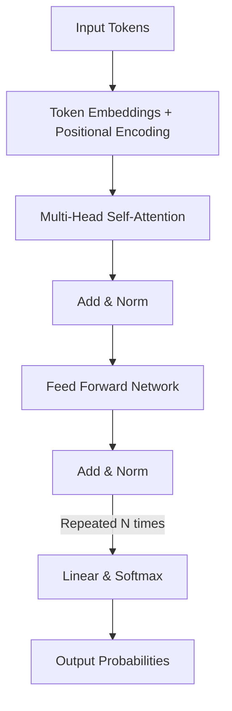
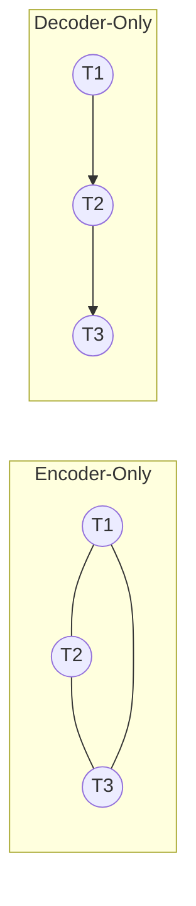

# LLM Fundamentals — Interview Training Notes

## Table of Contents
1. [Section 1: Foundation & Architecture](#section-1-foundation--architecture)
2. [Section 2: Tokenization](#section-2-tokenization)
3. [Section 3: Embeddings & Positional Encoding](#section-3-embeddings--positional-encoding)
4. [Section 4: Attention Mechanisms](#section-4-attention-mechanisms)
5. [Section 5: Transformer Internals](#section-5-transformer-internals)
6. [Section 6: Context & Generation](#section-6-context--generation)
7. [Section 7: Advanced Architectures & Techniques](#section-7-advanced-architectures--techniques)
8. [Section 8: Training & Alignment](#section-8-training--alignment)
9. [Section 9: Production Scenarios](#section-9-production-scenarios)

---
## Section 1: Foundation & Architecture

### Q: What are foundation models, and how have they changed AI engineering?

**🎯 What the interviewer is testing:** Your understanding of the paradigm shift from task-specific models to general-purpose base models.

**💬 How to answer:**
Foundation models are large-scale machine learning models trained on vast amounts of unlabelled data using self-supervised learning, designed to be adapted (e.g., via fine-tuning or prompting) for a wide range of downstream tasks. 

They have fundamentally changed AI engineering in three ways:
1. **From Task-Specific to General-Purpose:** Previously, we trained separate models for sentiment analysis, translation, and summarization. Now, a single foundation model can perform all these tasks via in-context learning or light fine-tuning.
2. **Emergent Capabilities:** Scale brings capabilities that were not explicitly trained, such as few-shot learning, reasoning, and code generation.
3. **Shift in Engineering Focus:** AI engineers now focus on prompt engineering, RAG (Retrieval-Augmented Generation), and orchestration (e.g., LangChain) rather than training models from scratch. The focus is on steering the model rather than training the weights.

**🔗 Follow-ups the interviewer might ask:**
- *Are foundation models only for text?* → No, they span multimodal domains (e.g., CLIP for vision-text, Whisper for audio).
- *What is the difference between a foundation model and an LLM?* → LLMs are a subset of foundation models focused purely on language.

**⚠️ Common mistakes:** Confusing foundation models with just ChatGPT, or failing to mention self-supervised pre-training.

**💡 What makes a great answer:** Highlighting the economic and architectural shift—how it democratized AI by separating the expensive pre-training phase from the cheaper adaptation phase.

---
### Q: What is a Large Language Model (LLM), and how does it work?

**🎯 What the interviewer is testing:** Core conceptual understanding of language modeling at scale.

**💬 How to answer:**
A Large Language Model (LLM) is a deep neural network—typically based on the Transformer architecture—with billions of parameters, trained on massive text corpora to understand and generate human-like language. 

At its core, an LLM works by **predicting the next token**. Given a sequence of tokens, it outputs a probability distribution over the entire vocabulary for the next token. 

Here is the high-level flow:
1. **Tokenization:** Input text is broken into subword tokens.
2. **Embedding:** Tokens are mapped to dense high-dimensional vectors, and positional information is added.
3. **Contextualization:** The Transformer layers (via self-attention) process these embeddings to understand context and relationships between tokens.
4. **Generation (Decoding):** The model outputs logits, which are converted to probabilities via softmax, and a sampling strategy (like Top-p) selects the next token. This process repeats autoregressively.

**🔗 Follow-ups the interviewer might ask:**
- *What does "Large" mean?* → Generally refers to models with billions of parameters and trained on terabytes of data, leading to emergent behaviors.
- *How does it handle tasks it wasn't explicitly trained on?* → Through in-context learning; the next-token prediction objective forces the model to learn world knowledge and logic to accurately predict language.

**⚠️ Common mistakes:** Describing it as a database that searches for answers, rather than a probabilistic engine predicting the next word.

**💡 What makes a great answer:** Mentioning that the simple objective of next-token prediction, when scaled up massively, forces the model to learn deep representations of syntax, semantics, and world knowledge.

---
### Q: What is the Transformer architecture and how does it work?

**🎯 What the interviewer is testing:** High-level understanding of the architecture that powers modern LLMs.

**💬 How to answer:**
The Transformer is a neural network architecture introduced by Google in 2017 ("Attention Is All You Need") that relies entirely on attention mechanisms, dispensing with recurrence (RNNs) and convolutions (CNNs). 

It works by processing all tokens in a sequence in parallel rather than sequentially, which allows for massive parallelization during training. The core innovation is **Self-Attention**, which allows the model to weigh the importance of every other word in the input sequence when encoding a specific word.

**🔗 Follow-ups the interviewer might ask:**
- *Why is it better than LSTMs?* → LSTMs process sequentially (slow to train) and suffer from the vanishing gradient problem on long sequences. Transformers process in parallel and have direct path connections (O(1) path length) between any two tokens.

**⚠️ Common mistakes:** Failing to mention that the original Transformer was an Encoder-Decoder model, while modern LLMs are mostly Decoder-only.

**💡 What makes a great answer:** Explaining the O(1) path length for information flow compared to O(N) in RNNs, which solves the long-term dependency problem.

---
### Q: What are the key components of the Transformer architecture?

**🎯 What the interviewer is testing:** Knowledge of the internal blocks of a Transformer.

**💬 How to answer:**
A Transformer consists of several repeating blocks, typically containing these key components:

1. **Input/Output Embeddings:** Converts discrete tokens into dense continuous vectors.
2. **Positional Encoding:** Injects sequence order information, since the attention mechanism itself is permutation-invariant.
3. **Multi-Head Self-Attention:** Computes attention weights for tokens relative to each other. Multi-head allows the model to focus on different aspects (e.g., syntax, semantics) simultaneously.
4. **Feed-Forward Neural Networks (FFN):** A two-layer MLP applied independently to each token's representation, expanding the dimensionality to introduce non-linearity and store learned facts.
5. **Residual (Skip) Connections & Layer Normalization:** Surrounds the attention and FFN sub-layers. Residuals help gradients flow during backpropagation, preventing vanishing gradients. LayerNorm stabilizes training.

**🔗 Follow-ups the interviewer might ask:**
- *Which part holds most of the model's parameters?* → The Feed-Forward Networks usually hold roughly 2/3 of the parameters in standard dense Transformers.

**⚠️ Common mistakes:** Forgetting the residual connections and layer normalization, which are critical for training deep networks.

**💡 What makes a great answer:** Structuring the answer clearly and knowing the parameter distribution (FFN vs. Attention).

---
### Q: What is the difference between encoder-only, decoder-only, and encoder-decoder Transformer architectures?

**🎯 What the interviewer is testing:** Understanding of different Transformer topologies and their use cases.

**💬 How to answer:**
The difference lies in how they process input and mask attention.

| Architecture | Description | Use Case | Example Models |
|--------------|-------------|----------|----------------|
| **Encoder-Only** | Uses bidirectional self-attention. Every token can attend to every other token (past and future). | Classification, masked language modeling, embedding generation. | BERT, RoBERTa |
| **Decoder-Only** | Uses causal (unidirectional) masked self-attention. Tokens can only attend to previous tokens to prevent "looking ahead." | Text generation, chat, autoregressive tasks. | GPT-4, Llama 3, Claude |
| **Encoder-Decoder** | Encoder reads full input bidirectionally, Decoder generates output autoregressively, attending to encoder outputs via cross-attention. | Translation, summarization (Sequence-to-Sequence). | T5, BART |

**🔗 Follow-ups the interviewer might ask:**
- *Why did the industry converge on Decoder-only for LLMs?* → Decoder-only models scale more predictably, simplify the architecture (no cross-attention), and perform zero-shot/few-shot tasks better as a unified next-token predictor.

**⚠️ Common mistakes:** Stating that GPT has an encoder.

**💡 What makes a great answer:** Explaining the masking difference (bidirectional vs causal) clearly.

---
## Section 2: Tokenization

### Q: What is tokenization in LLMs?

**🎯 What the interviewer is testing:** Understanding of how text is pre-processed for neural networks.

**💬 How to answer:**
Tokenization is the process of converting raw text strings into discrete, manageable units called tokens, which are then mapped to integer IDs for the neural network to process. 

Tokens are not strictly words; modern LLMs use **subword tokenization**. For example, the word "unbelievable" might be split into "un", "believ", and "able". 

This strikes a balance:
- Character-level tokenization loses semantic meaning and creates overly long sequences.
- Word-level tokenization results in a massive vocabulary size and struggles with out-of-vocabulary (OOV) words.
- Subword tokenization limits vocabulary size, handles rare words gracefully, and captures morphological meaning.

**🔗 Follow-ups the interviewer might ask:**
- *Why is tokenization problematic for code or non-English languages?* → If the tokenizer wasn't trained on sufficient multilingual data, a single non-English character might take multiple tokens, making inference slow and expensive.

**⚠️ Common mistakes:** Assuming tokens perfectly map to words.

**💡 What makes a great answer:** Highlighting the OOV problem and how subword tokenization elegantly solves it.

---
### Q: Explain BPE (Byte Pair Encoding).

**🎯 What the interviewer is testing:** Knowledge of the most common tokenization algorithm.

**💬 How to answer:**
Byte Pair Encoding (BPE) is a data compression algorithm adapted for subword tokenization, famously used in GPT models.

**How it works:**
1. **Initialize:** Start with a base vocabulary of individual characters (or bytes).
2. **Count:** Count the frequency of adjacent symbol pairs in the training corpus.
3. **Merge:** Find the most frequent pair (e.g., 'e' and 'r' -> 'er') and merge them into a single new symbol.
4. **Repeat:** Add the new symbol to the vocabulary and repeat the process until a target vocabulary size is reached.

**Advantage:** It ensures common words remain as single tokens while rare words are broken down into recognizable subword units, effectively eliminating Out-Of-Vocabulary issues.

**🔗 Follow-ups the interviewer might ask:**
- *Why Byte-level BPE instead of Character-level?* → Byte-level BPE (BBPE) operates on UTF-8 bytes, meaning it can handle absolutely any Unicode character (even emojis or new languages) without needing an explicit OOV token.

**⚠️ Common mistakes:** Explaining it as a rule-based stemmer rather than a statistical frequency-based merger.

**💡 What makes a great answer:** Mentioning Byte-level BPE (BBPE) as the modern standard.

---
### Q: Your tokenizer splits important domain terms into meaningless subword pieces. How do you fix it?

**🎯 What's being tested:** Handling domain-specific tokenization issues in practice.

**💬 How to approach this:**
1. **Diagnose first:** Identify the specific tokens being fragmented. For instance, in healthcare, "Echocardiogram" might split into "E", "cho", "card", "io", "gram", inflating sequence length and degrading representation.
2. **Root causes:** The tokenizer was trained on general web text, where this domain term was rare, so BPE didn't merge these subwords.
3. **Solutions:**
   - **Vocab Extension:** Add the domain-specific terms to the tokenizer's vocabulary explicitly. You must also resize the model's embedding matrix and output layer, and fine-tune the model so it learns the new embeddings for these added tokens.
   - **Retrain Tokenizer (Extreme):** If the domain is entirely different (e.g., genetic sequences), train a custom tokenizer from scratch and pre-train a new model.
4. **Prevention:** During pre-training, ensure domain data is sufficiently represented in the tokenizer training corpus.

**⚠️ Trap to avoid:** Suggesting you just "add it to the tokenizer" without mentioning that the model weights (embedding layer) must also be resized and trained.

**💡 Pro tip:** Mentioning that adding tokens requires extending the embedding matrix with newly initialized weights, which mandates fine-tuning to align those new vectors with the existing semantic space.

---
## Section 3: Embeddings & Positional Encoding

### Q: What are embeddings?

**🎯 What the interviewer is testing:** Foundational understanding of continuous representations.

**💬 How to answer:**
Embeddings are dense, low-dimensional continuous vector representations of discrete variables (like tokens). 

In an LLM, the embedding layer maps a token ID (e.g., ID 402) into a vector of fixed size (e.g., 4096 dimensions). The magic of embeddings is that they capture semantic meaning—tokens with similar meanings are mapped to points close to each other in this high-dimensional space. 

They serve as the initial input to the Transformer layers. Mathematically, it is essentially a lookup table (or a linear layer without bias) where each row corresponds to a token's vector.

**🔗 Follow-ups the interviewer might ask:**
- *What is the difference between token embeddings and context embeddings?* → Token embeddings are static representations from the lookup table. As they pass through Transformer layers, they become contextualized embeddings, meaning their representation changes based on surrounding words (e.g., "bank" in "river bank" vs "bank account").

**⚠️ Common mistakes:** Forgetting that initial embeddings are static and only become contextualized deeper in the network.

**💡 What makes a great answer:** Explaining that embeddings capture both semantic similarity (cosine similarity) and relational analogies (King - Man + Woman = Queen).

---
### Q: What is positional encoding, and why is it needed in Transformers?

**🎯 What the interviewer is testing:** Understanding of permutation invariance in attention.

**💬 How to answer:**
Positional encoding is a technique used to inject information about the relative or absolute position of tokens in a sequence. 

**Why it's needed:** Unlike RNNs, the Multi-Head Attention mechanism in Transformers computes relationships between all tokens simultaneously in parallel. It has no inherent notion of sequence order. Without positional encoding, the model would treat "The dog bit the man" and "The man bit the dog" as exactly the same set of tokens.

In the original Transformer, this was done by adding fixed sinusoidal functions (sine and cosine waves of different frequencies) directly to the token embeddings.

**🔗 Follow-ups the interviewer might ask:**
- *Why use sine and cosine?* → They allow the model to easily learn to attend by relative positions, since a linear transformation can offset the sinusoidal values.

**⚠️ Common mistakes:** Thinking positional encodings are concatenated rather than added to the embeddings in the original architecture.

**💡 What makes a great answer:** Contrasting absolute positional encoding (original Transformer) with modern relative/rotary approaches.

---
### Q: How does Rotary Position Embedding (RoPE) work, and why is it preferred over learned positional embeddings?

**🎯 What the interviewer is testing:** Knowledge of modern LLM architectures (Llama, Mistral).

**💬 How to answer:**
Rotary Position Embedding (RoPE) is a modern positional encoding technique that unifies absolute and relative positional encoding. Instead of adding a vector to the embeddings, RoPE applies a rotation to the Query and Key vectors in the attention mechanism.

**How it works:**
It pairs up the dimensions of the embedding and rotates them in a 2D plane by an angle proportional to the token's absolute position. When you compute the dot product between a Query at position $m$ and a Key at position $n$, the math works out such that the result depends only on the relative distance $(m - n)$, not their absolute positions.

**Why it's preferred:**
1. **Extrapolation:** It extrapolates better to sequence lengths longer than seen during training.
2. **Relative Focus:** It elegantly bakes relative distances directly into the attention scores.
3. **No context window hard-limit:** Unlike learned absolute embeddings (which crash if a position index exceeds the trained size), RoPE degrades gracefully or can be easily scaled (e.g., YaRN or RoPE scaling).

**🔗 Follow-ups the interviewer might ask:**
- *Where is RoPE applied?* → Just before the dot product in the attention mechanism (applied to Q and K, but not V).

**⚠️ Common mistakes:** Saying RoPE is added to the input embeddings. It is applied via rotation matrices to Q and K.

**💡 What makes a great answer:** Mentioning that RoPE is the industry standard (used in Llama, PaLM, Mistral) and enables context length extension via frequency interpolation.

---
## Section 4: Attention Mechanisms

### Q: Explain the Query(Q), Key(K), and Value(V) in attention.

**🎯 What the interviewer is testing:** Core intuition of the attention mechanism.

**💬 How to answer:**
The Query, Key, and Value concept is borrowed from retrieval systems (like a database). In self-attention, every token in the sequence acts as all three.

- **Query (Q):** What am I looking for? (e.g., a pronoun "it" searching for its noun referent).
- **Key (K):** What do I have? (e.g., a noun "apple" signaling "I am a fruit/noun").
- **Value (V):** What information do I actually provide if you attend to me?

**The process:**
For a given token, its Query vector takes the dot product with the Key vectors of all other tokens. A high dot product means high relevance. These scores are passed through a softmax function to create weights, which are then used to compute a weighted sum of the Value vectors. 

The output is a new, context-aware representation for that token.

**🔗 Follow-ups the interviewer might ask:**
- *How are Q, K, and V generated?* → By multiplying the token's embedding by three learned weight matrices ($W_Q$, $W_K$, $W_V$).

**⚠️ Common mistakes:** Failing to explain that Q, K, and V all come from the exact same input tokens in *self-attention*.

**💡 What makes a great answer:** The database retrieval analogy combined with the mathematical explanation of the weighted sum.

---
### Q: Why do we scale the dot product attention by √dₖ in the Transformer architecture?

**🎯 What the interviewer is testing:** Mathematical intuition behind model stability.

**💬 How to answer:**
In scaled dot-product attention, the formula is:
$Attention(Q, K, V) = softmax(\frac{QK^T}{\sqrt{d_k}})V$

We divide by $\sqrt{d_k}$ (where $d_k$ is the dimension of the key vectors) to prevent the dot products from growing too large in magnitude. 

If $d_k$ is large, the dot product of Q and K can result in very large variance. When large numbers are passed into the softmax function, it pushes the outputs into the extremely flat regions of the softmax curve. In these regions, gradients become vanishingly small, causing learning to stall. Scaling by the square root of the dimension keeps the variance of the dot products stable (close to 1), ensuring healthy gradient flow during backpropagation.

**🔗 Follow-ups the interviewer might ask:**
- *What happens if you don't scale it?* → The softmax output becomes essentially a one-hot vector (attention focuses entirely on one token), and gradients vanish, stopping the model from learning.

**⚠️ Common mistakes:** Saying it prevents memory issues. It's strictly about gradient flow and numerical stability.

**💡 What makes a great answer:** Explicitly mentioning the variance of the dot product and the "flat regions of the softmax" leading to vanishing gradients.

---
## Section 5: Transformer Internals

### Q: What are Feed-Forward Networks in LLMs?

**🎯 What the interviewer is testing:** Understanding of the FFN block's role in the Transformer.

**💬 How to answer:**
The Feed-Forward Network (FFN) is a two-layer multi-layer perceptron (MLP) applied independently and identically to each token position after the attention layer.

While self-attention moves information *between* tokens, the FFN processes information *within* each token. 
1. **Expansion:** The first linear layer expands the dimension (typically by 4x, e.g., from 4096 to 16384).
2. **Non-linearity:** An activation function (like ReLU, GELU, or SwiGLU) is applied.
3. **Projection:** The second linear layer projects it back to the original dimension.

**Role:** The FFN acts as the model's "memory" or "knowledge base." While attention figures out which words relate to each other, the FFN stores factual relationships and patterns learned during pre-training.

**🔗 Follow-ups the interviewer might ask:**
- *What activation functions are common now?* → SwiGLU (used in Llama) has largely replaced GELU/ReLU.

**⚠️ Common mistakes:** Thinking the FFN mixes information across tokens. It strictly operates on a per-token basis.

**💡 What makes a great answer:** The distinction between Attention (routing/context) and FFN (memory/computation).

---
## Section 6: Context & Generation

### Q: What is KV cache, and how does it speed up inference?

**🎯 What the interviewer is testing:** Knowledge of LLM inference optimization.

**💬 How to answer:**
The KV (Key-Value) Cache is an inference optimization technique used during autoregressive generation to prevent redundant calculations.

**The Problem:**
In autoregressive generation, an LLM generates one token at a time. To generate token $N$, the attention mechanism needs the Keys and Values for all previous $N-1$ tokens. Without caching, the model would recompute the K and V matrices for the entire sequence from scratch at every single step, leading to $O(N^2)$ complexity and terrible latency.

**The Solution:**
Since the historical tokens don't change, we compute their Key and Value vectors once and store them in memory (the KV cache). When generating the next token, we only compute the Q, K, and V for the *new* token, and append its K and V to the cache. The new Query attends to the cached Keys. 

This reduces the computational complexity of the attention step for generation from $O(N^2)$ to $O(N)$.

**🔗 Follow-ups the interviewer might ask:**
- *What is the downside of KV cache?* → It consumes a massive amount of VRAM, especially for large batch sizes and long context windows, often becoming the memory bottleneck during inference.

**⚠️ Common mistakes:** Confusing KV cache with prompt caching (which happens across different requests). KV cache operates within a single generation step.

**💡 What makes a great answer:** Clearly explaining the trade-off: trading VRAM (memory) for compute speed.

---
### Q: Your Transformer's KV cache grows too large during long sequence generation. How do you manage memory?

**🎯 What's being tested:** Handling production memory bottlenecks in LLM inference.

**💬 How to approach this:**
1. **Diagnose first:** KV cache scales with `Batch Size * Sequence Length * Layers * Dim`. If this exceeds VRAM, we get Out of Memory (OOM) errors or severe latency degradation.
2. **Architectural Solutions (Model Side):**
   - **Multi-Query Attention (MQA) / Grouped-Query Attention (GQA):** Instead of one KV head per Query head, share KV heads across queries. GQA reduces KV cache size by a factor of 4-8x while maintaining performance.
3. **System Solutions (Serving Side):**
   - **PagedAttention (vLLM):** Manages KV cache like virtual memory in an OS. It breaks KV cache into blocks and allocates them non-contiguously, eliminating memory fragmentation and allowing much higher batch sizes.
   - **Quantization:** Store the KV cache in lower precision (e.g., FP8 or INT8) instead of FP16.
   - **Context Eviction/Sliding Window:** Techniques like Sliding Window Attention (Mistral) or Heavy Hitter Oracles (H2O) evict less important tokens from the cache to keep it bounded.

**⚠️ Trap to avoid:** Suggesting model quantization (like LoRA or 4-bit weights). Weight quantization reduces model size, but KV cache grows dynamically with sequence length. You must address the dynamic memory.

**💡 Pro tip:** Mentioning PagedAttention and GQA together shows you understand both the system-level and architectural-level state-of-the-art solutions.

---
## Section 9: Production Scenarios

### Q: Your LLM keeps ignoring your instructions. How do you make it follow structured output formats?

**🎯 What's being tested:** Prompt engineering and constrained generation techniques.

**💬 How to approach this:**
1. **Diagnose first:** Standard LLMs predict text probabilistically. Without constraints, they will add conversational filler ("Here is the JSON you requested:...") which breaks parsers.
2. **Prompt-level Solutions:**
   - Use clear framing: "Output ONLY valid JSON. No explanations."
   - Provide Few-Shot examples of the exact expected output.
3. **System-level Solutions (Constrained Decoding):**
   - Use tools like **JSON Schema enforcement** (e.g., OpenAI's Structured Outputs, Instructor, or Outlines). 
   - **How it works:** These tools modify the logits during generation. If the schema requires a boolean, the system masks the logits for all tokens except "true" or "false", forcing the model to output valid syntax.
4. **Fine-tuning:** If prompting and constrained decoding are too slow or fail on complex domain formats, fine-tune the model on syntactically perfect examples.

**⚠️ Trap to avoid:** Relying solely on prompt engineering for critical pipelines. Prompts will eventually fail.

**💡 Pro tip:** Mentioning logit masking / guided decoding as the deterministic guarantee for structured outputs.

---
*This document contains foundational knowledge for LLM engineering interviews.*
