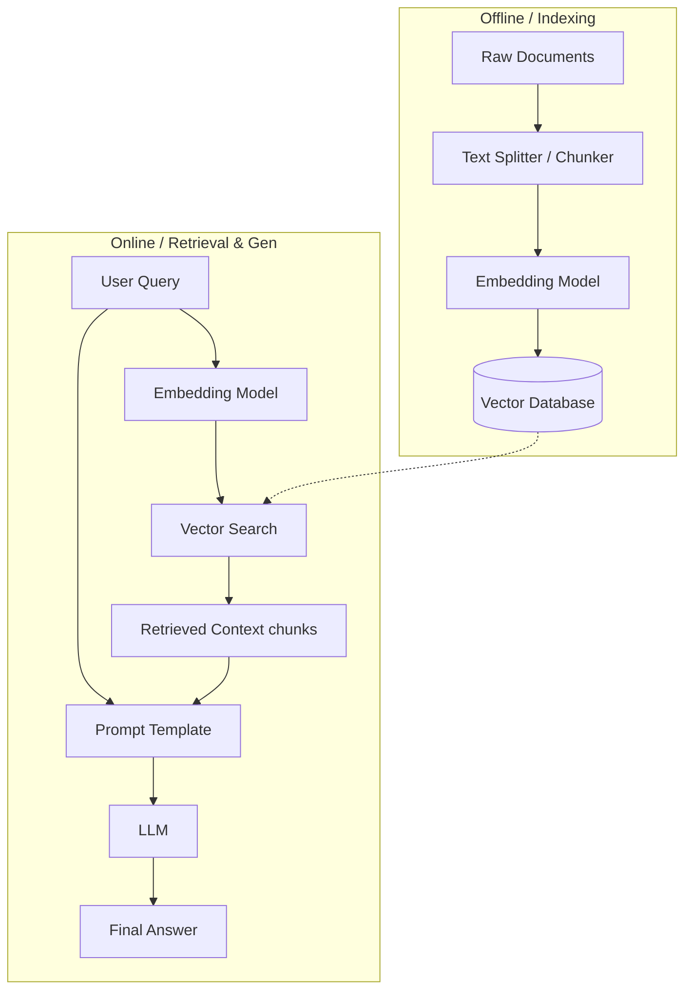
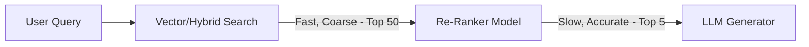
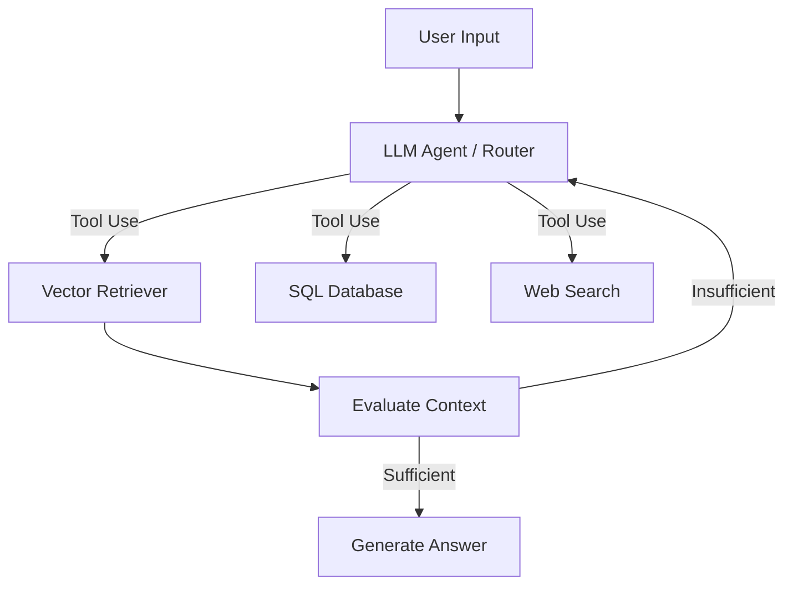
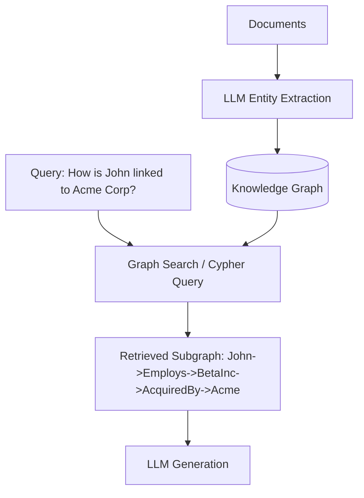
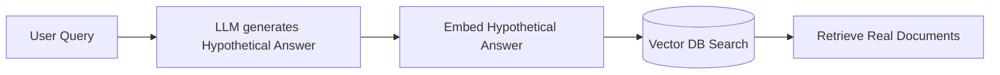
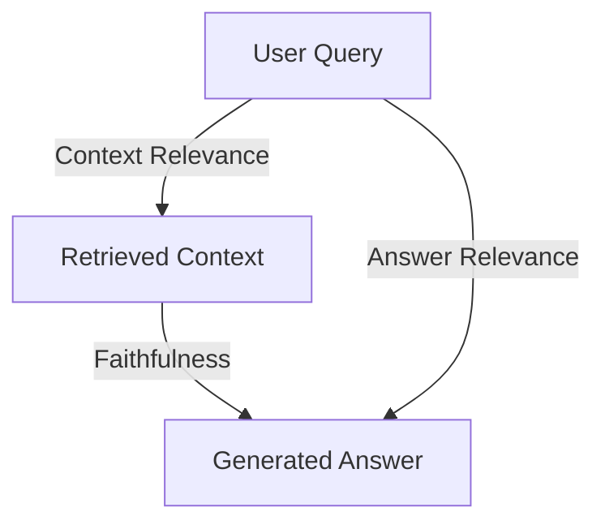

# Retrieval-Augmented Generation (RAG) — Interview Training Notes

## Table of Contents
1. [Section 1: RAG Fundamentals](#section-1-rag-fundamentals)
2. [Section 2: Data Preparation & Chunking](#section-2-data-preparation--chunking)
3. [Section 3: Embeddings & Search](#section-3-embeddings--search)
4. [Section 4: Advanced RAG Patterns](#section-4-advanced-rag-patterns)
5. [Section 5: Production RAG](#section-5-production-rag)
6. [Section 6: Scenario Questions](#section-6-scenario-questions)

---

## Section 1: RAG Fundamentals

### Q: What is Retrieval-Augmented Generation (RAG), and why is it important?

**🎯 What the interviewer is testing:** Understanding of the core concept, its purpose, and the problem it solves (hallucinations, static knowledge).

**💬 How to answer:**
Retrieval-Augmented Generation (RAG) is an architectural pattern that enhances large language models (LLMs) by retrieving relevant facts from an external knowledge base to ground the model's response. Instead of relying solely on the model's internal pre-trained weights, RAG dynamically pulls in up-to-date, domain-specific, or proprietary information.

It is important because it solves three major limitations of LLMs:
1. **Hallucinations:** By grounding the generation in retrieved facts, it significantly reduces the likelihood of the model making things up.
2. **Knowledge Cutoffs:** It allows the system to access real-time or updated information without needing to retrain the model.
3. **Data Privacy/Proprietary Data:** It enables enterprises to use LLMs with their internal, private data without fine-tuning the model on sensitive information.

**🔗 Follow-ups the interviewer might ask:**
- *Does RAG completely eliminate hallucinations?* → No, the LLM can still misinterpret the retrieved context or hallucinate if the retrieved context is poor, but it significantly reduces the rate.
- *How does it affect latency?* → It adds retrieval latency, which must be optimized using fast vector databases and efficient embedding models.

**⚠️ Common mistakes:** Stating that RAG trains or fine-tunes the model on new data. It does not alter the model's weights; it injects data into the prompt context.

**💡 What makes a great answer:** Mentioning that RAG shifts the LLM from a "knowledge retrieval engine" to a "reasoning and synthesis engine."

---
### Q: Explain the architecture of a basic RAG system.

**🎯 What the interviewer is testing:** Ability to visualize and articulate the end-to-end flow of data in a standard RAG application.

**💬 How to answer:**
A basic RAG architecture consists of two main pipelines: the **Indexing Pipeline** (offline) and the **Retrieval & Generation Pipeline** (online).

In the Indexing Pipeline, raw documents are ingested, split into smaller chunks, converted into vector representations using an embedding model, and stored in a Vector Database.

In the Retrieval & Generation Pipeline, a user query is embedded using the same model. The vector database performs a similarity search to find the most relevant chunks. These chunks are then prepended to the user's prompt as context and sent to the LLM to generate the final response.

**🔗 Follow-ups the interviewer might ask:**
- *What metric is used for vector search?* → Usually Cosine Similarity, but sometimes Dot Product or Euclidean distance depending on the embedding model.
- *Where is metadata stored?* → Alongside the vectors in the vector DB, used for pre/post-filtering.

**⚠️ Common mistakes:** Forgetting to mention the indexing pipeline or explaining only the query time flow.

**💡 What makes a great answer:** Clearly distinguishing between the offline indexing phase and the online query phase, showing an understanding of production lifecycles.

---
### Q: What are the key components of a RAG pipeline?

**🎯 What the interviewer is testing:** Deep understanding of the specific tools and technologies that make up the RAG stack.

**💬 How to answer:**
A robust RAG pipeline is built on several key components:
1. **Document Loaders:** Parsers that extract text from various formats (PDFs, HTML, Markdown, Word).
2. **Text Splitters (Chunkers):** Algorithms that break large texts into manageable, semantically meaningful pieces that fit within context windows.
3. **Embedding Models:** Neural networks (like OpenAI's `text-embedding-3`, BGE, or Cohere) that map text to high-dimensional dense vectors.
4. **Vector Database:** Specialized data stores (e.g., Pinecone, Milvus, Qdrant, pgvector) optimized for storing embeddings and performing Approximate Nearest Neighbor (ANN) search.
5. **Retriever:** The logic that queries the vector DB. In advanced setups, this includes re-rankers or hybrid search mechanisms.
6. **LLM Generator:** The instruction-tuned model (e.g., GPT-4, Claude 3, Llama 3) that synthesizes the retrieved context and answers the user's prompt.
7. **Orchestration Framework:** Libraries like LangChain, LlamaIndex, or custom code that ties these steps together.

**🔗 Follow-ups the interviewer might ask:**
- *Why not use a standard SQL database?* → Standard SQL databases aren't optimized for high-dimensional vector similarity search natively, though extensions like `pgvector` bridge this gap.
- *What's the most critical component for quality?* → The Retriever. If the retrieved context is irrelevant, the LLM cannot generate a correct answer (Garbage In, Garbage Out).

**⚠️ Common mistakes:** Listing only the LLM and the Vector DB, ignoring the critical data preparation steps like loaders and chunkers.

**💡 What makes a great answer:** Highlighting that the orchestration framework is just a wrapper, and the real engineering lies in optimizing the chunker, embedding model, and retriever.

---
### Q: Compare RAG vs fine-tuning. When would you use each?

**🎯 What the interviewer is testing:** Strategic decision-making and understanding the trade-offs between dynamic knowledge injection and model weight updates.

**💬 How to answer:**
RAG and Fine-Tuning solve different problems. RAG is for **knowledge augmentation**, while fine-tuning is for **behavior, tone, or task adaptation**. 

Use RAG when you need access to dynamic, up-to-date, or proprietary facts, and when you need strict source attribution (citations). Use fine-tuning when you want the model to learn a specific format, speak in a particular domain's "language," or perform a highly specialized task where prompting isn't enough.

| Feature | RAG (Retrieval-Augmented Gen) | Fine-Tuning |
| :--- | :--- | :--- |
| **Primary Use Case** | Adding new knowledge, facts, data | Changing behavior, tone, style, format |
| **Knowledge Updates** | Easy & Real-time (update DB) | Hard (requires retraining/re-tuning) |
| **Hallucinations** | Lower (grounded in context) | Higher (relies on internal memory) |
| **Cost & Effort** | Low to Medium | High (compute and curated datasets) |
| **Source Citations** | Yes (can trace back to chunks) | No (black-box weights) |
| **Latency** | Higher (retrieval step adds time) | Lower (direct generation) |

In many production systems, a hybrid approach is used: fine-tune a smaller model to understand the domain and format, and use RAG to supply the exact facts.

**🔗 Follow-ups the interviewer might ask:**
- *Can fine-tuning add new knowledge?* → Yes, but it's highly inefficient. The model might forget old knowledge (catastrophic forgetting) and cannot cite sources.
- *When would RAG fail but fine-tuning succeed?* → When the task requires a deep understanding of complex domain syntax (like a rare programming language) that won't fit in a prompt context.

**⚠️ Common mistakes:** Claiming fine-tuning is the best way to teach an LLM new facts about a company's internal wiki.

**💡 What makes a great answer:** Proposing the hybrid approach (Fine-tuning + RAG) as the ultimate enterprise solution.

---

## Section 2: Data Preparation & Chunking

### Q: What are chunking strategies, and how do you choose the right chunk size?

**🎯 What the interviewer is testing:** Practical experience with document processing and understanding the trade-off between context richness and noise.

**💬 How to answer:**
Chunking is the process of breaking down large documents into smaller, semantically cohesive segments before embedding them. Choosing the right chunk size is a balancing act:
- **Too small (e.g., 50 tokens):** The chunk loses surrounding context, meaning the embedding might not capture the true meaning, and the LLM won't have enough info to answer.
- **Too large (e.g., 2000 tokens):** The embedding vector becomes diluted, mixing multiple topics, which hurts retrieval accuracy. It also consumes too much of the LLM context window, increasing cost and latency.

To choose the right size, I consider:
1. **The Embedding Model:** Models have optimal token lengths (e.g., older models top out at 512 tokens; newer ones support larger context, but 256-512 is often a sweet spot for high-density similarity).
2. **The LLM Context Window:** How much context can I feed the generator?
3. **The Data Type:** Code needs larger chunks to keep functions intact; conversational text might need smaller chunks.
4. **Evaluation:** I run experiments using metrics like retrieval recall with varying sizes (e.g., 256, 512, 1024) to find the empirical optimum for my dataset.

**🔗 Follow-ups the interviewer might ask:**
- *What is chunk overlap and why use it?* → Overlap (e.g., 10-20% of chunk size) ensures that concepts at the boundary of two chunks aren't lost, maintaining continuous context.

**⚠️ Common mistakes:** Suggesting a random number without explaining the trade-offs or the experimental approach to finding it.

**💡 What makes a great answer:** Mentioning that the optimal chunk size isn't a fixed rule but something that must be empirically evaluated based on the specific embedding model and data.

---
### Q: Compare fixed-size chunking, semantic chunking, and recursive chunking.

**🎯 What the interviewer is testing:** Depth of knowledge in text splitting algorithms.

**💬 How to answer:**
These are three progressive strategies for splitting text:

| Strategy | Description | Pros | Cons |
| :--- | :--- | :--- | :--- |
| **Fixed-size** | Splitting text by a hard character/token limit (e.g., 500 chars) with a fixed overlap. | Fast, simple, easy to implement. | Breaks mid-sentence or mid-paragraph, destroying semantic meaning. |
| **Recursive** | Uses a hierarchy of separators (e.g., `\n\n`, `\n`, `.`, ` `). It tries the largest separator first, falling back to smaller ones to hit the target size. | Keeps paragraphs and sentences intact; good balance of structure and size. | Can still occasionally break semantic flow if paragraphs are extremely long. |
| **Semantic** | Uses an NLP model or embedding similarity between sentences to group them. If two adjacent sentences are highly similar, they form a chunk. | Highly cohesive chunks; excellent for retrieval accuracy. | Computationally expensive; slow to index; chunks can vary wildly in size. |

For most production use cases, **Recursive Character Splitting** is the default because it's fast and respects document structure, while Semantic Chunking is used for highly specialized, complex texts.

**🔗 Follow-ups the interviewer might ask:**
- *How does Markdown or HTML chunking differ?* → Structure-aware chunking parses the DOM or AST to split by headers or tags, ensuring entire sections stay together.

**⚠️ Common mistakes:** Assuming semantic chunking is always best just because it sounds more advanced, ignoring its massive compute cost.

**💡 What makes a great answer:** Acknowledging that document-structure-aware chunking (like parsing markdown headers) often beats basic recursive chunking for technical docs.

---
### Q: What is parent-child chunking, and how does it improve retrieval?

**🎯 What the interviewer is testing:** Knowledge of advanced retrieval optimization techniques (also known as Auto-merging retrieval or Small-to-Big retrieval).

**💬 How to answer:**
Parent-child chunking is a strategy that decouples the **embedding size** from the **context size**. 

In standard RAG, the chunk you retrieve is the exact chunk you feed to the LLM. In parent-child chunking, you break a large "parent" chunk (e.g., a whole page or section) into smaller "child" chunks (e.g., individual sentences or small paragraphs). 
You embed and index only the child chunks. When a user queries, the vector search finds the highly relevant child chunks. However, before sending data to the LLM, the system maps the child back to its parent, and feeds the *entire parent chunk* to the LLM.

It improves retrieval because smaller chunks create highly specific, precise embeddings (increasing search accuracy), while providing the parent chunk to the LLM ensures the model has full surrounding context to generate a comprehensive answer.

**🔗 Follow-ups the interviewer might ask:**
- *How do you implement this in a vector DB?* → Store the child embedding in the vector DB, and keep a metadata pointer `parent_id` linking to a document store (like MongoDB or Redis) that holds the full parent text.

**⚠️ Common mistakes:** Confusing parent-child chunking with hierarchical clustering or graph RAG.

**💡 What makes a great answer:** Explaining the underlying principle: decoupling the optimal representation for *search* from the optimal representation for *synthesis*.

---

## Section 3: Embeddings & Search

### Q: What are embedding models, and how do they convert text to vectors?

**🎯 What the interviewer is testing:** Foundational understanding of dense vector representations and NLP models.

**💬 How to answer:**
Embedding models are neural networks (often based on Transformer architectures like BERT) designed to map text into a dense, high-dimensional vector space (an array of floating-point numbers). 

They convert text to vectors by processing the input tokens through multiple attention layers. These layers capture the semantic meaning and context of the words. The final output is a fixed-size vector (e.g., 768 or 1536 dimensions). In this vector space, texts with similar semantic meanings are positioned closer together. Therefore, "puppy" and "dog" will have high cosine similarity, even if they share no exact characters.

**🔗 Follow-ups the interviewer might ask:**
- *What is the difference between sparse and dense embeddings?* → Dense embeddings (neural) capture semantic meaning in fixed dimensions. Sparse embeddings (like TF-IDF or BM25) rely on exact keyword frequencies and have vocabulary-sized dimensions with mostly zeros.

**⚠️ Common mistakes:** Explaining tokenization instead of embedding, or failing to mention that the vector captures semantic distance.

**💡 What makes a great answer:** Highlighting that the quality of the vector space depends entirely on the contrastive learning tasks the model was trained on.

---
### Q: How do you choose an embedding model for your RAG system?

**🎯 What the interviewer is testing:** Practical engineering criteria for model selection.

**💬 How to answer:**
I choose an embedding model based on a combination of performance, cost, and domain requirements:
1. **MTEB Benchmark Performance:** I check the Massive Text Embedding Benchmark leaderboard for high performance in the 'Retrieval' task specifically.
2. **Dimensionality & Storage Cost:** Larger dimensions (e.g., 3072) cost more to store and search in vector DBs. Sometimes a smaller, quantized model (e.g., BGE-small at 384 dimensions) is "good enough" and much faster.
3. **Context Length:** If I need to embed large chunks, I need a model with an 8k+ token limit (like OpenAI `text-embedding-3`).
4. **Domain Specificity:** Open-source models can be fine-tuned. If my domain is highly specialized (e.g., medical or legal), I might choose a domain-specific model over a generic API.
5. **Latency/Privacy:** Using an API (OpenAI) adds network latency and privacy concerns. Self-hosting an open-weight model (like Nomic or BGE) keeps data private and reduces latency.

**🔗 Follow-ups the interviewer might ask:**
- *How do you evaluate if a model is working for your data?* → Run a small evaluation set of queries and relevant documents, measuring Mean Reciprocal Rank (MRR) or NDCG.

**⚠️ Common mistakes:** Just saying "I use OpenAI because it's the best."

**💡 What makes a great answer:** Mentioning the trade-off between vector dimensions and cloud infrastructure costs.

---
### Q: What is hybrid search, and why is it better than pure vector search?

**🎯 What the interviewer is testing:** Knowledge of robust search techniques and the limitations of dense embeddings.

**💬 How to answer:**
Hybrid search is a retrieval technique that combines **Dense Vector Search** (semantic search) with **Sparse Keyword Search** (lexical search, like BM25). 

It is better than pure vector search because dense embeddings excel at finding conceptual matches ("How to reset my password" matches "Forgot credentials"), but they frequently fail at exact keyword lookups (e.g., finding a specific error code like "ERR_509", a specific part number, or a unique name). BM25 excels at exact matches but fails at semantics.

By running both searches simultaneously and merging the results using techniques like Reciprocal Rank Fusion (RRF) or a convex combination of scores (alpha parameter), hybrid search provides the best of both worlds.

**🔗 Follow-ups the interviewer might ask:**
- *What is Reciprocal Rank Fusion (RRF)?* → An algorithm that combines multiple ranked lists without needing calibrated scores. Formula: `Score = 1 / (k + rank)`, where k is a constant (usually 60).

**⚠️ Common mistakes:** Assuming vector search is always superior to traditional search.

**💡 What makes a great answer:** Giving a concrete example where vector search fails (like an exact UUID or part number) to prove the necessity of hybrid search.

---
### Q: What is re-ranking, and how does it improve RAG retrieval quality?

**🎯 What the interviewer is testing:** Understanding of two-stage retrieval architectures to maximize relevance.

**💬 How to answer:**
Re-ranking is a second stage in the retrieval process. Because searching millions of documents is computationally heavy, the first stage (Vector/Hybrid search) acts as a fast, coarse filter to retrieve the top-K documents (e.g., top 50).

However, vector similarity isn't perfect. Re-ranking takes those top 50 documents and passes them, alongside the user's query, into a **Cross-Encoder model** (like Cohere Re-rank or BGE-Reranker). Unlike bi-encoders (standard embeddings) which process the query and document separately, cross-encoders process the query and document *together* through the transformer's attention layers. This allows the model to capture deep contextual relationships and accurately score relevance. 

It dramatically improves quality by pushing the truly relevant chunks to the very top (Top 3-5) before passing them to the LLM, reducing context noise.

**🔗 Follow-ups the interviewer might ask:**
- *Why not just use a cross-encoder for the whole database?* → Cross-encoders are O(N) at query time. Running inference on 1 million documents takes hours. Vector search is O(log N) and takes milliseconds.

**⚠️ Common mistakes:** Not distinguishing between Bi-encoders (used for vector search) and Cross-encoders (used for re-ranking).

**💡 What makes a great answer:** Explaining the computational complexity trade-off (O(N) vs O(log N)) that makes the two-stage architecture necessary.

---
### Q: What is the role of metadata filtering in RAG systems?

**🎯 What the interviewer is testing:** Experience with practical vector database features to improve precision and security.

**💬 How to answer:**
Metadata filtering allows you to attach key-value pairs (like `date_published`, `author`, `department`, `document_id`) to vector embeddings. During a search, you apply exact-match or range filters *before* or *after* the vector similarity calculation.

Its roles are:
1. **Improving Accuracy:** Constraining the search space. If a user asks "What was our revenue in Q3 2023?", filtering by `year=2023` ensures the vector search doesn't return highly semantically similar reports from 2022.
2. **Access Control (RBAC):** Filtering by `user_role` or `permissions` ensures users only retrieve chunks they are authorized to see.
3. **Performance:** Pre-filtering reduces the number of vectors the ANN algorithm has to search, speeding up the query.

**🔗 Follow-ups the interviewer might ask:**
- *What is the difference between pre-filtering and post-filtering?* → Pre-filtering filters the dataset before nearest-neighbor search (can cause issues with some HNSW graph implementations). Post-filtering searches first, then filters (might return fewer than `k` results). Most modern vector DBs use custom algorithms to handle this optimally.

**⚠️ Common mistakes:** Treating vector search as a pure text problem and ignoring the structural metadata that usually accompanies enterprise data.

**💡 What makes a great answer:** Mentioning Access Control (RBAC) as a primary use case, showing enterprise production experience.

---

## Section 4: Advanced RAG Patterns

### Q: Explain Agentic RAG.

**🎯 What the interviewer is testing:** Understanding of autonomous agents combined with retrieval.

**💬 How to answer:**
Agentic RAG moves beyond the linear "Retrieve -> Generate" pipeline. In Agentic RAG, an LLM acts as an autonomous agent with the *ability* to use retrieval as a tool, deciding *if, when, and how* to query the knowledge base.

Instead of a fixed pipeline, the Agent can:
1. Break down a complex question into sub-queries.
2. Choose different retrievers (e.g., query a vector DB, check a SQL table, or search the web).
3. Evaluate the retrieved context. If it's insufficient, the agent can reformulate the query and search again in a loop until it has enough information to answer.

**🔗 Follow-ups the interviewer might ask:**
- *What are the drawbacks?* → Much higher latency and cost due to multiple LLM calls, plus the risk of the agent getting stuck in infinite loops.

**⚠️ Common mistakes:** Confusing a simple query router with a full agentic loop that evaluates its own retrieval success.

**💡 What makes a great answer:** Highlighting the iterative, multi-step reasoning aspect (looping) that defines true agentic behavior.

---
### Q: What is Self-RAG? How does the model decide when to retrieve?

**🎯 What the interviewer is testing:** Knowledge of cutting-edge RAG frameworks and reflection tokens.

**💬 How to answer:**
Self-RAG (Self-Reflective RAG) is a framework where a specially trained LLM learns to retrieve, critique, and generate text dynamically. 

Unlike standard RAG, the model is trained to output specific **Reflection Tokens** (e.g., `[Retrieve]`, `[Relevant]`, `[Fully Supported]`). 
1. The model starts generating an answer. If it realizes it needs facts, it outputs a `[Retrieve]` token, which pauses generation and triggers a search.
2. It ingests the retrieved passages and outputs tokens like `[Relevant]` or `[Irrelevant]`.
3. It generates a response segment based on relevant passages, and outputs a token like `[Fully Supported]` to indicate the claim is backed by the text.

This allows the model to selectively retrieve only when necessary and self-critique its own generations to prevent hallucinations.

**🔗 Follow-ups the interviewer might ask:**
- *Does Self-RAG require fine-tuning?* → Yes, the original Self-RAG implementation requires fine-tuning an open-source model (like Llama) on a dataset containing these reflection tokens.

**⚠️ Common mistakes:** Assuming Self-RAG is just standard RAG with a "check your work" prompt at the end.

**💡 What makes a great answer:** Specifically mentioning the use of control/reflection tokens integrated into the generation process.

---
### Q: What is GraphRAG, and when would you use it over traditional RAG?

**🎯 What the interviewer is testing:** Understanding of Knowledge Graphs and relationship-based retrieval.

**💬 How to answer:**
GraphRAG integrates Knowledge Graphs (KGs) into the RAG pipeline. Instead of just chunking text into vectors, GraphRAG extracts entities (nodes) and their relationships (edges) from the documents and stores them in a graph database (like Neo4j) during indexing.

You use GraphRAG over traditional vector RAG when answering questions requires traversing complex relationships or understanding the holistic structure of a dataset. Vector search is great for "What is X?", but fails at "How is X connected to Y through Z?" or summarizing themes across thousands of documents.

In GraphRAG, the system retrieves subgraphs related to the query, providing the LLM with explicit, deterministic facts about how entities relate, resulting in highly accurate, multi-hop reasoning.

**🔗 Follow-ups the interviewer might ask:**
- *What is the biggest challenge of GraphRAG?* → The indexing phase is incredibly expensive and slow because you must use an LLM to extract entities and relationships from every piece of text.

**⚠️ Common mistakes:** Stating GraphRAG replaces vector DBs entirely. Usually, they are used together (Graph + Vector).

**💡 What makes a great answer:** Explaining that GraphRAG excels at "global" questions (summarizing themes across the whole corpus) which vector RAG completely fails at.

---
### Q: What is query transformation in RAG (HyDE, query decomposition, step-back prompting)?

**🎯 What the interviewer is testing:** Techniques to bridge the gap between user intent and vector search reality.

**💬 How to answer:**
Users often write terrible, vague, or short queries. Query transformation uses an LLM to rewrite or expand the query *before* retrieval.
1. **Query Decomposition:** Breaks a complex query into sub-queries. (e.g., "Compare X and Y" becomes "What is X?", "What is Y?", then retrieves for both).
2. **Step-Back Prompting:** Abstracts the query to a higher level. (e.g., "Why did my API call fail with error 502?" becomes "What are common causes of 502 Bad Gateway errors?").
3. **HyDE (Hypothetical Document Embeddings):** The LLM hallucinates a theoretical answer to the query. This hallucinated document is then embedded and used to search the vector DB. Because a generated answer looks structurally closer to the target chunks than a short question, it yields much better similarity matches.

**🔗 Follow-ups the interviewer might ask:**
- *What is the risk of HyDE?* → If the LLM generates a hypothetical answer completely completely off-base (wrong domain), it will retrieve irrelevant documents.

**⚠️ Common mistakes:** Treating query transformation as a post-retrieval step rather than a pre-retrieval optimization.

**💡 What makes a great answer:** Explaining the semantic mismatch problem: users query with *questions*, but vector DBs store *answers*. HyDE bridges this embedding space gap.

---
### Q: How do you handle multi-document and multi-hop questions in RAG?

**🎯 What the interviewer is testing:** Ability to architect solutions for complex reasoning queries.

**💬 How to answer:**
Multi-hop questions (e.g., "Who is the CEO of the company that acquired WhatsApp?") require piecing together facts from multiple disparate documents. Standard RAG usually fails because a single chunk doesn't contain the whole answer.

I handle this using:
1. **Query Decomposition (Iterative Retrieval):** Break the query down.
   - Step 1: "Which company acquired WhatsApp?" -> Retrieve -> "Facebook".
   - Step 2: "Who is the CEO of Facebook?" -> Retrieve -> "Mark Zuckerberg".
2. **GraphRAG:** If the knowledge base is modeled as a Knowledge Graph, multi-hop reasoning is natively solved by graph traversal (finding paths between the WhatsApp node and a CEO node).
3. **Agentic Workflows:** Using tools like ReAct or LangGraph where an agent searches, reads the result, realizes it needs more info, and formulates a follow-up search before finally answering the user.

**🔗 Follow-ups the interviewer might ask:**
- *How does context window size affect this?* → Multi-hop requires pulling in lots of context, which can bloat the prompt and trigger the "lost in the middle" problem.

**⚠️ Common mistakes:** Believing increasing the `top_k` returned chunks will naturally solve multi-hop reasoning.

**💡 What makes a great answer:** Highlighting that multi-hop is fundamentally an iterative search problem, not a single-pass search problem.

---
### Q: What is the 'lost in the middle' problem in RAG systems?

**🎯 What the interviewer is testing:** Awareness of LLM context window limitations beyond just token count.

**💬 How to answer:**
The "lost in the middle" phenomenon refers to a flaw in how LLMs process long contexts. Research shows that LLMs are very good at paying attention to information at the very beginning and the very end of their context window. However, they frequently ignore or "forget" information located in the middle of the prompt.

In RAG, if you retrieve 20 chunks and the actual answer is in chunk #10, the LLM might hallucinate or say it doesn't know the answer.

To mitigate this:
1. **Re-ranking:** Ensure the most relevant chunks are placed at the very top or very bottom of the prompt, not in the middle.
2. **Reduce Context Size:** Only send the top 3-5 chunks instead of stuffing the context window.
3. **Information Extraction:** Have an LLM summarize each chunk individually before combining them into a final prompt.

**🔗 Follow-ups the interviewer might ask:**
- *Does this affect newer models like Claude 3.5 or Gemini 1.5?* → It's significantly reduced in state-of-the-art models with massive context windows, but benchmark tests show it still exists at extreme lengths.

**⚠️ Common mistakes:** Assuming "lost in the middle" just means the prompt was too long and threw an out-of-memory error.

**💡 What makes a great answer:** Explaining the mitigation strategy of manipulating the order of retrieved chunks specifically to put the highest-scoring chunks at the extremes of the prompt.

---

## Section 5: Production RAG

### Q: How do you evaluate a RAG system? Explain faithfulness, relevance, and context precision/recall.

**🎯 What the interviewer is testing:** Knowledge of the RAG Triad and quantitative evaluation frameworks (like Ragas or TruLens).

**💬 How to answer:**
Evaluating RAG is complex because you must evaluate both the *retrieval* quality and the *generation* quality. I use LLM-as-a-judge frameworks to measure the RAG Triad:

1. **Context Relevance (Retrieval Metric):** Did the system retrieve useful information? (Precision: Are the retrieved chunks relevant to the query? Recall: Did it retrieve all necessary chunks?).
2. **Faithfulness / Groundedness (Generation Metric):** Is the generated answer strictly derived from the retrieved context? If the answer contains facts not present in the context, it's a hallucination.
3. **Answer Relevance (End-to-End Metric):** Does the generated answer directly address the user's original query, regardless of the context?

**🔗 Follow-ups the interviewer might ask:**
- *How do you automate this in CI/CD?* → Create a golden dataset of query/answer/context triplets. Use a strong LLM (GPT-4) as an automated judge to score the triad metrics on every PR.

**⚠️ Common mistakes:** Only mentioning standard ML metrics like BLEU or ROUGE, which are terrible for evaluating semantic LLM outputs.

**💡 What makes a great answer:** Clearly separating retrieval metrics from generation metrics, showing you know how to isolate the point of failure.

---
### Q: How do you handle structured data (tables, SQL databases) in a RAG pipeline?

**🎯 What the interviewer is testing:** Capability to move beyond unstructured text into enterprise data realities.

**💬 How to answer:**
Standard text-to-vector RAG handles tables poorly because flattening a table to text destroys row/column relationships and numbers lose their significance.

To handle structured data:
1. **Text-to-SQL (For SQL DBs):** Instead of vectorizing a database, I give the LLM the database schema. The LLM translates the user's natural language query into a SQL query, executes it against the database, and uses the resulting data rows to formulate an answer.
2. **Table Parsing (For documents/PDFs):** I use specialized models (like Unstructured.io, specialized vision models, or LlamaParse) to extract tables as Markdown or HTML. 
3. **Table Summaries:** I pass the extracted Markdown table to an LLM during indexing to generate a natural language summary of what the table contains. I embed the *summary* for search, but link it to the raw Markdown table to pass to the LLM at generation time.

**🔗 Follow-ups the interviewer might ask:**
- *What if the Text-to-SQL generates a destructive command (DROP TABLE)?* → Always execute LLM-generated SQL on a read-only replica with strict database permissions.

**⚠️ Common mistakes:** Thinking you can just embed rows of a CSV file as text and expect the LLM to perform mathematical aggregations (SUM, AVG) during generation.

**💡 What makes a great answer:** Highlighting Text-to-SQL for databases, and the "embed summary, retrieve raw" pattern for document tables.

---
### Q: What are the common failure modes of RAG systems, and how do you debug them?

**🎯 What the interviewer is testing:** Hard-earned production debugging experience.

**💬 How to answer:**
I debug RAG by isolating the pipeline into discrete steps and asking specific questions:

1. **Failure to Retrieve (Bad Search):** The context retrieved has nothing to do with the prompt.
   *Debug:* Check chunking strategy, embedding model performance, or try hybrid search. Look at the raw similarity scores.
2. **Failure to Generate (Bad Context):** The retrieved context is relevant, but doesn't actually contain the specific answer.
   *Debug:* Document ingestion failed, chunk size is too small (cut off the answer), or the knowledge base simply doesn't contain the info.
3. **Hallucination / Unfaithful (Bad LLM):** The context contains the answer, but the LLM ignores it or makes something up.
   *Debug:* Prompt engineering. Use stronger system prompts ("Answer STRICTLY based on context"). Upgrade the LLM to a more capable reasoning model.
4. **Lost in the Middle / Context bloat:** Top chunks are good, but there's too much noise.
   *Debug:* Add a re-ranker, reduce `top_k`.

**🔗 Follow-ups the interviewer might ask:**
- *How do you know which one failed in production?* → By logging the retrieved context alongside every user query and model response, allowing asynchronous review.

**⚠️ Common mistakes:** Blaming the LLM immediately for every bad answer without checking the retrieved chunks.

**💡 What makes a great answer:** Systematically breaking down the pipeline into Retrieval errors vs Generation errors.

---
### Q: How do you handle document updates and maintain freshness in a RAG system?

**🎯 What the interviewer is testing:** Knowledge of vector database operations and data lifecycle management.

**💬 How to answer:**
Keeping vector DBs fresh requires careful ID management and synchronization.
1. **Document Hashing/IDs:** When ingesting a document, I generate a deterministic ID (e.g., hash of the source URL or file path). I propagate this ID to all chunks created from that document as metadata (`doc_id`).
2. **Upserts:** When a document is updated, I re-chunk and re-embed the new version. I perform an "Upsert" (Update/Insert) operation in the vector DB using the `doc_id`. This deletes the old chunks and inserts the new ones, preventing duplicate or conflicting information.
3. **Tombstoning (Deletes):** If a document is deleted from the source, an event triggers a delete operation in the Vector DB for all chunks matching that `doc_id`.
4. **Event-Driven Pipelines:** I tie the ingestion pipeline to webhook events from the source system (e.g., Confluence or S3 triggers) to run these updates in real-time.

**🔗 Follow-ups the interviewer might ask:**
- *What happens if the chunking strategy changes?* → You have to perform a full re-indexing of the entire corpus.

**⚠️ Common mistakes:** Treating vector databases as append-only logs, leading to massive redundancy and conflicting facts.

**💡 What makes a great answer:** Mentioning deterministic hashing and explicit propagation of document IDs to chunk metadata.

---
### Q: How do you optimize RAG for latency in production?

**🎯 What the interviewer is testing:** Systems engineering and performance tuning.

**💬 How to answer:**
Latency in RAG comes from three places: Embedding the query, searching the DB, and LLM generation. I optimize each:
1. **Semantic Caching:** Cache previous queries and their answers using a vector cache (like RedisVL or GPTCache). If a new query is 95% semantically similar to a cached query, return the cached answer instantly.
2. **Faster Embeddings:** Use smaller, faster embedding models (e.g., BGE-small) and deploy them locally rather than relying on network calls to APIs.
3. **Vector Search Tuning:** Ensure proper indexing (HNSW parameters) in the vector DB. Use scalar quantization to reduce memory footprint and speed up distance calculations.
4. **Streaming Generation:** Stream the LLM output token-by-token to the user. This reduces *Time to First Token (TTFT)*, making the application feel much faster, even if total generation time is the same.

**🔗 Follow-ups the interviewer might ask:**
- *How does re-ranking impact latency?* → It increases it significantly. To mitigate, use lightweight, fast re-rankers or limit the initial retrieval to a smaller `top_k`.

**⚠️ Common mistakes:** Suggesting switching to a faster LLM without addressing the retrieval or embedding bottlenecks.

**💡 What makes a great answer:** Semantic caching and streaming TTFT, as these have the biggest impact on user-perceived performance.

---
### Q: How do you implement citation and source attribution in RAG?

**🎯 What the interviewer is testing:** UI/UX alignment and building trust in AI systems.

**💬 How to answer:**
Source attribution is critical for user trust. To implement it:
1. **Metadata Tracking:** During indexing, every chunk must have metadata attached: source URL, document title, page number, or chunk ID.
2. **Prompt Engineering:** Instruct the LLM to cite sources. E.g., *"If you use information from a context block, append the citation [Doc ID] to the end of the sentence."*
3. **Post-processing:** When the LLM outputs the text with `[Doc ID]`, my application backend intercepts it, looks up the corresponding metadata from the retrieved chunks, and replaces it with a clickable hyperlink or a hover-over footnote in the UI.

**🔗 Follow-ups the interviewer might ask:**
- *What if the LLM cites a document that wasn't provided in the context?* → This is a citation hallucination. You implement a post-generation validation step (regex or rule-based) to verify every cited ID actually exists in the provided context list.

**⚠️ Common mistakes:** Expecting the LLM to perfectly generate the exact URL from memory without specific instructions and mapping.

**💡 What makes a great answer:** Mentioning the post-generation validation step to prevent fake citations.

---
### Q: How do you scale a RAG system to millions of documents?

**🎯 What the interviewer is testing:** Scalability, distributed systems, and MLOps.

**💬 How to answer:**
Scaling RAG involves architecting both the ingestion and the retrieval systems for high throughput and massive storage.
1. **Ingestion (MapReduce/Spark):** You cannot chunk and embed millions of documents sequentially. I use distributed data processing frameworks (like Ray, Apache Spark, or AWS Batch) to parallelize document parsing, chunking, and embedding.
2. **Vector DB Scaling:** Move from in-memory DBs to distributed, production-grade vector databases (like Milvus, Pinecone, or Qdrant) that support sharding and horizontal scaling.
3. **Quantization:** Store embeddings using Product Quantization (PQ) or scalar quantization to reduce the RAM requirements by 4x-10x, allowing millions of vectors to fit in memory.
4. **Multi-Tenant Architecture:** Use namespace partitioning or metadata filtering to separate data physically or logically, ensuring searches only scan relevant sub-sections of the massive dataset.

**🔗 Follow-ups the interviewer might ask:**
- *How do you handle rate limits when embedding millions of docs?* → Self-host the embedding model on GPU instances (e.g., vLLM or Triton) rather than relying on OpenAI APIs, which will rate-limit or become prohibitively expensive.

**⚠️ Common mistakes:** Ignoring the time and compute required for the initial indexing phase.

**💡 What makes a great answer:** Highlighting quantization and self-hosted embeddings to control cloud costs at scale.

---

## Section 6: Scenario Questions

### Q: Your RAG system is hallucinating despite having the right context. How do you fix it?

**🎯 What's being tested:** Debugging generation failures and prompt engineering.

**💬 How to approach this:**
1. **Diagnose first:** Look at the exact prompt sent to the LLM. Are the relevant chunks actually in the prompt? Are they lost in the middle?
2. **Root causes:** The prompt lacks strict constraints, the LLM is too weak for the reasoning task, or the context is too noisy/long.
3. **Solutions:** 
   - Strengthen the system prompt: *"You are a strict assistant. Answer ONLY using the provided context. If the answer is not in the context, say 'I don't know'."*
   - Implement citation requirements to force the model to ground its claims.
   - Upgrade to a stronger reasoning model (e.g., from GPT-3.5 to GPT-4o).
4. **Prevention:** Implement an evaluation pipeline using Ragas (Faithfulness metric) to catch hallucinations before deployment.

**⚠️ Trap to avoid:** Immediately tweaking the vector search. If the right context is already there, it's an LLM/prompt problem.

**💡 Pro tip:** Use "Chain of Thought" prompting, asking the model to explicitly state the facts it found in the context *before* generating the final answer.

---
### Q: Your RAG chunk overlap causes redundant results. How do you reduce redundancy?

**🎯 What's being tested:** Knowledge of result deduplication and diversity algorithms.

**💬 How to approach this:**
1. **Diagnose first:** The vector search is returning chunks that are highly similar to each other, wasting context space.
2. **Root causes:** High chunk overlap during indexing, or the document naturally repeats itself.
3. **Solutions:** 
   - Apply **Maximal Marginal Relevance (MMR)** during retrieval. MMR optimizes for both relevance to the query *and* diversity among the retrieved documents. It penalizes chunks that are too similar to chunks already selected.
   - Adjust indexing: reduce the chunk overlap size.
4. **Prevention:** Standardize on MMR instead of pure cosine similarity for all user-facing retrieval.

**⚠️ Trap to avoid:** Suggesting a complete re-indexing without first trying algorithmic fixes like MMR at query time.

**💡 Pro tip:** MMR is the industry standard for the "redundant chunks" problem.

---
### Q: Your RAG retrieval is too slow with a large knowledge base. How do you speed it up?

**🎯 What's being tested:** Performance optimization of the retrieval step.

**💬 How to approach this:**
1. **Diagnose first:** Where is the bottleneck? Network latency? Embedding generation? Vector search execution?
2. **Root causes:** Unoptimized vector index (e.g., exact KNN instead of ANN), massive vector dimensions, or network hops.
3. **Solutions:**
   - Ensure the database is using an Approximate Nearest Neighbor (ANN) index like HNSW, not flat brute-force search.
   - Use metadata pre-filtering to drastically reduce the search space.
   - Implement semantic caching for frequent queries.
   - Switch to a lower-dimensional embedding model or apply quantization.
4. **Prevention:** Monitor vector DB query latency metrics and set up alerts for queries > 100ms.

**⚠️ Trap to avoid:** Assuming the LLM generation is the slow part when the scenario specifically says *retrieval* is slow.

**💡 Pro tip:** Pre-filtering with metadata (e.g., restricting search to just a specific user's department) is often the fastest way to cut down search times.

---
### Q: Your RAG system returns duplicate results. How do you deduplicate?

**🎯 What's being tested:** Data pipeline hygiene and record management.

**💬 How to approach this:**
1. **Diagnose first:** Are these literally the exact same text, or semantically similar?
2. **Root causes:** The ingestion pipeline ran multiple times without upsert logic, creating duplicate vectors for the same document.
3. **Solutions:**
   - **Immediate fix:** Apply a post-retrieval deduplication filter in code based on chunk text or ID before sending to the LLM.
   - **Root cause fix:** Re-architect the indexing pipeline to use deterministic hashing (MD5/SHA) of the document content as the Vector DB ID. Use UPSERT instead of INSERT so re-processing a document overwrites the old chunks.
4. **Prevention:** Implement strict primary key / ID management in the vector database.

**⚠️ Trap to avoid:** Trying to use MMR to fix pipeline bugs. MMR is for semantic diversity, not cleaning up dirty database duplicates.

**💡 Pro tip:** Content-based hashing ensures that even if a file is renamed and re-uploaded, it won't create duplicate vectors.

---
### Q: Your RAG system needs per-user access control on internal documents. How do you implement it?

**🎯 What's being tested:** Enterprise security and Role-Based Access Control (RBAC) in vector DBs.

**💬 How to approach this:**
1. **Diagnose first:** Standard vector search will return the most relevant chunk, even if it's the CEO's private salary document.
2. **Root causes:** Lack of metadata filtering linked to user identity.
3. **Solutions:**
   - During ingestion, tag every chunk with an ACL (Access Control List) metadata field (e.g., `allowed_groups: ["engineering", "admin"]`).
   - At query time, inject the user's groups into the vector search query as a **metadata pre-filter**.
   - The vector DB will execute: `Match embeddings WHERE query_groups IN allowed_groups`.
4. **Prevention:** Ensure the retrieval API strictly enforces the injection of the auth token context; never trust client-side filters.

**⚠️ Trap to avoid:** Retrieving all documents and filtering them in the application layer (post-filtering). This can result in 0 results returned to the LLM if all top-K documents are restricted.

**💡 Pro tip:** Pre-filtering is mandatory for security. Emphasize that the Vector DB must support pre-filtering algorithms that don't destroy the HNSW graph traversal.

---
### Q: Your RAG system fails on domain-specific jargon. How do you fix it?

**🎯 What's being tested:** Understanding embedding model limitations and hybrid search.

**💬 How to approach this:**
1. **Diagnose first:** Dense embedding models trained on general internet text often map domain acronyms or unique product names poorly.
2. **Root causes:** Out-of-vocabulary terms or semantic mismatch (e.g., "Python" the snake vs "Python" the code).
3. **Solutions:**
   - Implement **Hybrid Search**. Combine the dense vector search with BM25 (keyword search). BM25 will easily find exact matches for jargon or acronyms.
   - Fine-tune the embedding model (using sentences pairs from the domain) to pull domain-specific terms closer together.
4. **Prevention:** For highly specialized enterprise setups, prioritize hybrid search from day one.

**⚠️ Trap to avoid:** Trying to fine-tune the generator LLM. If the retriever can't find the documents because of the jargon, the LLM can't fix it.

**💡 Pro tip:** Before fine-tuning embeddings (expensive), always implement BM25 hybrid search (cheap and highly effective).

---
### Q: Your text-only RAG system now needs to handle images and tables. How do you extend it?

**🎯 What's being tested:** Multimodal RAG architectures.

**💬 How to approach this:**
1. **Diagnose first:** Text embeddings cannot represent image pixels, and raw tables lose structure.
2. **Root causes:** Need for a multimodal pipeline.
3. **Solutions:**
   - **For Images:** Use a Multi-modal Embedding Model (like CLIP) that embeds text and images into the same vector space. Store image embeddings in the Vector DB. When retrieving, pass the image directly to a Multimodal LLM (like GPT-4o).
   - **Alternative for Images:** Use a Vision LLM during indexing to write a detailed text description of the image. Embed the text description.
   - **For Tables:** Extract as Markdown/HTML. Generate a text summary for the vector index, but retrieve the raw Markdown table for the LLM.
4. **Prevention:** Standardize on an advanced document parser (like LlamaParse) that handles multimodal extraction natively.

**⚠️ Trap to avoid:** Trying to OCR images and embed the raw extracted text, which loses all visual context (charts, graphs).

**💡 Pro tip:** The "Image-to-Text Summary" pattern is currently more robust and easier to debug than pure Multimodal Vector spaces.

---
### Q: Your RAG knowledge base gets updated frequently and needs versioning. How do you manage it?

**🎯 What's being tested:** Data versioning and state management in retrieval systems.

**💬 How to approach this:**
1. **Diagnose first:** Users might ask questions about past states ("What was our policy in 2022?"). Overwriting old chunks destroys this ability.
2. **Root causes:** Simple upserts erase historical data.
3. **Solutions:**
   - Append a `version` or `valid_from` / `valid_to` timestamp to the metadata of every chunk.
   - Instead of overwriting, insert the new chunks with the current timestamp.
   - Use metadata filtering at query time. By default, filter for `status=active` or the latest timestamp. If the user asks about the past, extract the date intent and filter for the historical timestamp.
4. **Prevention:** Maintain a relational database alongside the vector DB to act as the source of truth for document version history.

**⚠️ Trap to avoid:** Appending timestamps to the text itself and hoping the LLM figures it out. Use explicit metadata.

**💡 Pro tip:** Mentioning temporal metadata filtering shows a deep understanding of time-series knowledge management.

---
### Q: Your RAG system fails on multi-hop questions that require combining multiple facts. How do you fix it?

**🎯 What's being tested:** Complex reasoning architectures.

**💬 How to approach this:**
1. **Diagnose first:** A single vector search only retrieves chunks similar to the immediate question, missing the intermediate steps.
2. **Root causes:** Vector search lacks relational traversal.
3. **Solutions:**
   - Implement **Query Decomposition**: Use an LLM to break the question down into sequential sub-questions. Execute RAG on Q1, feed the answer into Q2, etc.
   - Implement an **Agentic workflow** (ReAct loop) where the LLM can search, read, and search again.
   - Evaluate **GraphRAG** if the dataset is highly interconnected.
4. **Prevention:** Route queries based on complexity. Simple queries go to standard RAG; multi-hop queries are routed to the slower agentic pipeline.

**⚠️ Trap to avoid:** Just increasing the `top_k` retrieved chunks.

**💡 Pro tip:** Routing queries by complexity saves cost and latency while solving the edge cases.

---
### Q: Your enterprise RAG system returns contradictory answers from different source documents. How do you resolve conflicts?

**🎯 What's being tested:** Conflicting context resolution and metadata authority.

**💬 How to approach this:**
1. **Diagnose first:** The knowledge base contains conflicting info (e.g., an old draft policy vs a new approved policy).
2. **Root causes:** Poor document lifecycle management and lack of hierarchy.
3. **Solutions:**
   - **Metadata Authority:** Tag chunks with a `source_authority` score or `last_updated` date. Sort or re-rank the retrieved results so the authoritative/newer document is prioritized.
   - **Prompt Engineering:** Pass the dates/authority alongside the chunks to the LLM and explicitly instruct it: *"If documents contradict, prioritize the one with the most recent date or highest authority."*
4. **Prevention:** Implement a strict deprecation policy in the ingestion pipeline to remove outdated documents.

**⚠️ Trap to avoid:** Expecting the LLM to inherently know which document is right without explicit temporal or authority metadata.

**💡 Pro tip:** Giving the LLM the tools (metadata) and instructions to resolve the conflict itself.

---
### Q: Your RAG system returns outdated answers from an evolving knowledge base. How do you keep it current?

**🎯 What's being tested:** Real-time data sync and cache invalidation.

**💬 How to approach this:**
1. **Diagnose first:** The LLM is generating answers based on stale vector chunks.
2. **Root causes:** The vector database is out of sync with the source systems.
3. **Solutions:**
   - Set up **Event-Driven Ingestion**. Instead of nightly batch jobs, use webhooks from source systems (Notion, Google Drive, Jira) to trigger an immediate delete/upsert in the vector DB whenever a document changes.
   - Clear semantic caches whenever underlying documents are updated.
4. **Prevention:** Implement a monitoring dashboard showing the "time since last sync" for various data sources.

**⚠️ Trap to avoid:** Relying entirely on the LLM's internal knowledge date rather than the freshness of the vector DB.

**💡 Pro tip:** Event-driven architecture is the key to real-time RAG.

---
### Q: Your RAG system struggles with PDF documents containing tables and layouts. How do you fix PDF parsing?

**🎯 What's being tested:** Practical OCR and document processing experience.

**💬 How to approach this:**
1. **Diagnose first:** Standard PDF loaders (like PyPDF2) just scrape text from left to right, destroying tables and mixing multi-column layouts into gibberish.
2. **Root causes:** Lack of layout-aware parsing.
3. **Solutions:**
   - Replace basic parsers with **Vision/Layout-aware models** (like Unstructured.io, LlamaParse, or Marker). These models use computer vision to identify columns, headers, and tables, reconstructing them into clean Markdown.
   - For tables, extract them as Markdown grids so the spatial relationships are maintained for the LLM.
4. **Prevention:** Always inspect the raw extracted text before embedding it. If it looks like garbage to a human, it will be garbage to the LLM.

**⚠️ Trap to avoid:** Blaming the embedding model for poor retrieval when the actual extracted text is mangled.

**💡 Pro tip:** Converting complex PDFs to structured Markdown is the industry standard for high-quality RAG ingestion.
