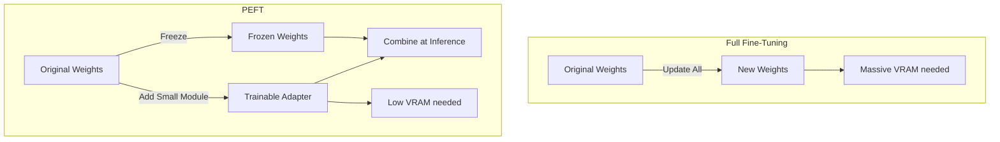
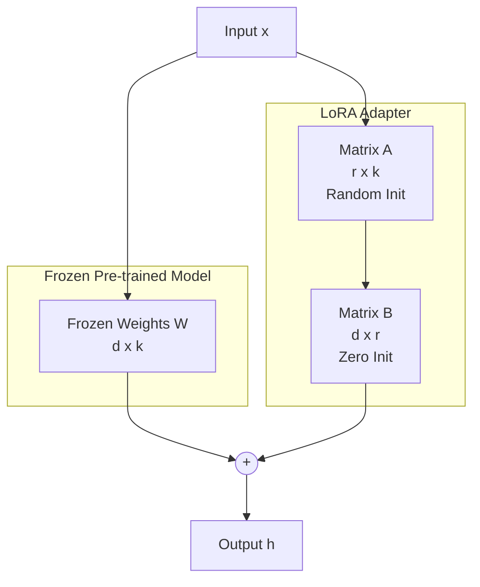
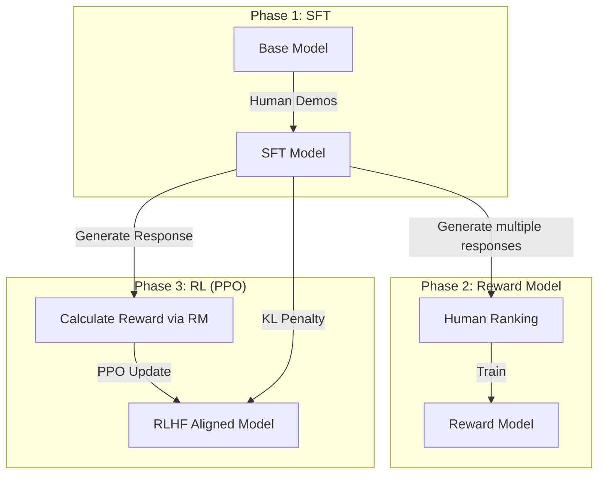

# Fine-Tuning & Model Adaptation — Interview Training Notes

## Table of Contents
- [Section 1: Fine-Tuning Fundamentals](#section-1-fine-tuning-fundamentals)
- [Section 2: Parameter-Efficient Methods](#section-2-parameter-efficient-methods)
- [Section 3: Alignment & RLHF](#section-3-alignment--rlhf)
- [Section 4: Data & Training](#section-4-data--training)
- [Section 5: Domain-Specific & Advanced](#section-5-domain-specific--advanced)
- [Section 6: Scenario Questions](#section-6-scenario-questions)

---

## Section 1: Fine-Tuning Fundamentals

---
### Q: What is fine-tuning, and when should you fine-tune an LLM?

**🎯 What the interviewer is testing:** Your understanding of when to adapt model weights vs. when to use cheaper/easier methods like prompt engineering or RAG.

**💬 How to answer:**
Fine-tuning is the process of taking a pre-trained language model and updating its internal weights by training it on a smaller, domain-specific, or task-specific dataset. This specializes the model's behavior, tone, or knowledge representation.

You should fine-tune an LLM when:
1. **You need to change the model's form or behavior:** You want the model to output a specific JSON schema reliably, mimic a specific persona, or follow a specialized conversational structure.
2. **The domain vocabulary is highly specialized:** The model lacks basic semantic understanding of your domain's jargon (e.g., niche legal or internal proprietary code languages).
3. **Prompt context limits are an issue:** You have too many examples or rules to fit into the prompt context window affordably or within latency budgets.
4. **Distillation is needed:** You want to train a smaller, cheaper model to match the performance of a larger model on a narrow task.

**🔗 Follow-ups the interviewer might ask:**
- *Does fine-tuning add new knowledge to the model?* → Generally, it's inefficient for injecting raw facts; RAG is better. Fine-tuning is for teaching the model *how* to use facts or *how* to behave.
- *How much data do you need?* → For simple behavioral changes (instruction tuning), 100-1,000 high-quality examples can suffice. For domain adaptation, 10,000+ examples might be needed.

**⚠️ Common mistakes:** Recommending fine-tuning just to teach the model a few new facts or up-to-date information, which is a classic anti-pattern (RAG is better suited for this).

**💡 What makes a great answer:** Emphasizing the distinction between "teaching a model what to know" (RAG) vs. "teaching a model how to act" (Fine-tuning).
---

---
### Q: How does fine-tuning work?

**🎯 What the interviewer is testing:** Deep understanding of the training loop and how weights are updated.

**💬 How to answer:**
Fine-tuning uses the same underlying mechanism as pre-training but on a targeted dataset. 
1. **Forward Pass:** Input data is passed through the network to generate predictions (logits).
2. **Loss Calculation:** The model calculates the difference between its prediction and the actual target (ground truth) using a loss function, typically Cross-Entropy Loss for next-token prediction.
3. **Backward Pass (Backpropagation):** The gradients of the loss with respect to all the model weights are calculated using the chain rule.
4. **Weight Update:** An optimizer (like AdamW) updates the model's weights in the direction that minimizes the loss, scaled by the learning rate.

In modern LLMs, we usually don't update all weights (Full Fine-Tuning) because it's too computationally expensive. Instead, we use Parameter-Efficient Fine-Tuning (PEFT) techniques like LoRA to update a small subset of weights.

**🔗 Follow-ups the interviewer might ask:**
- *What is the loss function?* → Usually Cross-Entropy Loss over the vocabulary for the generated tokens.
- *Do we calculate loss on the prompt?* → No, usually we only calculate loss on the *completion* tokens (response), not the instruction/prompt tokens.

**⚠️ Common mistakes:** Not understanding that the fundamental process (forward, backward, step) is exactly the same as pre-training, just on a different scale and dataset.

**💡 What makes a great answer:** Mentioning that you typically mask out the prompt tokens in the loss calculation during instruction tuning, so the model only learns to predict the answer, not the prompt.
---

---
### Q: When should you choose fine-tuning over RAG over prompt engineering?

**🎯 What the interviewer is testing:** Architectural decision-making and cost/performance trade-offs.

**💬 How to answer:**
I use a simple framework based on two axes: **Context Needed** (External Knowledge) and **Behavior Change** (Form/Tone).

1. **Prompt Engineering (Few-Shot):** The baseline. Use when the task is simple, the model already has the reasoning capabilities, and you just need to guide its output format. It's cheap and immediate.
2. **RAG (Retrieval-Augmented Generation):** Use when the model lacks facts, needs to access real-time data, or needs to synthesize information across massive, dynamic proprietary documents. RAG provides external memory.
3. **Fine-Tuning:** Use when the model needs to fundamentally change its behavior, adopt a very specific tone, learn a new dialect/syntax, or when few-shot examples take up too much context window (driving up latency and cost).
4. **RAG + Fine-Tuning:** The ultimate combination for enterprise systems. Fine-tune a smaller model to perfectly understand instructions and format outputs, while using RAG to supply the actual facts it reasons over.

| Method | Best For | Pros | Cons |
|---|---|---|---|
| Prompting | Simple tasks, quick prototyping | Zero training cost | Context limits, token costs |
| RAG | Dynamic facts, citations, proprietary data | No retraining, factual accuracy | Complex infra (vector DB), retrieval latency |
| Fine-Tuning | Tone, format, specialized vocabulary, edge deployment | Low inference cost, customized behavior | High upfront training cost, static knowledge |

**🔗 Follow-ups the interviewer might ask:**
- *If latency is the primary concern, which do you pick?* → Fine-tuning a smaller model. RAG adds retrieval latency and massive prompt sizes.

**⚠️ Common mistakes:** Treating RAG and Fine-Tuning as mutually exclusive competitors rather than complementary techniques.

**💡 What makes a great answer:** Recommending a hybrid approach (Fine-Tuning + RAG) and demonstrating that fine-tuning is for *form/behavior* while RAG is for *facts*.
---

---
### Q: What is the difference between SFT (Supervised Fine-Tuning) and alignment training?

**🎯 What the interviewer is testing:** Understanding the stages of post-training an LLM.

**💬 How to answer:**
Both are post-training steps, but they serve different purposes in shaping the model.

**Supervised Fine-Tuning (SFT)** is the first step. It teaches the model *how to interact*. We provide high-quality (Prompt, Response) pairs, and the model learns to map instructions to expected formats. It transforms a base model (which just predicts the next word on the internet) into a helpful assistant.
- **Data:** Human-written or synthesized high-quality demonstrations.
- **Objective:** Cross-entropy loss (predict the exact words in the target response).

**Alignment Training (e.g., RLHF, DPO)** comes after SFT. It teaches the model *what is desirable*. While SFT teaches it *how* to answer, Alignment teaches it to choose the *best, safest, and most helpful* answer among many possible valid ones.
- **Data:** Preference data (Prompt, Good Response, Bad Response).
- **Objective:** Maximize a reward score (RLHF) or directly optimize preferences (DPO).

**🔗 Follow-ups the interviewer might ask:**
- *Can you skip SFT and go straight to RLHF?* → It's very difficult. The model needs a baseline understanding of how to format answers (learned via SFT) before it can be effectively judged by a reward model.

**⚠️ Common mistakes:** Confusing SFT (which uses standard supervised learning) with RLHF (which uses reinforcement learning and preference modeling).

**💡 What makes a great answer:** Explaining that SFT creates a "capable" assistant, while Alignment creates a "safe and helpful" assistant.
---

## Section 2: Parameter-Efficient Methods

---
### Q: Explain the difference between full fine-tuning and parameter-efficient fine-tuning (PEFT).

**🎯 What the interviewer is testing:** Knowledge of computational constraints in deep learning and modern adaptation techniques.

**💬 How to answer:**
**Full Fine-Tuning** updates every single parameter (weight) in the neural network during backpropagation. 
- **Pros:** Maximum flexibility; can fundamentally alter the model's knowledge.
- **Cons:** Extremely expensive. You need massive VRAM to store the model weights, gradients, and optimizer states (usually 3-4x the model size). It's prone to catastrophic forgetting if not done carefully.

**Parameter-Efficient Fine-Tuning (PEFT)** freezes the pre-trained model weights and only trains a small number of extra, newly added parameters.
- **Pros:** Drastically reduces VRAM requirements (often by 90%+). You only store gradients and optimizer states for a tiny fraction of parameters. You can train a 7B model on a single consumer GPU. It also acts as a regularizer, preventing catastrophic forgetting.
- **Cons:** Might slightly underperform full fine-tuning on extremely complex, fundamental knowledge shifts.

**🔗 Follow-ups the interviewer might ask:**
- *What are examples of PEFT?* → LoRA, Prefix Tuning, Prompt Tuning.

**⚠️ Common mistakes:** Saying PEFT is strictly worse in performance. For many downstream tasks, PEFT matches or even slightly exceeds full fine-tuning because it prevents overfitting on small datasets.

**💡 What makes a great answer:** Mentioning that PEFT allows you to swap "adapters" at runtime. You can serve one giant base model and load different tiny PEFT modules per user/task without duplicating the base model in VRAM.
---

---
### Q: What is LoRA (Low-Rank Adaptation), and how does it work?

**🎯 What the interviewer is testing:** Mathematical intuition behind the most popular fine-tuning method.

**💬 How to answer:**
LoRA (Low-Rank Adaptation) is a PEFT technique that hypothesizes that the changes in weights during fine-tuning have a low "intrinsic rank"—meaning the necessary updates can be represented in a much lower-dimensional space.

Instead of updating the massive original weight matrix $W$, LoRA freezes $W$ and injects a trainable low-rank decomposition matrix into the layer.
The update $\Delta W$ is represented as the product of two smaller matrices: $A$ and $B$.

**The Math:**
$h = Wx + \Delta Wx = Wx + BAx$

Where:
- $W \in \mathbb{R}^{d \times k}$ is the frozen original weight matrix.
- $B \in \mathbb{R}^{d \times r}$ and $A \in \mathbb{R}^{r \times k}$ are the trainable LoRA matrices.
- $r$ is the rank (e.g., 8, 16, 64), where $r \ll \min(d, k)$.

Initially, $A$ is initialized with random Gaussian noise, and $B$ is initialized with zeros, so at step 0, $\Delta W = 0$ and the model behaves exactly like the base model.

**🔗 Follow-ups the interviewer might ask:**
- *Why initialize B with zeros?* → So the fine-tuning starts exactly from the pre-trained model's behavior, ensuring stability.
- *What layers do you apply LoRA to?* → Typically the Query and Value projection matrices in the self-attention mechanism, though applying it to all linear layers (including MLPs) is becoming standard.

**⚠️ Common mistakes:** Forgetting to mention the initialization trick (A random, B zero) which is crucial for training stability.

**💡 What makes a great answer:** Explaining that at inference time, $BA$ can be multiplied together and directly added to $W$ ($W_{new} = W + BA$), meaning LoRA adds **zero inference latency**.
---

---
### Q: What is QLoRA, and how does it enable fine-tuning on consumer hardware?

**🎯 What the interviewer is testing:** Hardware constraints, quantization, and cutting-edge fine-tuning optimizations.

**💬 How to answer:**
QLoRA (Quantized LoRA) pushes PEFT even further by aggressively quantizing the base model weights, allowing fine-tuning of large models on single consumer GPUs (like a 24GB RTX 3090 or 4090).

It combines LoRA with three key innovations:
1. **4-bit NormalFloat (NF4) Quantization:** The frozen base model weights are quantized down to a highly optimized 4-bit data type designed specifically for the normal distribution of neural network weights.
2. **Double Quantization:** It quantizes the quantization constants themselves, saving additional memory.
3. **Paged Optimizers:** Uses NVIDIA unified memory to page optimizer states to CPU RAM when VRAM spikes, preventing Out-Of-Memory (OOM) errors.

In QLoRA, the forward pass dequantizes the 4-bit weights to 16-bit (Brain Float 16 / bf16) on the fly for computation, while the LoRA adapters ($A$ and $B$) remain in 16-bit and are the only things being updated during backpropagation.

**🔗 Follow-ups the interviewer might ask:**
- *Does QLoRA degrade performance compared to LoRA?* → The authors demonstrated that 4-bit QLoRA achieves nearly identical performance to 16-bit full fine-tuning and 16-bit LoRA.

**⚠️ Common mistakes:** Thinking the LoRA adapters themselves are 4-bit. Only the frozen base model is 4-bit; the trainable adapters and the active compute are in bf16/fp16.

**💡 What makes a great answer:** Highlighting the memory math: A 7B model normally takes ~14GB just to load in fp16. In 4-bit, it takes ~3.5GB, leaving plenty of VRAM for activations, gradients, and optimizer states.
---

---
### Q: Explain Prefix Tuning and Prompt Tuning. How are they different from LoRA?

**🎯 What the interviewer is testing:** Breadth of knowledge across different PEFT techniques.

**💬 How to answer:**
Unlike LoRA, which injects weights into the internal linear layers of the network, Prefix and Prompt Tuning operate on the input or activation sequences.

- **Prompt Tuning:** We prepend a set of trainable "soft prompt" continuous embeddings to the input sequence. The entire LLM is frozen. Only these soft prompt vectors are updated via backpropagation. It's like having the model learn the mathematically perfect, continuous prompt.
- **Prefix Tuning:** Similar concept, but instead of just prepending embeddings at the input layer, it prepends trainable "prefix" activation vectors to the key and value matrices at *every single transformer layer*.

**Comparison to LoRA:**
- **Mechanism:** LoRA modifies weight matrices ($\Delta W$). Prompt/Prefix tuning modify the sequence length (adding virtual tokens).
- **Context Window:** Prompt/Prefix tuning consume sequence length (context window space), whereas LoRA does not.
- **Performance:** LoRA generally outperforms both and is more stable to train, which is why it has become the industry standard.

**🔗 Follow-ups the interviewer might ask:**
- *Are soft prompts human-readable?* → No, they are continuous vector embeddings, not discrete tokens in the vocabulary.

**⚠️ Common mistakes:** Confusing Prompt Tuning (updating continuous vectors via backprop) with Prompt Engineering (manually writing text).

**💡 What makes a great answer:** Noting that Prefix tuning consumes part of the valuable context window, giving LoRA a distinct architectural advantage.
---

---
### Q: What is adapter-based fine-tuning?

**🎯 What the interviewer is testing:** Historical context of PEFT.

**💬 How to answer:**
Adapter tuning was one of the earliest PEFT methods (Houlsby et al., 2019). It involves inserting small bottleneck feed-forward neural networks (adapters) *between* the existing layers of the frozen pre-trained model.

An adapter typically consists of a down-projection to a lower dimension, a non-linear activation, and an up-projection back to the original dimension. 

While effective at reducing trainable parameters, standard adapters introduce **inference latency** because they physically add new layers that the data must sequentially pass through. LoRA solved this by putting the low-rank matrices *parallel* to the existing weights, allowing them to be merged at inference time with zero latency cost.

**⚠️ Common mistakes:** Using "adapters" synonymously with "LoRA". While LoRA modules are often colloquially called adapters, classical Adapter architecture is structurally different (sequential vs. parallel).
---

---
### Q: How do you merge multiple LoRA adapters?

**🎯 What the interviewer is testing:** MLOps and production serving of fine-tuned models.

**💬 How to answer:**
Because LoRA operates by creating an additive matrix ($\Delta W = BA$), you can merge the adapter directly into the base weights via simple matrix addition:
$W_{merged} = W_{base} + B \cdot A$

If you have multiple LoRA adapters trained on different tasks (e.g., one for Python, one for SQL), you cannot blindly add them all without destroying the weights.
Techniques for multi-LoRA routing/merging include:
1. **Dynamic Swapping at Inference:** Don't merge. Keep the base model in GPU memory, and load/swap the tiny LoRA matrices per-request (e.g., using vLLM or LoRAX).
2. **Linear Interpolation (Task Arithmetic):** Average the adapters together with weights: $W = W_{base} + \alpha_1(B_1 A_1) + \alpha_2(B_2 A_2)$.
3. **Ties-Merging / SLERP:** Advanced weight merging techniques that resolve interference/sign conflicts between different adapters to create a single "super-adapter."

**💡 What makes a great answer:** Mentioning multi-LoRA serving frameworks (like vLLM) that batch requests dynamically by applying the correct LoRA adapter on the fly to a shared base model.
---

## Section 3: Alignment & RLHF

---
### Q: What is RLHF (Reinforcement Learning from Human Feedback), and how is it used to align LLMs?

**🎯 What the interviewer is testing:** Deep understanding of the standard alignment pipeline for modern LLMs (like ChatGPT).

**💬 How to answer:**
RLHF is a multi-step process used to align an LLM with human preferences (helpfulness, honesty, harmlessness) when the "correct" answer is subjective and hard to define via standard loss functions.

The pipeline consists of 3 phases:
1. **Supervised Fine-Tuning (SFT):** Train a base model on high-quality instruction-response pairs to learn basic interaction.
2. **Reward Model Training:** Take the SFT model, generate multiple responses for a single prompt, and have human labelers rank them from best to worst. Train a separate "Reward Model" (often a slightly smaller LLM) to take in a (Prompt, Response) pair and output a scalar reward score that mimics human preference.
3. **PPO (Proximal Policy Optimization):** Use Reinforcement Learning. The SFT model generates responses. The Reward Model scores them. PPO updates the SFT model's weights to maximize this reward. A KL-divergence penalty is added so the model doesn't drift too far from the original SFT model (preventing "reward hacking," like outputting gibberish that tricks the reward model).

**🔗 Follow-ups the interviewer might ask:**
- *What is the KL penalty for?* → To prevent mode collapse and reward hacking. If the model finds a weird phrase the reward model loves, it will exploit it. KL divergence forces the output distribution to stay close to the fluent SFT model.

**⚠️ Common mistakes:** Forgetting the Reward Model step. You don't use RL directly on human feedback; humans train the RM, and the RM provides the dense reward signals needed for PPO.

**💡 What makes a great answer:** Explaining that RLHF is being heavily supplanted by **DPO (Direct Preference Optimization)**, which bypasses the complex RM and PPO steps entirely by mathematically deriving a loss function directly from preference data.
---

---
### Q: What is instruction tuning, and why is it important for chat models?

**🎯 What the interviewer is testing:** Understanding the gap between pre-training and usability.

**💬 How to answer:**
Instruction tuning is the process of fine-tuning a base language model on datasets composed of instructions and their corresponding desired outputs. 

**Why it's important:**
A base pre-trained model (like Llama 3 Base) is simply a next-word predictor trained on internet text. If you prompt it with: *"Translate 'hello' to French"*, it might complete it with *"Translate 'goodbye' to Spanish"* because it thinks it's looking at a list of translation tasks on a webpage.

Instruction tuning breaks this habit. By training on formats like `<User> Do X \n <Assistant> Here is X`, the model learns to shift from being a "document completer" to a "helpful assistant" that follows zero-shot commands.

**💡 What makes a great answer:** Highlighting that instruction tuning also teaches the model specific prompt templates (like ChatML or Llama-3-instruct format), and that mixing system prompts, user prompts, and assistant responses requires careful masking of the loss function (so the model only trains on predicting the assistant's tokens).
---

---
### Q: What is RLAIF (RL from AI Feedback), and how does it differ from RLHF?

**🎯 What the interviewer is testing:** Awareness of scaling limits of human labeling and modern automation techniques.

**💬 How to answer:**
RLAIF replaces human labelers in the RLHF pipeline with a highly capable AI model (like GPT-4 or Claude 3.5 Sonnet).

**How it works:**
Instead of paying humans to rank responses to train the Reward Model, you prompt a frontier LLM with a rubric (e.g., "Which response is more helpful and less toxic? Explain your reasoning and choose A or B"). You use the AI's preferences to train the Reward Model (or use the AI directly as the reward model).

**Differences & Benefits:**
- **Cost and Speed:** Human labeling is incredibly expensive and slow. RLAIF is cheap and can generate millions of preference pairs overnight.
- **Consistency:** Humans suffer from fatigue and subjective disagreement. A well-prompted AI provides consistent evaluations based on the exact provided rubric.
- **Performance:** Studies (like from Anthropic/Constitutional AI) show RLAIF can match or even exceed human-level alignment, particularly on complex tasks where humans struggle to evaluate correctness (like complex coding).

**⚠️ Common mistakes:** Thinking RLAIF uses a "dumb" model. It requires a significantly more capable "teacher" model to evaluate the "student" model.
---

## Section 4: Data & Training

---
### Q: How do you prepare a dataset for fine-tuning an LLM?

**🎯 What the interviewer is testing:** Hands-on data engineering skills for AI.

**💬 How to answer:**
Data preparation is 90% of the work in fine-tuning. "Garbage in, garbage out" is strictly true here.

1. **Format Standardization:** Format the data into the exact chat template the base model expects (e.g., ShareGPT format, ChatML, or Llama-3 tokens).
2. **Data Cleaning:** 
   - Deduplicate inputs to prevent the model from memorizing exact phrasing.
   - Filter out toxic, irrelevant, or malformed data.
   - Fix formatting (e.g., broken markdown).
3. **Quality Filtering:** Use a stronger LLM as a judge to score the quality of the responses. Discard anything below a high threshold. 1,000 pristine examples beat 50,000 mediocre ones.
4. **Tokenization:** Pre-tokenize the dataset using the target model's specific tokenizer. 
5. **Loss Masking:** Crucially, set the labels for the prompt/instruction tokens to `-100` (in PyTorch) so the loss is only calculated on the assistant's generated response.
6. **Packing:** Concatenate multiple short sequences into a single max-length context window (e.g., 4096 tokens) separated by EOS tokens to maximize GPU utilization.

**🔗 Follow-ups the interviewer might ask:**
- *Why set prompt labels to -100?* → If you calculate loss on the user's prompt, the model is wasting gradient updates learning how to generate user questions, rather than focusing purely on answering them.

**💡 What makes a great answer:** Mentioning Sequence Packing and Loss Masking, which show you have actually implemented fine-tuning pipelines.
---

---
### Q: What is synthetic data generation, and how do you use it for fine-tuning?

**🎯 What the interviewer is testing:** Knowledge of modern techniques to overcome data scarcity.

**💬 How to answer:**
Synthetic data generation involves using a larger, highly capable "teacher" model (like GPT-4) to generate training data for a smaller "student" model.

**How to use it:**
1. **Seed Prompts:** Start with a small set of human-curated domain topics or tasks.
2. **Self-Instruct / Evol-Instruct:** Use the teacher model to generate hundreds of variations, increasing complexity and adding constraints (e.g., "Rewrite this prompt to make it harder").
3. **Response Generation:** Have the teacher model answer those prompts perfectly.
4. **Filtering/Verification:** Use another prompt or external tools (like executing generated code) to verify the synthetic data is correct.
5. **Fine-Tuning:** Train the small model on this synthetic dataset.

This is the exact methodology behind models like Alpaca, Vicuna, and modern open-source models like Llama 3 (which heavily utilized synthetic data for post-training).

**⚠️ Common mistakes:** Assuming synthetic data is perfectly clean. It often contains hallucinations or repetitive AI "tones" (e.g., "As an AI language model..."). Aggressive filtering is required.
---

---
### Q: What are the key hyperparameters for fine-tuning?

**🎯 What the interviewer is testing:** Intuition for debugging and optimizing training runs.

**💬 How to answer:**
1. **Learning Rate (LR):** The most critical. For LLM fine-tuning, it should be much smaller than pre-training. For LoRA, typically around `1e-4` or `2e-4`. For full fine-tuning, closer to `1e-5` to `2e-5`. Too high = catastrophic forgetting; too low = model learns nothing.
2. **Epochs:** Usually 1 to 3 epochs. LLMs overfit extremely quickly on small datasets. It's better to have more data and 1 epoch than small data and 10 epochs.
3. **Batch Size (and Gradient Accumulation):** The number of examples processed before a weight update. If limited by VRAM, you keep micro-batch size small (e.g., 1 or 2) and use Gradient Accumulation steps to simulate a larger effective batch size (e.g., 16 or 32) for stable gradients.
4. **LoRA Rank (r):** Controls the capacity of the adapter. $r=8$ or $r=16$ is standard for simple tasks. $r=64$ or $128$ for complex domain adaptation. Higher rank = more parameters = better capability but higher risk of overfitting.
5. **LoRA Alpha ($\alpha$):** A scaling factor for the LoRA adapter. Best practice is to set $\alpha = 2 \times r$.

**🔗 Follow-ups the interviewer might ask:**
- *What happens if your learning rate schedule has no warmup?* → The initial large gradient updates might destabilize the pre-trained weights, causing the loss to spike uncontrollably. Always use a cosine schedule with a warmup period (e.g., 10% of steps).
---

---
### Q: What is catastrophic forgetting, and how do you prevent it during fine-tuning?

**🎯 What the interviewer is testing:** Understanding of the fragility of neural networks.

**💬 How to answer:**
Catastrophic forgetting occurs when an LLM drastically loses its original pre-trained capabilities (like coding, reasoning, or general knowledge) while being fine-tuned on a new, specific task. The new gradient updates overwrite the old knowledge representations.

**How to prevent it:**
1. **Use PEFT (LoRA):** Because the base weights are frozen, the original knowledge remains largely intact. The adapter only *steers* the model.
2. **Lower the Learning Rate:** Ensure weight updates are gentle.
3. **Data Mixing / Replay:** Mix a small percentage (e.g., 5-10%) of general-purpose pre-training or instruction data into your domain-specific dataset. This forces the model to remember general capabilities while learning the new domain.
4. **Early Stopping / Fewer Epochs:** Monitor evaluation metrics on general tasks and stop training before the model overfits the target domain.

**💡 What makes a great answer:** Bringing up Data Mixing as the most robust solution for Full Fine-Tuning. 
---

---
### Q: What is continual pre-training, and when would you use it?

**🎯 What the interviewer is testing:** Knowing the difference between SFT and injecting core knowledge.

**💬 How to answer:**
Continual pre-training (or Domain-Adaptive Pretraining - DAPT) happens before instruction tuning. You take a base model and resume standard causal language modeling (next-token prediction) on a massive corpus of unstructured domain-specific text (e.g., millions of legal documents or proprietary code).

**When to use it:**
You use it when the base model lacks the fundamental vocabulary, syntax, or foundational concepts of your domain. 

For example, BloombergGPT used continual pre-training on financial documents. If you just used SFT on Q&A pairs, the model wouldn't understand complex financial jargon deeply. Continual pre-training builds the semantic foundation; SFT later shapes it into an assistant.

**⚠️ Common mistakes:** Confusing SFT (which requires formatted Q&A pairs) with continual pre-training (which just requires raw, unstructured text).
---

## Section 5: Domain-Specific & Advanced

---
### Q: How do you fine-tune a model for a specific domain (legal, medical, finance)?

**🎯 What the interviewer is testing:** End-to-end architecture design for domain adaptation.

**💬 How to answer:**
Domain adaptation is a multi-stage process. 

1. **Evaluate the Base Model:** Does it already know the vocabulary? If not, perform **Continual Pre-training** on raw, unstructured domain documents (e.g., PubMed, SEC filings).
2. **Supervised Fine-Tuning (SFT):** Curate high-quality instruction-response pairs specific to the domain. Ensure medical/legal experts review the data. Use LoRA to fine-tune on this dataset to teach the model how to format diagnoses or legal summaries.
3. **Knowledge Injection via RAG:** Fine-tuning shouldn't memorize specific case laws or patient records. I would pair the fine-tuned model with a RAG system that retrieves the most up-to-date legal codes or patient history at inference time.
4. **Alignment:** Use DPO or RLHF with domain experts rating the outputs to ensure the model doesn't give dangerous medical advice (harmlessness).

**💡 What makes a great answer:** Recognizing that fine-tuning alone is dangerous in high-stakes domains (legal hallucinations). The best approach is fine-tuning for *domain reasoning/tone* + RAG for *factual grounding*.
---

---
### Q: How do you evaluate a fine-tuned model's performance?

**🎯 What the interviewer is testing:** Rigor in ML validation and preventing regressions.

**💬 How to answer:**
Evaluating generative models is notoriously hard. I use a multi-tiered approach:

1. **Automated Benchmarks:** Run standard benchmarks (MMLU, HumanEval) to ensure the model hasn't suffered catastrophic forgetting of general knowledge.
2. **Domain-Specific Holdout Set:** Evaluate on a test set from the fine-tuning data domain. Look at metrics like Perplexity or exact match (for rigid formatting).
3. **LLM-as-a-Judge:** Use a powerful model like GPT-4 as an automated evaluator. Pass the prompt, the fine-tuned model's answer, and a grading rubric, and ask GPT-4 to score the response on a scale of 1-5 for accuracy, tone, and formatting.
4. **Human Evaluation (A/B Testing):** The gold standard. Have domain experts blindly rate side-by-side outputs from the base model and the fine-tuned model.

**⚠️ Common mistakes:** Relying solely on training loss or BLEU/ROUGE scores. Generative text rarely matches exact strings, making traditional NLP metrics nearly useless for chat models.

**💡 What makes a great answer:** Mentioning "LLM-as-a-Judge" and establishing that you must test for both *improvement on the target task* AND *lack of regression on general tasks*.
---

---
### Q: What is knowledge distillation for fine-tuning, and what are the legal considerations?

**🎯 What the interviewer is testing:** Advanced cost-saving architectures and compliance awareness.

**💬 How to answer:**
Knowledge distillation is the process of transferring knowledge from a massive, expensive "teacher" model (like GPT-4) to a smaller, cheaper "student" model (like Llama-3-8B).

In the context of fine-tuning, this usually means generating massive amounts of synthetic instruction data using the teacher model, and then running SFT on the student model using that data.

**Legal/TOS Considerations:**
Almost all closed-source API providers (OpenAI, Anthropic, Google) explicitly state in their Terms of Service that you **cannot use their outputs to train a competing model**. If you use GPT-4 to generate a dataset to fine-tune Llama 3 for commercial use, you are technically violating OpenAI's TOS. Open-weight models (like using Llama-3-70B to train Llama-3-8B) are generally safer, but license terms must still be reviewed.

**💡 What makes a great answer:** Bringing up the Terms of Service proactively shows maturity and enterprise readiness.
---

## Section 6: Scenario Questions

---
### Q: Your fine-tuned LLM produces factually wrong outputs due to training data quality issues. How do you fix it?

**🎯 What's being tested:** Debugging data pipelines and root cause analysis.

**💬 How to approach this:**
1. **Diagnose first:** Identify the specific hallucinations. Are they random gibberish, or is the model confidently repeating a specific error?
2. **Root causes:** 
   - Dirty training data (the model literally learned the wrong fact).
   - Conflicting data (the dataset has two different answers for the same prompt).
   - Hallucination extrapolation (the model is guessing facts to match a tone).
3. **Solutions:**
   - Implement programmatic data filtering. Use embedding clustering to find conflicting Q&A pairs in the dataset.
   - Use "LLM-as-a-Judge" to score the factual accuracy of the training dataset against a trusted source, and drop data below a threshold.
4. **Prevention:** Shift facts out of the fine-tuning weights entirely. Rely on RAG for facts and only use fine-tuning for behavior.

**⚠️ Trap to avoid:** Suggesting just training for more epochs or changing the learning rate. Factuality is a data problem, not a hyperparameter problem.
---

---
### Q: You must choose between LoRA and full fine-tuning for a domain-specific assistant. How do you decide?

**🎯 What's being tested:** Engineering trade-offs.

**💬 How to approach this:**
I would evaluate based on Data Volume, Hardware, and Domain Complexity.

1. **Start with LoRA:** Always the default. It's cheaper, faster, and prevents catastrophic forgetting. I'd set $r=64$ or $128$ for domain adaptation.
2. **Switch to Full Fine-Tuning IF:**
   - I have a massive dataset (millions of tokens).
   - The task requires fundamental shifts in language understanding (e.g., training a model to understand a highly proprietary machine code or a totally different human language).
   - We have the massive GPU clusters required (multiple A100s/H100s) and the budget to support it.

*Summary Table:*

| Factor | LoRA | Full Fine-Tuning |
|---|---|---|
| Hardware needed | Low (1-2 consumer GPUs) | High (Multi-GPU clusters) |
| Catastrophic Forgetting | Low risk | High risk (requires data mixing) |
| Speed | Fast | Slow |
| Best For | Tone, formatting, minor domain shifts | Fundamental knowledge injection, new languages |

**💡 Pro tip:** Mention that almost all modern open-source instruct models are created using full fine-tuning, but for enterprise applications, LoRA is sufficient 95% of the time.
---

---
### Q: Your fine-tuned model memorized training data verbatim instead of learning patterns. How do you fix overfitting?

**🎯 What's being tested:** Understanding of overfitting in deep learning.

**💬 How to approach this:**
1. **Diagnose first:** Check the training and validation loss curves. If training loss goes to near zero while validation loss spikes, the model has memorized the data.
2. **Root causes:** Too many epochs, learning rate too high, or dataset too small/repetitive.
3. **Solutions:**
   - **Reduce Epochs:** LLMs overfit fast. Drop training down to 1 or 2 epochs.
   - **Increase Dropout:** Add LoRA dropout (e.g., 0.05 or 0.1) to regularize the weights.
   - **Data Augmentation:** Diversify the dataset. Use an LLM to rewrite the prompts in different styles so the model learns the *concept*, not the exact string.
   - **Lower LoRA Rank:** If using LoRA, lower the rank $r$ to restrict the capacity of the adapter, forcing it to generalize.

**⚠️ Trap to avoid:** Ignoring the dataset size. If you have 50 examples, the model *will* memorize them. You need more data.
---

---
### Q: Your fine-tuned LLM forgot its general capabilities after domain-specific fine-tuning. How do you fix catastrophic forgetting?

**🎯 What's being tested:** Mitigation strategies for model degradation.

**💬 How to approach this:**
1. **Diagnose first:** Run a general benchmark (like MMLU) on the base model and the fine-tuned model to quantify the exact degradation.
2. **Root causes:** Full fine-tuning without regularization, learning rate too high, or training only on narrow domain data.
3. **Solutions:**
   - **Switch to LoRA:** If doing full fine-tuning, switch to PEFT. Freezing the base weights inherently protects general knowledge.
   - **Data Mixing (Replay):** If full fine-tuning is required, inject 10-20% of high-quality general instruction data (like the ShareGPT or WizardLM datasets) into the domain dataset.
   - **Decrease Learning Rate:** A smaller learning rate prevents aggressive overwriting of the base weights.

**💡 Pro tip:** Mention "Task Arithmetic" or LoRA merging—you can train a domain adapter, and then blend it back into the base model at a partial weight (e.g., 50%) to soften the degradation.
---

---
### Q: Your RLHF preference data has low annotator agreement. How do you ensure data quality?

**🎯 What's being tested:** Managing human-in-the-loop ML systems.

**💬 How to approach this:**
1. **Diagnose first:** Calculate the inter-annotator agreement (e.g., Cohen's Kappa). Identify *which* specific prompts cause the most disagreement.
2. **Root causes:** Subjective tasks (e.g., "be funny"), ambiguous rubrics, or lack of domain expertise (e.g., average annotators judging Python code).
3. **Solutions:**
   - **Refine the Rubric:** Provide highly specific guidelines. Instead of "Which is better?", use "Which is more concise and avoids hallucinations?"
   - **Multi-Annotator Consensus:** Have 3 annotators score difficult prompts and take the majority vote.
   - **Switch to RLAIF:** Replace subjective humans with an AI judge given a strict, explicit rubric to ensure absolute consistency.
4. **Prevention:** Discard data with high variance. Training a reward model on noisy, contradictory data will cause it to collapse to the mean.

**⚠️ Trap to avoid:** Assuming humans are always a perfect gold standard. Humans are noisy and contradictory.
---
