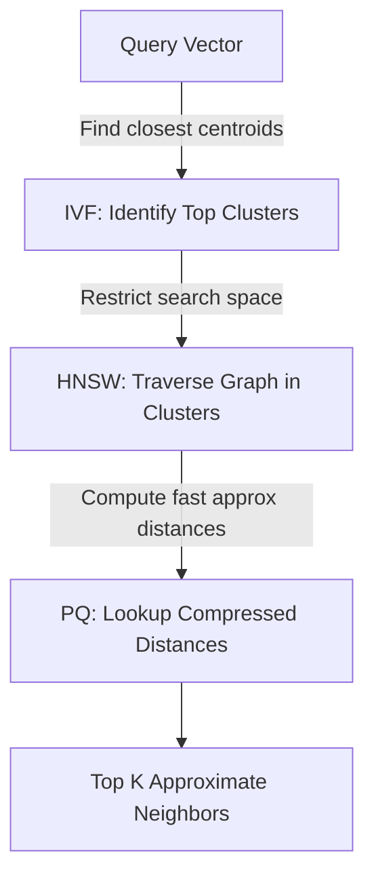
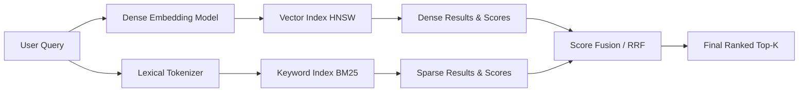

# Vector Databases & Embeddings — Interview Training Notes

## Table of Contents
1. [Section 1: Embedding Fundamentals](#section-1-embedding-fundamentals)
2. [Section 2: Similarity & Search](#section-2-similarity--search)
3. [Section 3: Vector Database Architecture](#section-3-vector-database-architecture)
4. [Section 4: Embedding Model Selection & Tuning](#section-4-embedding-model-selection--tuning)
5. [Section 5: Scenario Questions](#section-5-scenario-questions)

---

## Section 1: Embedding Fundamentals

---
### Q: What are embeddings in the context of AI engineering?

**🎯 What the interviewer is testing:** Understanding of semantic representation and vector space mapping.

**💬 How to answer:**
Embeddings are numerical representations of data—typically text, images, or audio—mapped into a high-dimensional continuous vector space. The core idea is that data with similar semantic meanings will be located close to each other in this space.

In an AI engineering context, embeddings serve as the bridge between raw, unstructured data and machine learning algorithms. Instead of relying on exact keyword matching, embeddings capture the contextual meaning of words or sentences. For example, "dog" and "puppy" will have similar embedding vectors, allowing a system to understand their relationship even if the exact strings don't match. They are fundamental for retrieval-augmented generation (RAG), recommendation systems, and semantic search.

**🔗 Follow-ups the interviewer might ask:**
- Can embeddings capture opposite meanings? → Yes, though antonyms often appear close because they share similar contexts. Modern contrastive learning helps separate them better.
- How do embeddings differ from one-hot encoding? → One-hot encoding is sparse, high-dimensional, and orthogonal (doesn't capture meaning/relationships), while embeddings are dense and capture semantic similarity.

**⚠️ Common mistakes:** Explaining embeddings purely as "arrays of numbers" without emphasizing the semantic mapping and distance properties.

**💡 What makes a great answer:** Highlighting that embeddings map concepts into a latent space where mathematical operations (like distance calculations) translate to semantic relationships.

---
### Q: How do embedding models convert text to vectors?

**🎯 What the interviewer is testing:** Knowledge of the internal mechanics of transformer-based encoding.

**💬 How to answer:**
Embedding models, specifically modern Transformer-based ones like BERT or text-embedding-ada-002, convert text to vectors through a sequence of steps:
1. **Tokenization:** The input text is split into tokens (sub-words or words) using algorithms like Byte-Pair Encoding (BPE) or WordPiece.
2. **Initial Embeddings:** Each token is mapped to an initial dense vector from a learned vocabulary matrix, and positional encodings are added to retain word order context.
3. **Contextualization:** The tokens pass through multiple layers of multi-head self-attention mechanisms. Each token's vector is updated by aggregating information from all other tokens in the sequence, allowing it to capture context (e.g., "bank" of a river vs. financial "bank").
4. **Pooling:** Finally, the sequence of contextualized token vectors is aggregated into a single vector representing the entire text. This is typically done via Mean Pooling (averaging the vectors) or taking the vector of a special `[CLS]` token.

**🔗 Follow-ups the interviewer might ask:**
- Why is pooling necessary? → Transformer layers output a vector for *every* token. To compare whole sentences, we need a single fixed-size representation.
- What's the context window limit? → Transformer attention scales quadratically with sequence length, so models enforce a maximum token limit (e.g., 512 for BERT, 8192 for modern OpenAI models).

**⚠️ Common mistakes:** Confusing the generation process of an LLM with the encoding process of an embedding model.

**💡 What makes a great answer:** Specifically mentioning the role of self-attention in capturing context and the final pooling step to create a fixed-size vector.

---
### Q: What is the difference between sparse and dense embeddings?

**🎯 What the interviewer is testing:** Understanding of different representation formats and their search paradigms.

**💬 How to answer:**
The difference lies in their dimensionality, sparsity, and what they represent:

- **Sparse Embeddings (e.g., TF-IDF, BM25, SPLADE):**
  - **Structure:** Very high dimensional (often matching the vocabulary size, e.g., 50k+ dimensions), but most values are exactly zero.
  - **Mechanism:** They capture exact lexical matches. Each dimension corresponds to a specific token or term.
  - **Strengths:** Excellent for exact keyword matching, out-of-vocabulary terms, acronyms, and rare names. 
  - **Weaknesses:** Cannot capture synonyms or semantic intent.

- **Dense Embeddings (e.g., OpenAI embeddings, BERT, sentence-transformers):**
  - **Structure:** Lower dimensional (typically 384 to 3072 dimensions) where almost all values are non-zero (dense).
  - **Mechanism:** They capture semantic meaning. Each dimension represents an abstract, learned latent feature.
  - **Strengths:** Excellent for semantic search, capturing intent, and finding conceptually similar content even with zero word overlap.
  - **Weaknesses:** Struggle with exact keyword searches, specific product codes, or rare names.

**🔗 Follow-ups the interviewer might ask:**
- When would you use sparse over dense? → When searching across specific identifiers, part numbers, or when keyword precision is paramount.
- Can they be combined? → Yes, in Hybrid Search, which merges the scores from both approaches.

**⚠️ Common mistakes:** Assuming dense embeddings are always superior to sparse embeddings.

**💡 What makes a great answer:** Recognizing that sparse representations are still heavily used in production systems (like BM25 in Elasticsearch) and highlighting how they complement dense vectors.

---
### Q: What is embedding dimensionality, and how does it affect performance and cost?

**🎯 What the interviewer is testing:** Trade-off analysis in system design.

**💬 How to answer:**
Dimensionality refers to the number of floating-point values in a single embedding vector (e.g., 384, 768, 1536). It dictates the "resolution" of the semantic space.

Dimensionality heavily impacts both performance and cost:
1. **Information Capacity:** Higher dimensions capture more nuanced semantic relationships, generally leading to better recall and precision for complex queries.
2. **Storage Costs:** A 1536-dimensional float32 vector requires ~6KB of memory. Scaling to 100 million vectors requires ~600GB of RAM just for the raw vectors, significantly increasing hosting costs.
3. **Compute Performance:** Distance calculations (like dot product) scale linearly with dimensionality. Higher dimensions mean higher latency and lower QPS (queries per second) during search.

We often use techniques like Matryoshka Representation Learning (MRL) or dimensionality reduction (PCA) to shrink vectors (e.g., from 1536 to 256) while retaining 90%+ of the semantic performance, drastically cutting costs.

**🔗 Follow-ups the interviewer might ask:**
- How does dimensionality impact the "curse of dimensionality"? → In extremely high dimensions, the distance between all points tends to become uniform, making nearest-neighbor search less effective.
- What data type is typically used? → Float32, but Float16 or Int8 quantization are increasingly used to save space.

**⚠️ Common mistakes:** Believing higher dimensions always yield linearly better results without acknowledging the diminishing returns and exponential cost increases.

**💡 What makes a great answer:** Mentioning modern techniques like Matryoshka embeddings or quantization to mitigate the cost of high-dimensional vectors.

---
### Q: What are multi-modal embeddings, and how are they generated?

**🎯 What the interviewer is testing:** Knowledge of advanced representation learning beyond just text.

**💬 How to answer:**
Multi-modal embeddings map data from different modalities—such as text, images, and audio—into a single, shared vector space. This allows you to perform cross-modal search, like using a text query to find a matching image, or vice versa.

They are generated using contrastive learning models like CLIP (Contrastive Language-Image Pretraining). 
The generation process involves:
1. **Separate Encoders:** The model uses specialized encoders for each modality. For example, a Vision Transformer (ViT) processes images, while a text Transformer processes captions.
2. **Projection:** The outputs of these separate encoders are projected into the same dimensional space.
3. **Contrastive Loss:** During training, the model is fed matching pairs (e.g., an image of a dog and the text "a dog") and non-matching pairs. The contrastive loss function pushes the embeddings of matching pairs closer together (high cosine similarity) and pulls non-matching pairs apart.

**🔗 Follow-ups the interviewer might ask:**
- How do you use multi-modal embeddings in production? → By embedding product images and descriptions into the same space to power unified search or image-to-image recommendation engines.

**⚠️ Common mistakes:** Thinking a single transformer processes both image and text simultaneously in standard multi-modal embeddings, rather than using dual encoders mapped to a joint space.

**💡 What makes a great answer:** Specifically citing CLIP and explaining the mechanism of contrastive loss pushing cross-modal pairs together in the latent space.

---

## Section 2: Similarity & Search

---
### Q: Explain cosine similarity, dot product, and Euclidean distance for vector search. (Include formulas and when to use each)

**🎯 What the interviewer is testing:** Mathematical intuition behind vector search metrics.

**💬 How to answer:**
These are the three primary distance metrics used to determine how "close" two vectors ($A$ and $B$) are in the latent space.

**1. Dot Product (Inner Product):**
- **Formula:** $A \cdot B = \sum_{i=1}^{n} A_i B_i$
- **What it measures:** The unnormalized projection of one vector onto another. It accounts for both the angle and the magnitude of the vectors.
- **When to use:** Preferred when vector magnitude holds semantic meaning (e.g., a longer vector implies higher confidence or importance). It's also the fastest to compute, making it ideal if vectors are already normalized.

**2. Cosine Similarity:**
- **Formula:** $\cos(\theta) = \frac{A \cdot B}{\|A\| \|B\|}$
- **What it measures:** The cosine of the angle between two vectors, ignoring their magnitudes. It ranges from -1 (opposite) to 1 (identical direction).
- **When to use:** Use when only the direction of the vector matters, not its length. Often the default for text embeddings (like OpenAI's) because document length shouldn't disproportionately skew similarity. *Note: If vectors are L2-normalized ($\|A\| = 1$), Cosine Similarity is mathematically equivalent to the Dot Product.*

**3. Euclidean Distance (L2 Distance):**
- **Formula:** $d(A, B) = \sqrt{\sum_{i=1}^{n} (A_i - B_i)^2}$
- **What it measures:** The straight-line spatial distance between the endpoints of two vectors.
- **When to use:** When the absolute spatial position in the latent space matters. Rarely used for standard NLP embeddings but common in computer vision and continuous feature spaces.

**🔗 Follow-ups the interviewer might ask:**
- If OpenAI embeddings are already normalized, which should you use? → Dot product, because it's computationally cheaper and yields the exact same ranking as cosine similarity for normalized vectors.

**⚠️ Common mistakes:** Failing to explain that cosine similarity ignores magnitude, or not knowing that dot product and cosine similarity are identical for normalized vectors.

**💡 What makes a great answer:** Highlighting the computational efficiency of dot product and how normalization allows you to use it as a drop-in replacement for cosine similarity.

---
### Q: How does Approximate Nearest Neighbor (ANN) search work? (Cover HNSW, IVF, PQ)

**🎯 What the interviewer is testing:** Deep understanding of how vector search scales sub-linearly.

**💬 How to answer:**
Exact Nearest Neighbor (k-NN) compares a query vector against every single vector in the database ($O(N)$), which is unscalable for millions of vectors. Approximate Nearest Neighbor (ANN) trades a tiny bit of accuracy for massive speedups by narrowing down the search space. 

There are three primary techniques used to achieve this:

1. **HNSW (Hierarchical Navigable Small World):**
   - **How it works:** A graph-based approach. It builds multiple layers of graphs. The top layer has few nodes and long links (like highways). Bottom layers have dense nodes and short links (like local roads).
   - **Search:** A query enters the top layer, greedily navigates to the closest node, drops down to the next layer, and repeats until it hits the bottom. It provides incredible search speed and high recall but consumes a lot of memory.

2. **IVF (Inverted File Index):**
   - **How it works:** A clustering approach. The vector space is divided into Voronoi cells (clusters) using k-means, and each cluster has a centroid. 
   - **Search:** The query is compared only to the centroids. The search then only scans the vectors inside the top $n$ closest clusters (called `nprobe`). It drastically reduces the search space.

3. **PQ (Product Quantization):**
   - **How it works:** A compression technique. It splits high-dimensional vectors into smaller sub-vectors, runs clustering on the sub-vectors, and replaces them with a short ID representing the closest centroid.
   - **Search:** Distances are approximated using a lookup table of centroid distances. It massively reduces memory footprint and speeds up computation.

**ANN Search Process Diagram:**

*(Modern vector DBs often combine these, e.g., IVF-PQ or HNSW-PQ).*

**🔗 Follow-ups the interviewer might ask:**
- What is the main tradeoff in HNSW? → Memory consumption. The graph edges take up massive amounts of RAM, often more than the vectors themselves.

**⚠️ Common mistakes:** Describing ANN as just "indexing" without being able to articulate the mechanics of HNSW or IVF.

**💡 What makes a great answer:** Explaining how these techniques are composable (e.g., using PQ to compress vectors in memory, while using HNSW to navigate them quickly).

---
### Q: What is hybrid search (combining keyword search with vector search)?

**🎯 What the interviewer is testing:** Understanding of real-world search pipelines and combining scoring mechanisms.

**💬 How to answer:**
Hybrid search bridges the gap between exact keyword matching (sparse retrieval) and semantic understanding (dense retrieval). 

Dense vector search is great for conceptual similarity but often fails at finding specific nouns, IDs, or exact acronyms. Sparse search (like BM25) excels at exact matches but fails at synonyms. Hybrid search runs both searches concurrently and fuses their results.

**How it works:**
1. **Parallel Execution:** A user query is sent to both a dense vector index (using ANN) and a sparse lexical index (using BM25/TF-IDF).
2. **Score Normalization:** Because vector distances (e.g., 0.82) and BM25 scores (e.g., 14.5) are on entirely different scales, they must be normalized into a comparable range (e.g., 0 to 1).
3. **Reciprocal Rank Fusion (RRF) or Convex Combination:** 
   - *Convex Combination:* A weighted sum of the normalized scores: `Final_Score = (alpha * Dense_Score) + ((1 - alpha) * Sparse_Score)`.
   - *RRF:* Ranks documents based on their positional rank in both lists rather than their raw scores, which requires no score normalization. `Score = 1 / (k + rank_dense) + 1 / (k + rank_sparse)`.

**Hybrid Search Pipeline:**

**🔗 Follow-ups the interviewer might ask:**
- How do you tune the alpha parameter? → Through rigorous offline evaluation (NDCG/Recall) on a golden dataset of user queries, optimizing for the specific domain.

**⚠️ Common mistakes:** Assuming you can just add a BM25 score to a Cosine Similarity score without normalization or rank fusion.

**💡 What makes a great answer:** Explicitly mentioning Reciprocal Rank Fusion (RRF) as a robust, parameter-free way to merge disparate scoring systems.

---

## Section 3: Vector Database Architecture

---
### Q: What is a vector database, and how does it differ from a traditional database?

**🎯 What the interviewer is testing:** Architectural understanding of vector-native data stores vs. relational/NoSQL stores.

**💬 How to answer:**
A vector database is a specialized data store engineered to store, manage, and query high-dimensional embeddings efficiently. 

While traditional databases (RDBMS/NoSQL) optimize for CRUD operations and exact match/range queries on structured data using B-Trees or Hash Indexes, vector databases optimize for **similarity search** on unstructured data.

Key differences:
1. **Query Paradigm:** Traditional DBs search for exact matches (`WHERE id = 5`). Vector DBs search for approximate nearest neighbors based on distance metrics (`ORDER BY vector <-> query LIMIT 10`).
2. **Indexing Strategy:** Traditional DBs use B-Trees. Vector DBs use specialized ANN algorithms like HNSW, IVF, and PQ.
3. **Hardware Utilization:** Vector DBs are extremely RAM-heavy because ANN graphs (like HNSW) must largely reside in memory for fast traversal. They also heavily leverage SIMD (Single Instruction, Multiple Data) or GPUs for accelerated matrix math.

**Comparison of Popular Vector DBs:**
| Feature | Pinecone | Weaviate | Qdrant | Milvus | ChromaDB | pgvector |
| :--- | :--- | :--- | :--- | :--- | :--- | :--- |
| **Architecture** | SaaS only | Open-source/Cloud | Open-source/Cloud | Distributed/Cloud | Local/Embedded | Postgres Ext. |
| **Primary Language** | Proprietary | Go | Rust | Go/C++ | Python/TS | C |
| **Best For** | Zero-ops scale | Hybrid search | High perf/Rust devs | Massive enterprise scale | Local dev/Prototypes | Existing Postgres stacks |

**Vector Database Architecture Diagram:**

**🔗 Follow-ups the interviewer might ask:**
- Why use pgvector over a dedicated vector DB? → If your stack is already heavily reliant on PostgreSQL, keeping vectors alongside relational data simplifies architecture and ensures strict ACID compliance, though it may not scale to billions of vectors as well as Milvus.

**⚠️ Common mistakes:** Claiming traditional databases can't store arrays. They can, but they can't natively perform sub-linear similarity searches on them.

**💡 What makes a great answer:** Highlighting the memory architecture (RAM dependence) and providing a balanced view of when to use a dedicated vector DB vs. an extension like pgvector.

---
### Q: What is the role of metadata in vector databases?

**🎯 What the interviewer is testing:** Practical knowledge of building production-ready search systems.

**💬 How to answer:**
Metadata is structured, key-value data attached to a vector payload (e.g., `document_id`, `author`, `timestamp`, `category`). In production, semantic similarity alone is rarely enough; users need to restrict the search space based on business logic.

Metadata enables **Filtered Vector Search**. There are three ways vector DBs handle this:
1. **Post-filtering:** Perform the vector search first to get Top-K, then filter out results that don't match the metadata. *Problem:* If all Top-K results are filtered out, you return zero results.
2. **Pre-filtering:** Filter the metadata first to get a subset of valid IDs, then perform vector search on that subset. *Problem:* If the filter is too restrictive, traversing the HNSW graph breaks because the remaining nodes are too disconnected.
3. **Single-Stage Filtering (Custom filtering):** The standard in modern Vector DBs (like Qdrant or Pinecone). The ANN traversal and metadata filtering happen simultaneously. The algorithm traverses the graph but only evaluates and collects nodes that satisfy the metadata payload criteria.

**🔗 Follow-ups the interviewer might ask:**
- How do you manage metadata indexing? → Vector DBs maintain inverted indexes (like a traditional DB) alongside the HNSW graph to rapidly evaluate metadata predicates during traversal.

**⚠️ Common mistakes:** Not understanding why post-filtering leads to "empty result" bugs in production.

**💡 What makes a great answer:** Clearly explaining the differences between pre, post, and single-stage filtering, and identifying single-stage as the production standard.

---
### Q: How do you index and query multi-tenant data in a vector database?

**🎯 What the interviewer is testing:** SaaS architecture and data isolation patterns.

**💬 How to answer:**
Multi-tenancy ensures that User A's queries only search User A's data, with zero risk of data leakage. There are three main strategies:

1. **Namespace / Collection Isolation (Physical/Logical Separation):**
   - Each tenant gets their own dedicated namespace or index. 
   - *Pros:* Perfect isolation, easy to drop a tenant's data.
   - *Cons:* Terrible resource utilization. HNSW graphs have high fixed memory overhead. Creating 10,000 collections for 10,000 users will crash the database due to memory exhaustion.

2. **Metadata Filtering (Shared Index):**
   - All tenants share a single large index. Every vector is tagged with a `tenant_id` in its metadata. Queries must include a strict pre-filter: `WHERE tenant_id = 'A'`.
   - *Pros:* Excellent resource efficiency.
   - *Cons:* Graph traversal can become highly inefficient if a single tenant's data is vastly distributed across a massive global graph.

3. **Partitioning / Multi-tenant native features (The best approach):**
   - Modern DBs (like Qdrant's payload-based partitioning or Pinecone's metadata indexing) natively support multi-tenancy. They logically partition the HNSW graph based on a partition key (e.g., `tenant_id`). The system maintains small, efficient sub-graphs for each tenant within a unified infrastructure.

**🔗 Follow-ups the interviewer might ask:**
- What if Tenant A has 1M vectors and Tenant B has 10? → A pure shared index with metadata filtering might suffer from the "noisy neighbor" problem. Partitioning solves this.

**⚠️ Common mistakes:** Suggesting creating a separate collection/index for every single user without understanding the massive RAM overhead of HNSW graphs.

**💡 What makes a great answer:** Recognizing the RAM overhead of collections and advocating for native partitioning or optimized metadata filtering for SaaS multi-tenancy.

---
### Q: What is quantization of embeddings, and how does it reduce storage costs?

**🎯 What the interviewer is testing:** Knowledge of memory optimization techniques for vector scaling.

**💬 How to answer:**
Quantization is a lossy compression technique used to reduce the memory footprint and increase the retrieval speed of high-dimensional embeddings.

Vectors are typically output as 32-bit floats (`fp32`). A 1536-dimensional vector takes ~6KB. Quantization reduces the precision of these numbers.

1. **Scalar Quantization (SQ):** 
   - Converts `fp32` (32 bits) to `int8` (8 bits) or `binary` (1 bit).
   - It identifies the min/max values of the vector distribution and maps the floats into 256 discrete integer buckets.
   - *Impact:* Reduces RAM usage by 4x. Often retains 95%+ of search accuracy.
2. **Product Quantization (PQ):** 
   - Splits the vector into sub-vectors (e.g., 1536 dims split into 96 chunks of 16 dims).
   - It runs clustering on these chunks and replaces the sub-vector with the ID of the nearest cluster centroid (typically a 1-byte ID).
   - *Impact:* Can reduce RAM usage by up to 97%, at a higher cost to accuracy.

By reducing the vector size, more vectors fit into RAM, reducing the need for costly distributed clusters. Furthermore, calculating distances on `int8` or binary vectors is significantly faster at the CPU level (via SIMD instructions).

**🔗 Follow-ups the interviewer might ask:**
- How do you mitigate the accuracy loss from quantization? → By over-fetching (e.g., retrieving Top 100 quantized results) and then doing a **rescoring** step: fetching the uncompressed `fp32` vectors from disk for just those 100, and re-ranking them precisely.

**⚠️ Common mistakes:** Confusing Scalar Quantization with Dimensionality Reduction (PCA). Quantization reduces the *precision* of dimensions, PCA reduces the *number* of dimensions.

**💡 What makes a great answer:** Explaining the "Quantize for search, exact float for rescore" pattern, which offers the best of both worlds (low memory, high accuracy).

---
### Q: How do you handle large-scale vector search with billions of vectors?

**🎯 What the interviewer is testing:** Distributed systems knowledge and massive-scale engineering.

**💬 How to answer:**
Scaling to billions of vectors exceeds the RAM capacity of any single machine. A production-grade distributed architecture is required.

1. **Sharding (Horizontal Scaling):**
   - The vector collection must be sharded (partitioned) across multiple independent nodes. Queries are broadcasted (scatter-gather) to all shards concurrently, and the top-k results from each are merged at the coordinator node.
2. **Memory Optimization (PQ & Disk-ANN):**
   - Storing 1 billion `fp32` 1536-dim vectors requires ~6 Terabytes of RAM. 
   - I would apply Product Quantization (PQ) to compress the vectors in memory.
   - Alternatively, utilize **DiskANN** algorithms (supported by Milvus and Weaviate) which keep only a highly compressed navigational graph in RAM, while reading the actual vector chunks efficiently from NVMe SSDs, drastically lowering memory requirements.
3. **Replication & High Availability:**
   - Implement read replicas to handle high QPS. The ingestion pipeline (Kafka) feeds primary nodes, which async replicate to read nodes to prevent ingestion from impacting search latency.
4. **Streaming Ingestion:**
   - Vector indexing is computationally heavy. I would use bulk inserts and background indexing so that the HNSW graph is rebuilt asynchronously, avoiding locking the database during high ingestion rates.

**🔗 Follow-ups the interviewer might ask:**
- What is the bottleneck in the scatter-gather approach? → Network latency and the coordinator node becoming a CPU bottleneck during the final merge/sort of results from thousands of shards.

**⚠️ Common mistakes:** Assuming you can just scale up (vertically) indefinitely, or failing to mention compression/DiskANN for billion-scale problems.

**💡 What makes a great answer:** Combining distributed systems concepts (sharding/scatter-gather) with vector-specific memory optimizations (DiskANN/PQ).

---

## Section 4: Embedding Model Selection & Tuning

---
### Q: How do you choose the right embedding model for your use case?

**🎯 What the interviewer is testing:** Pragmatic engineering decision-making and evaluation methodology.

**💬 How to answer:**
Choosing an embedding model is an exercise in balancing accuracy, latency, cost, and domain specificity. I evaluate models based on four pillars:

1. **Domain Alignment:** If I am building a medical RAG system, a generalist model like `text-embedding-ada-002` might fail on clinical jargon. I would look at the MTEB (Massive Text Embedding Benchmark) leaderboard for models specifically pre-trained on medical texts (e.g., PubMedBERT variants).
2. **Context Window Size:** If I am embedding large legal contracts, I need a model with an 8k context window (like `text-embedding-3-large` or `jina-embeddings-v2`). If I'm embedding short user queries, a 512-token limit (like `all-MiniLM-L6-v2`) is sufficient and much faster.
3. **Deployment Topology (Cloud vs. Local):** 
   - *Cloud (OpenAI/Cohere):* Zero infrastructure, easy to use, but incurs per-token costs and API latency.
   - *Local/Open-source (BGE, MiniLM via HuggingFace):* Requires managing GPU inference infrastructure, but offers zero variable token costs, guarantees data privacy, and removes network latency.
4. **Dimensionality & Storage constraints:** If vector database cost is a primary constraint, I will select models that support Matryoshka learning or output smaller dimensions natively (e.g., 384 dims) to reduce storage by 75%.

**🔗 Follow-ups the interviewer might ask:**
- What is the MTEB leaderboard? → A comprehensive benchmark by HuggingFace evaluating embedding models across diverse tasks like retrieval, classification, and clustering.

**⚠️ Common mistakes:** Just saying "I use OpenAI because it's the standard."

**💡 What makes a great answer:** Mentioning specific model names (BGE, Jina, MiniLM), acknowledging the context window limits, and referencing the MTEB leaderboard.

---
### Q: How do you benchmark and evaluate embedding model quality?

**🎯 What the interviewer is testing:** Rigorous evaluation methodologies for AI systems.

**💬 How to answer:**
Evaluating embeddings requires moving away from generic leaderboards and creating a domain-specific evaluation pipeline.

1. **Golden Dataset Creation:** 
   - I construct a dataset of `(Query, Relevant_Document)` pairs specific to my company's data. If I lack labeled data, I use an LLM to synthetically generate diverse queries based on my document chunks.
2. **Information Retrieval (IR) Metrics:** 
   - Using this dataset, I index the documents with the candidate model and run the queries. I evaluate the results using standard search metrics:
     - **Recall@K (e.g., Recall@5):** Did the relevant document appear in the top 5 results? Crucial for RAG, where the context window limits how many chunks we can inject.
     - **NDCG (Normalized Discounted Cumulative Gain):** Measures the *ranking* quality. Getting the right document at position 1 is scored much higher than position 5.
     - **MRR (Mean Reciprocal Rank):** Evaluates the position of the *first* relevant document.
3. **A/B Testing (Online Evaluation):**
   - Offline metrics are proxies. Ultimately, I route a percentage of live traffic to the new model and measure business metrics (e.g., Click-Through Rate on search results, or User Acceptance Rate of RAG answers).

**🔗 Follow-ups the interviewer might ask:**
- Why is Recall@K so critical for RAG? → Because if the correct document isn't retrieved in the top K chunks sent to the LLM, it is mathematically impossible for the LLM to generate a factual answer based on internal data.

**⚠️ Common mistakes:** Suggesting measuring "cosine similarity" as the primary metric, without realizing that similarity scores are relative and not an absolute measure of relevance.

**💡 What makes a great answer:** Explaining the process of generating synthetic queries using LLMs to bootstrap a golden dataset when human labels are missing.

---
### Q: How do you fine-tune an embedding model for a specific domain?

**🎯 What the interviewer is testing:** Advanced NLP capability and understanding of contrastive learning.

**💬 How to answer:**
When off-the-shelf models fail on specialized jargon (e.g., proprietary error codes, deep legal terminology), fine-tuning adapts the model to your domain. The standard approach is **Contrastive Fine-Tuning**.

1. **Data Preparation:** 
   - You need triplets: `(Anchor, Positive, Negative)`. 
   - *Anchor:* A user query.
   - *Positive:* A document that answers the query.
   - *Negative:* A document that is irrelevant. (Hard negatives—documents that look similar but are actually wrong—are crucial for good performance).
2. **Loss Function:** 
   - I use **Multiple Negatives Ranking Loss (MNRL)** or Triplet Loss. These functions penalize the model when the distance between the Anchor and Positive is large, and when the distance between Anchor and Negative is small.
3. **Training Process:** 
   - Using a library like `sentence-transformers`, I take a pre-trained open-source model (like `BGE-base`) and train it on my triplet dataset for a few epochs. 
   - Because full fine-tuning can be expensive, techniques like **LoRA (Low-Rank Adaptation)** can be applied to the embedding model's transformer layers to train efficiently on consumer GPUs.

**🔗 Follow-ups the interviewer might ask:**
- How do you generate "hard negatives"? → Use BM25 to find documents that share many keywords with the query but are known *not* to be the correct answer.

**⚠️ Common mistakes:** Confusing fine-tuning an LLM for generation with fine-tuning an embedding model for representation. 

**💡 What makes a great answer:** Specifically mentioning the creation of triplets and the importance of "hard negatives" to force the model to learn deep semantics rather than superficial keyword matching.

---
### Q: How do you handle embedding drift when the embedding model is updated?

**🎯 What the interviewer is testing:** Operations, versioning, and migration strategies for ML systems in production.

**💬 How to answer:**
Embedding models map data to a specific, unique latent space. If you change the model (or update to a new version, e.g., v1 to v2), the new vectors will inhabit an entirely different coordinate system. You cannot compare a v1 query vector to a v2 document vector—the similarity score will be garbage.

When updating models, a migration strategy is required:
1. **Dual Indexing (Shadow Deployment):**
   - Create a brand new vector database collection/index for the v2 model.
   - Run a batch job to re-embed your entire historical corpus using the v2 model and insert it into the new index.
   - Update the ingestion pipeline to embed new documents with *both* v1 and v2 models simultaneously, keeping both indexes up to date.
2. **Cutover:**
   - Once the v2 index is fully populated, route evaluation traffic to it. If it passes, flip the API router to send user queries through the v2 model and query the v2 index.
3. **Deprecation:**
   - Once the cutover is stable, stop the v1 ingestion and delete the v1 index to save costs.

*Alternative (Cross-Encoder / Projection):* In rare cases where re-embedding billions of documents is too costly, you can train a small neural network to project v2 query vectors into the v1 latent space, but this degrades search quality and is generally avoided in favor of full re-indexing.

**🔗 Follow-ups the interviewer might ask:**
- How do you minimize downtime during re-indexing? → By keeping the v1 index fully operational for reads while the batch job builds the v2 index in the background.

**⚠️ Common mistakes:** Suggesting that you can just append new v2 vectors to the existing v1 index.

**💡 What makes a great answer:** Clearly explaining that embedding spaces are strictly incompatible across models, and detailing a robust blue/green deployment strategy for data.

---

## Section 5: Scenario Questions

---
### Q: Your vector database for RAG is consuming too much memory. How do you reduce it?

**🎯 What's being tested:** Pragmatic resource optimization and understanding of DB internals.

**💬 How to approach this:**
1. **Diagnose first:** I would check the DB monitoring to see what's consuming RAM. Is it the raw vectors, the HNSW graph edges, or the metadata indexes?
2. **Root causes & Solutions:**
   - **Unnecessary Dimensionality:** If we are using 1536-dim vectors, I would evaluate switching to a Matryoshka model and truncating to 512, or switching to a natively smaller model (e.g., 384-dim). This reduces both raw storage and graph size.
   - **Lack of Quantization:** If vectors are stored as `fp32`, I would immediately enable Scalar Quantization (`int8`), reducing memory by 4x with negligible accuracy loss.
   - **HNSW Parameter Tuning:** HNSW graphs consume massive memory. I would review the `m` (number of bi-directional links per node) parameter. Lowering it reduces memory but slightly decreases recall. 
   - **Switch to DiskANN:** If the DB supports it (like Milvus/Weaviate), I would move the raw vectors to NVMe SSDs and only keep compressed representations in RAM.
3. **Prevention:** Implement strict capacity planning and enforce quantization policies for all new collections.

**⚠️ Trap to avoid:** Immediately suggesting deleting data or buying a smaller model without exploring hardware/algorithmic optimizations like quantization first.

**💡 Pro tip:** Mentioning that in HNSW, the graph topology itself often takes up as much or more memory than the vector payloads.

---
### Q: Your vector database cannot scale to millions of embeddings. How do you fix the bottleneck?

**🎯 What's being tested:** System bottleneck identification and distributed scaling strategies.

**💬 How to approach this:**
1. **Diagnose first:** I need to identify where the system is failing. Is it failing during ingestion (write bottleneck)? Is it running out of RAM (memory bottleneck)? Or are queries timing out (CPU/compute bottleneck)?
2. **Root causes & Solutions:**
   - **Write Bottleneck (Ingestion):** Vector DBs must dynamically update the ANN graph on insertion, which is highly CPU intensive. I would pause indexing during bulk uploads. Most DBs allow you to upload raw vectors fast, and then build the HNSW index in a batch process afterward.
   - **Memory Bottleneck:** Millions of vectors likely exceed single-node RAM. I would implement sharding across multiple nodes and enable `int8` quantization.
   - **Compute Bottleneck (Queries):** If the single node's CPU is pegged during search, I would add read-replicas. 
3. **Prevention:** Separate read and write workloads. Introduce a Kafka queue for asynchronous ingestion so spikes in document creation don't lock the database.

**⚠️ Trap to avoid:** Throwing more RAM at a single monolithic database (vertical scaling) instead of addressing the architectural limits.

**💡 Pro tip:** Recognizing that building an HNSW graph is a massive write bottleneck, and suggesting disabling indexing during bulk inserts.

---
### Q: Your new embedding model has different dimensions from the existing vectors in production. How do you handle the mismatch?

**🎯 What's being tested:** Data migration and coordinate space understanding.

**💬 How to approach this:**
1. **Diagnose first:** Recognize immediately that vector spaces are completely incompatible. You cannot simply pad a 384-dim vector with zeros to match a 1536-dim vector; the semantic meaning of the dimensions does not align.
2. **Solutions:**
   - **Full Re-indexing (The Right Way):** Create a new collection configured for the new dimensionality. Run a background job to pass all raw source text through the *new* embedding model, and insert the new vectors into the new collection. Once complete, switch the read traffic.
   - **Dimensionality Reduction (The Hack):** If the new model is larger (e.g., 1536) and I *must* fit it into a legacy DB constrained to 768, I would train a PCA matrix or an autoencoder on a sample of the new vectors to project them down to 768 dims before insertion.
3. **Prevention:** Always store the raw source text alongside the vectors (or in an adjacent document store like S3/Postgres) so that re-embedding is always possible.

**⚠️ Trap to avoid:** Suggesting zero-padding, truncating (unless it's a specific Matryoshka model), or mathematical interpolation between different models.

**💡 Pro tip:** Emphasizing the golden rule of vector databases: *Always treat vector stores as ephemeral caches; the source of truth must be the raw text.*

---
### Q: Your vector search returns irrelevant results despite high similarity scores. How do you fix it?

**🎯 What's being tested:** Debugging semantic search quality and understanding embedding limitations.

**💬 How to approach this:**
1. **Diagnose first:** High similarity scores with poor relevance indicates that the *embedding model's latent space* does not align with the *user's definition of relevance*.
2. **Root causes & Solutions:**
   - **Asymmetric Search Problem:** The user query is short ("error 504") but the documents are long chunks. The model struggles to match them. *Fix:* Implement Hypothetical Document Embeddings (HyDE). Use an LLM to generate a hypothetical answer to the query, and embed that answer instead of the raw query.
   - **Domain Mismatch:** The model wasn't trained on your domain's vocabulary. *Fix:* Switch to a domain-specific model or fine-tune using contrastive learning.
   - **Over-reliance on Semantics:** The user is searching for exact SKUs or names, and dense vectors are retrieving "semantically similar" but wrong items. *Fix:* Implement Hybrid Search. Combine the vector search with BM25 keyword search and fuse scores with Reciprocal Rank Fusion (RRF).
3. **Prevention:** Implement continuous evaluation using a curated Golden Dataset to catch these issues offline before users report them.

**⚠️ Trap to avoid:** Trying to fix this by tweaking the database (e.g., changing HNSW parameters). Database parameters affect *recall* of the top vectors, but they cannot fix poor *relevance* caused by the model.

**💡 Pro tip:** Correctly identifying the "Asymmetric Search Problem" and suggesting HyDE or Hybrid search as immediate architectural fixes.

---
### Q: You deployed a new embedding model, and search quality crashed overnight. How do you handle embedding drift?

**🎯 What's being tested:** Incident response and backward compatibility of latent spaces.

**💬 How to approach this:**
1. **Diagnose first:** Confirm if the issue is a complete failure (garbage results) or degraded relevance. A complete crash usually means a dimension mismatch or a space collision (querying a v1 index with a v2 query vector).
2. **Root causes & Solutions:**
   - **Immediate Rollback:** Revert the query API to use the previous embedding model (v1) immediately to restore service.
   - **Investigate the pipeline:** The most common cause is that the backend API was updated to embed user queries using the new v2 model, but the backend database was never re-indexed with v2 vectors. Comparing a v2 query vector against v1 document vectors yields random, meaningless distances.
   - **Proper Migration:** Follow the Blue/Green deployment strategy. Build a v2 index in parallel, populate it with v2 vectors, validate it offline, and only then flip the router to use the v2 query model.
3. **Prevention:** Enforce strict coupling between the Model Version and the Vector Database Collection ID in the application configuration.

**⚠️ Trap to avoid:** Trying to debug the new model's quality (assuming it's a bad model) before verifying if the database index was actually updated.

**💡 Pro tip:** Identifying that "drift" in this context usually means an operational error (mismatched spaces) rather than statistical drift in the data distribution.

---
### Q: Your semantic search fails for short queries. How do you improve it?

**🎯 What's being tested:** Handling information asymmetry in RAG and search.

**💬 How to approach this:**
1. **Diagnose first:** Short queries (1-3 words) lack context. Dense embedding models rely on context to place vectors accurately in latent space. Without context, a short query vector wanders randomly or defaults to a generic centroid.
2. **Root causes & Solutions:**
   - **Implement HyDE (Hypothetical Document Embeddings):** When a user searches "database scaling", pass this to a fast LLM with a prompt: "Write a paragraph explaining database scaling." Then, embed the *generated paragraph* instead of the short query. The paragraph has rich context and will align perfectly with document chunks in the database.
   - **Query Expansion:** Use an LLM to rewrite the short query into a richer, more descriptive query based on user history or session context before embedding.
   - **Hybrid Search Backoff:** Short queries are often keyword-driven (e.g., "iPhone 15"). Shift the weighting in your hybrid search to favor the BM25/Sparse index for queries under 3 words.
3. **Prevention:** Log all queries and cluster them by length to track performance degradation metrics specifically for short queries.

**⚠️ Trap to avoid:** Prompt engineering the retrieval model (you can't prompt an embedding model).

**💡 Pro tip:** Explaining the mechanics of HyDE and why transforming a short query into a synthetic document bridges the semantic gap in the vector space.
