# AI System Design — Interview Training Notes

## Table of Contents
1. [Section 1: Core AI System Designs](#section-1-core-ai-system-designs)
2. [Section 2: Infrastructure & Platform Designs](#section-2-infrastructure--platform-designs)
3. [Section 3: Search & Recommendations](#section-3-search--recommendations)
4. [Section 4: Content Generation](#section-4-content-generation)
5. [Section 5: Enterprise AI Systems](#section-5-enterprise-ai-systems)
6. [Section 6: Production Concerns](#section-6-production-concerns)
7. [Section 7: Specialized Designs](#section-7-specialized-designs)

---

## Section 1: Core AI System Designs

### Q: Design ChatGPT: Training to Serving (End to End)
**🎯 What's being tested:** End-to-end understanding of LLM lifecycle (Pre-training, SFT, RLHF, Inference).
**💬 How to structure your answer:**

**Step 1 — Requirements & Scope** (2 min)
- Low-latency streaming response. High throughput. Scalable to millions of users. Memory of conversation context.

**Step 2 — High-Level Architecture** (5 min)
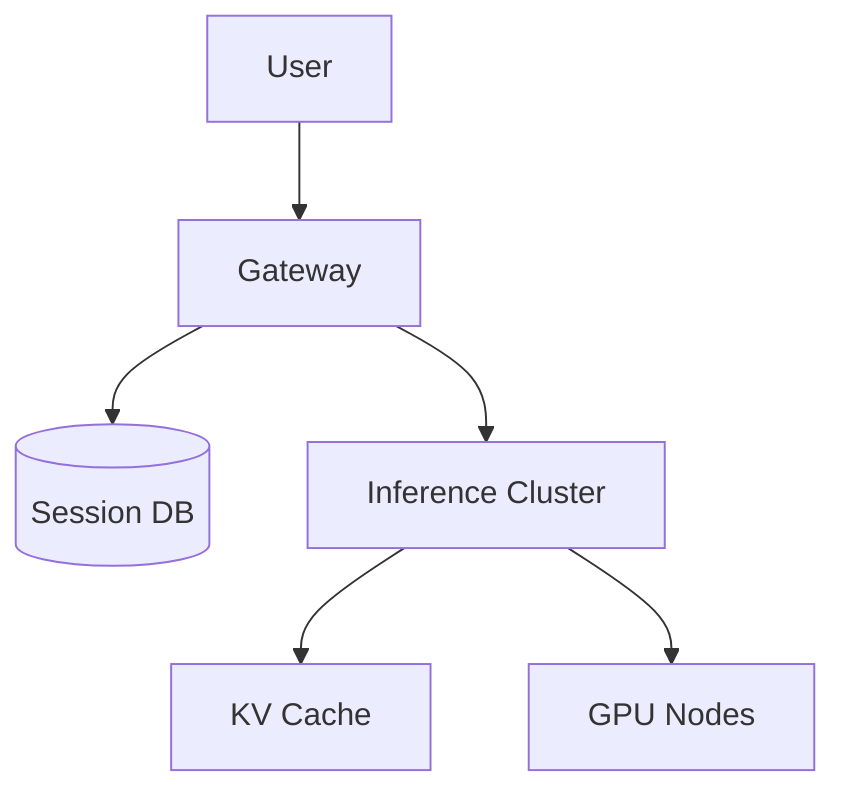
- **Gateway**: Rate limiting and routing.
- **Session DB**: Stores conversation history (Redis/Cassandra).
- **Inference Cluster**: Manages batching and model execution.

**Step 3 — Deep Dive on Key Components** (15 min)
- **Continuous Batching**: Instead of waiting for a full batch to finish, inject new requests into the batch as others finish generating their EOS token.
- **KV Cache**: Store Key and Value tensors for previously generated tokens to avoid recomputation. PagedAttention is critical for memory management.

**Step 4 — Trade-offs & Scaling** (5 min)
- Pipeline vs Tensor parallelism for scaling across GPUs.

**⚠️ Common mistakes:** Focusing too much on model architecture (Transformers) and ignoring inference infrastructure (PagedAttention, batching).
**💡 What makes a great answer:** Explaining PagedAttention and how KV cache memory fragmentation limits concurrent users.

### Q: Design a RAG System (Chat with Your Documents)
**🎯 What's being tested:** Information retrieval, vector databases, and grounding LLMs.
**💬 How to structure your answer:**

**Step 1 — Requirements & Scope** (2 min)
- Accurately retrieve relevant document chunks. Prevent hallucinations. Handle diverse document types (PDFs, docs).

**Step 2 — High-Level Architecture** (5 min)
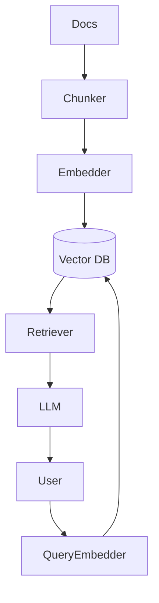
- **Data Pipeline**: Document parser, chunker, embedding model, vector store.
- **Inference**: Query parsing, retrieval, prompt augmentation, LLM generation.

**Step 3 — Deep Dive on Key Components** (15 min)
- **Chunking Strategy**: Semantic chunking vs fixed-size chunking. Overlaps are needed to maintain context.
- **Hybrid Search**: Combining Dense (Vector) and Sparse (BM25) search for better recall (keyword + semantic).
- **Reranking**: Use a Cross-Encoder to re-score top-K results before passing to the LLM.

**Step 4 — Trade-offs & Scaling** (5 min)
- Vector DB index choices: HNSW (faster, approximate) vs Flat (exact, slow).

**⚠️ Common mistakes:** Assuming a vector DB solves all retrieval problems; ignoring chunking strategy.
**💡 What makes a great answer:** Discussing query rewriting, hypothetical document embeddings (HyDE), and re-ranking.

### Q: Design Memory for a Personal AI Assistant
**🎯 What's being tested:** State management, summarization architectures, and long-term context windows.
**💬 How to structure your answer:**

**Step 1 — Requirements & Scope** (2 min)
- Assistant must remember user facts forever. Fast retrieval. Privacy and data isolation.

**Step 2 — High-Level Architecture** (5 min)
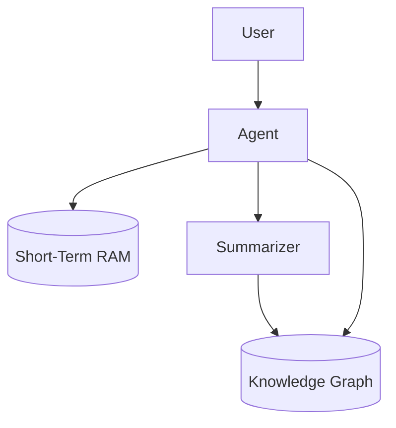
- **Short-Term Memory**: Rolling sliding window of recent chat history (e.g., Redis).
- **Long-Term Memory**: Vector DB or Knowledge Graph storing facts extracted by a background summarization agent.

**Step 3 — Deep Dive on Key Components** (15 min)
- **Fact Extraction**: Run an LLM asynchronously to extract triplets (Subject-Predicate-Object) from user messages.
- **Context Injection**: On query, retrieve relevant facts and inject them into the system prompt.

**Step 4 — Trade-offs & Scaling** (5 min)
- Infinite context window models (e.g., Gemini 1.5) vs external memory (Vector DB). Cost vs accuracy.

**⚠️ Common mistakes:** Just saying "stuff everything into a Vector DB."
**💡 What makes a great answer:** Using a Knowledge Graph combined with Vector search for precise factual recall.

### Q: Design a Deep Research Agent
**🎯 What's being tested:** Agentic workflows, planning, web scraping, and iterative refinement.
**💬 How to structure your answer:**

**Step 1 — Requirements & Scope** (2 min)
- Agent needs to browse the web, synthesize info, plan research steps, and output a 10-page report.

**Step 2 — High-Level Architecture** (5 min)
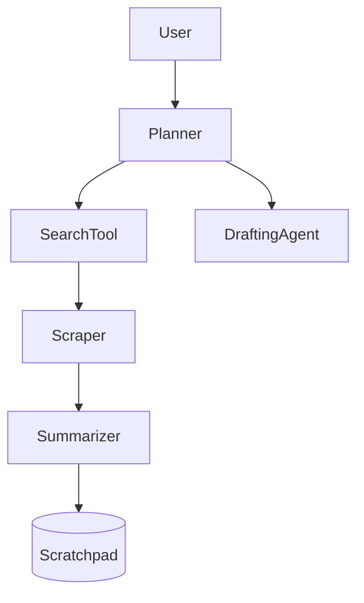
- **Planner Agent**: Breaks down user query into sub-questions.
- **Execution Agents**: Search web, scrape HTML, extract text.
- **Synthesis**: Compiles findings and writes the report.

**Step 3 — Deep Dive on Key Components** (15 min)
- **ReAct Framework**: Reason and Act loop. Agent decides when it has enough info to stop searching.
- **State Management**: LangGraph/Autogen to manage the state machine and handle loops/errors.

**Step 4 — Trade-offs & Scaling** (5 min)
- Latency is high (minutes to hours). Use async processing and webhooks for user notification.

**⚠️ Common mistakes:** Designing a synchronous system. This must be an async background job.
**💡 What makes a great answer:** Discussing fail-safes (handling blocked sites, looping prevention).

### Q: Design a Multi-Agent Customer Support System
**🎯 What's being tested:** Routing, agent orchestration, and tool usage.
**💬 How to structure your answer:**

**Step 1 — Requirements & Scope** (2 min)
- Resolve tier 1/2 tickets. Handoff to human on failure. Execute actions (refunds, password resets).

**Step 2 — High-Level Architecture** (5 min)
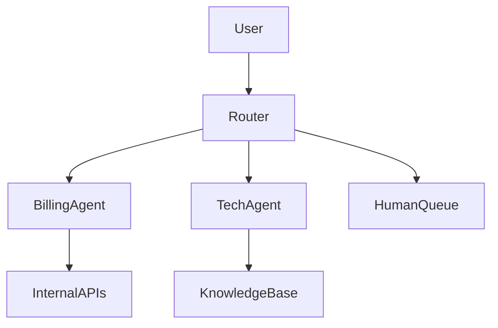
- **Semantic Router**: Classifies intent and routes to specialized agents.
- **Specialized Agents**: e.g., Billing Agent with tool access (Stripe API).

**Step 3 — Deep Dive on Key Components** (15 min)
- **Tool Calling**: Strict schema definition. Validation of API responses.
- **Human-in-the-loop (HITL)**: Confidence thresholds. If confidence < 0.8, route to Human Queue.

**Step 4 — Trade-offs & Scaling** (5 min)
- One monolithic LLM vs multiple specialized smaller models. Smaller models reduce cost/latency.

**⚠️ Common mistakes:** Giving one agent all the tools.
**💡 What makes a great answer:** Implementing a supervisor agent that monitors the conversation quality and forces a human handoff if it detects user frustration.

### Q: Design an AI Coding Agent
**🎯 What's being tested:** Code generation, secure execution environments, and iterative debugging.
**💬 How to structure your answer:**

**Step 1 — Requirements & Scope** (2 min)
- Read repository context, generate code, run tests, and fix errors autonomously.

**Step 2 — High-Level Architecture** (5 min)
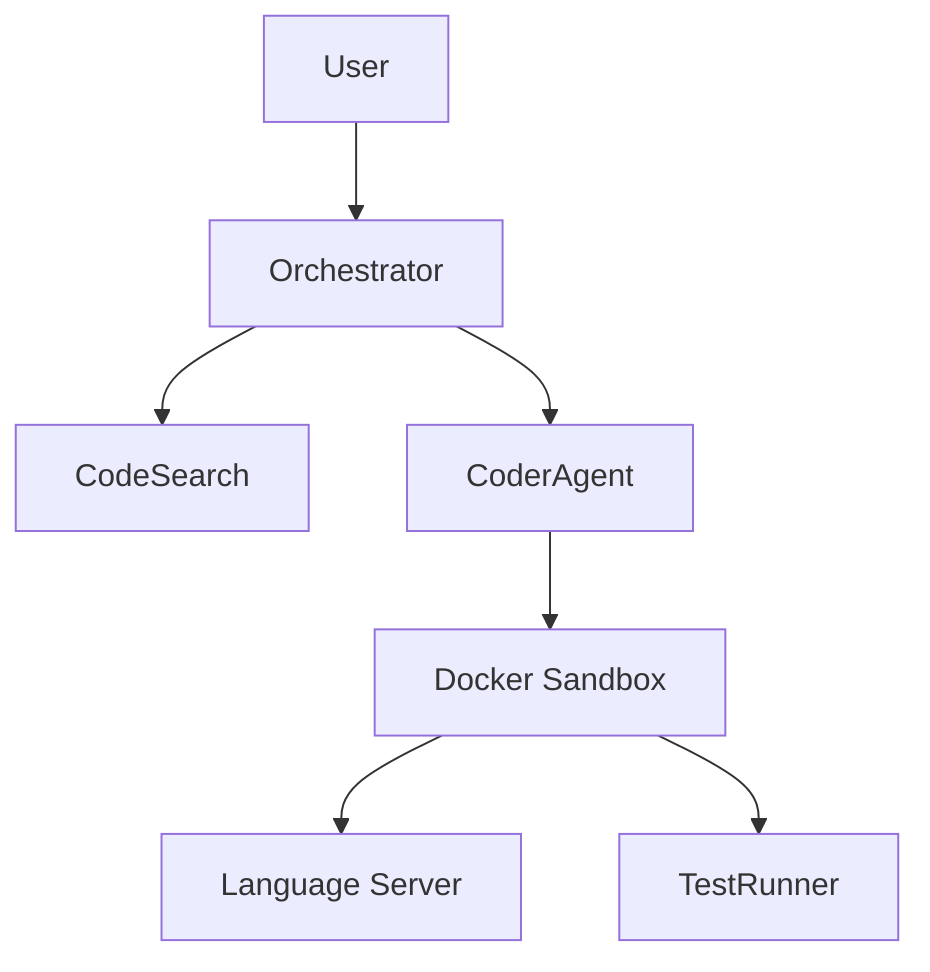
- **Code Search**: AST parsing + vector search for repo context.
- **Coder Agent**: Writes code.
- **Sandbox**: Secure execution environment to run tests and linters.

**Step 3 — Deep Dive on Key Components** (15 min)
- **Context Construction**: Using an LSP (Language Server Protocol) to resolve dependencies and definitions, feeding them to the prompt.
- **Feedback Loop**: Capture stderr/stdout from the Sandbox and feed it back to the Coder Agent for iterative fixing.

**Step 4 — Trade-offs & Scaling** (5 min)
- Security vs capability. Need strictly isolated gVisor/Firecracker microVMs for running untrusted AI-generated code.

**⚠️ Common mistakes:** Ignoring the security risks of executing AI-generated code.
**💡 What makes a great answer:** Integrating AST-based code chunking and LSP for precise context retrieval, rather than just naive chunking.

---

## Section 2: Infrastructure & Platform Designs

### Q: Design an On-Device AI Assistant
**🎯 What's being tested:** Edge computing, model quantization, and privacy-preserving AI.
**💬 How to structure your answer:**

**Step 1 — Requirements & Scope** (2 min)
- Offline capability, minimal battery drain, low latency, memory constraints (<4GB RAM).

**Step 2 — High-Level Architecture** (5 min)
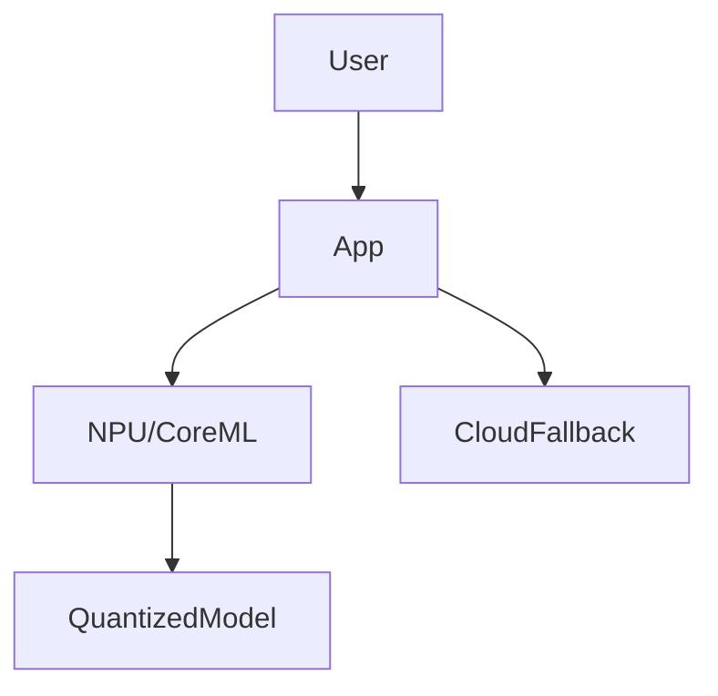
- **Local Engine**: Uses ONNX/CoreML for inference.
- **Cloud Fallback**: For complex queries exceeding local model capability.

**Step 3 — Deep Dive on Key Components** (15 min)
- **Quantization & LoRA**: Use Int4/Int8 quantization (GGUF/AWQ). Dynamically swap LoRA adapters for different tasks (e.g., one LoRA for coding, one for summarization) to save memory.
- **Router**: Lightweight heuristic or classifier to decide if query stays local or goes to cloud.

**Step 4 — Trade-offs & Scaling** (5 min)
- Battery vs Accuracy.

**⚠️ Common mistakes:** Proposing a 70B model for a phone.
**💡 What makes a great answer:** Discussing dynamic LoRA adapter swapping and KV cache offloading to unified memory.

### Q: Design an LLM Inference Platform (vLLM-as-a-Service)
**🎯 What's being tested:** Distributed systems, GPU scheduling, and high-throughput inference.
**💬 How to structure your answer:**

**Step 1 — Requirements & Scope** (2 min)
- Serve multiple models. High availability, autoscaling, handle spikey traffic.

**Step 2 — High-Level Architecture** (5 min)
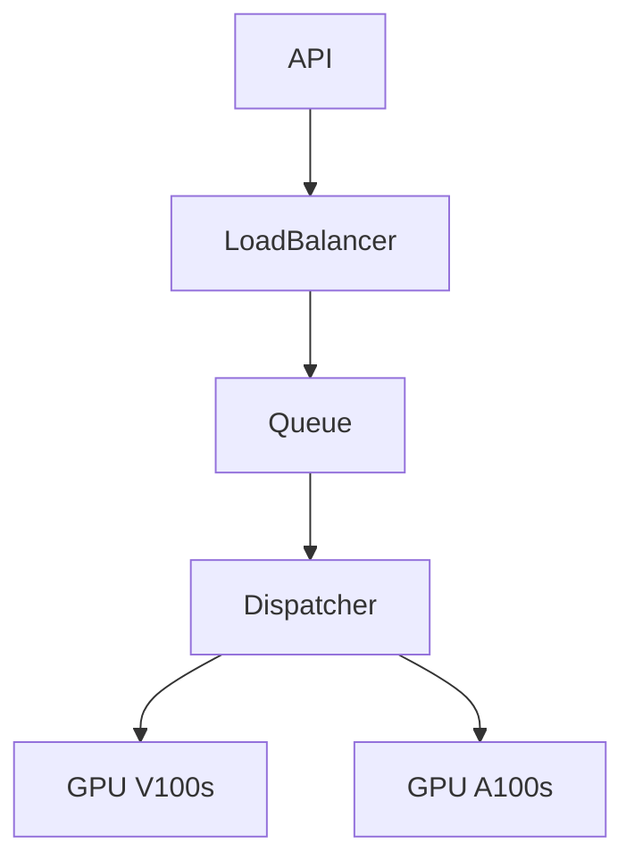
- **Gateway**: API auth, rate limiting.
- **Dispatcher**: Smart routing based on GPU memory availability.

**Step 3 — Deep Dive on Key Components** (15 min)
- **Continuous Batching & PagedAttention**: Maximizing GPU utilization.
- **Autoscaling**: Scale based on queue length and KV cache memory pressure, not just CPU.

**Step 4 — Trade-offs & Scaling** (5 min)
- Cold starts. Keep a pool of warm nodes or use fast weight loading from NVMe to GPU (using technologies like GPUDirect).

**⚠️ Common mistakes:** Treating GPUs like CPUs for autoscaling metrics.
**💡 What makes a great answer:** Discussing Prefix Caching (sharing KV cache for common system prompts across different users).

### Q: Design an LLM Evaluation Platform
**🎯 What's being tested:** MLOps, metrics, and CI/CD for LLMs.
**💬 How to structure your answer:**

**Step 1 — Requirements & Scope** (2 min)
- Automated eval of model changes, human annotation UI, A/B testing framework, latency tracking.

**Step 2 — High-Level Architecture** (5 min)
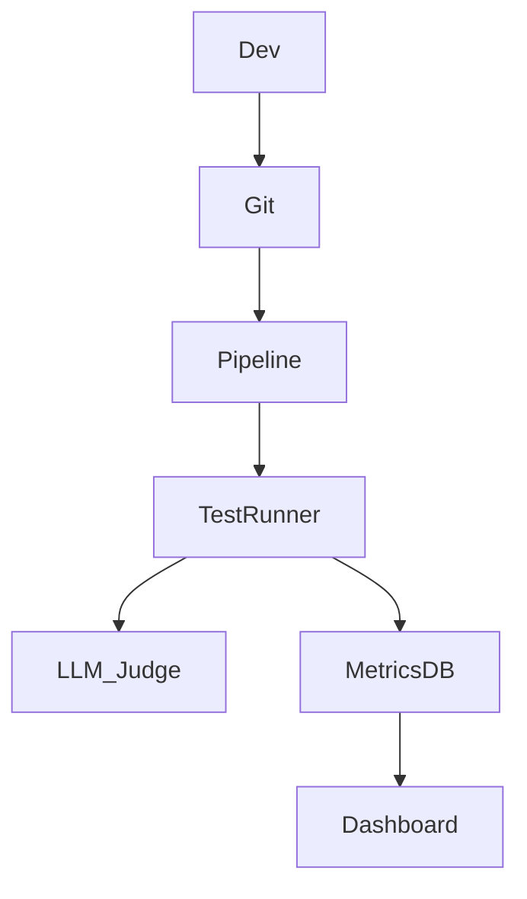
**Step 3 — Deep Dive on Key Components** (15 min)
- **LLM-as-a-Judge**: Use GPT-4 to evaluate outputs of smaller models based on rubrics (helpfulness, toxicity).
- **Dataset Management**: Golden datasets for regression testing.

**Step 4 — Trade-offs & Scaling** (5 min)
- Cost of LLM-as-a-judge vs human annotators.

**⚠️ Common mistakes:** Relying only on traditional ML metrics (BLEU/ROUGE) instead of semantic evals.
**💡 What makes a great answer:** Implementing pairwise Elo rating for models via A/B testing in production.

### Q: Design an AI gateway/proxy
**🎯 What's being tested:** Enterprise security, observability, and routing.
**💬 How to structure your answer:**

**Step 1 — Requirements & Scope** (2 min)
- Single entry point for all internal apps calling LLMs. Audit logging, cost tracking, PII redaction, model fallback.

**Step 2 — High-Level Architecture** (5 min)
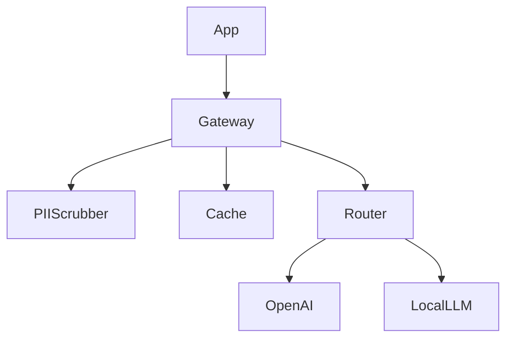
**Step 3 — Deep Dive on Key Components** (15 min)
- **Semantic Caching**: Cache exact and semantically similar queries to save costs.
- **Fallback Logic**: If OpenAI 500s, route to Anthropic automatically.
- **Data Loss Prevention (DLP)**: Regex and NER models to mask PII before it leaves the VPC.

**Step 4 — Trade-offs & Scaling** (5 min)
- Gateway adds latency. Caching offsets this.

**⚠️ Common mistakes:** Forgetting tenant-level cost tracking.
**💡 What makes a great answer:** Explaining how to stream responses through the gateway without breaking SSE (Server-Sent Events) protocols.

---

## Section 3: Search & Recommendations

### Q: Design a Multimodal Search System (Text, Image, Video)
**🎯 What's being tested:** Joint embedding spaces (CLIP/Align) and multimodal vector search.
**💬 How to structure your answer:**

**Step 1 — Requirements & Scope** (2 min)
- Search images/videos using text, or search videos using images. Low latency.

**Step 2 — High-Level Architecture** (5 min)
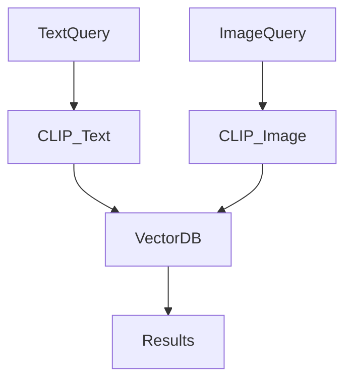
**Step 3 — Deep Dive on Key Components** (15 min)
- **Unified Embedding Space**: Using CLIP to map text and images to the same vector space.
- **Video Processing**: Extract keyframes (1 per second), embed them, and link them to timestamps.

**Step 4 — Trade-offs & Scaling** (5 min)
- Storage cost of dense vectors for video frames. Use PCA/quantization to reduce dimensions.

**⚠️ Common mistakes:** Extracting features separately and trying to map them later.
**💡 What makes a great answer:** Handling temporal search in videos (finding a specific *sequence* of events).

### Q: Design a real-time AI recommendation system
**🎯 What's being tested:** Two-tower models, real-time feature stores, streaming.
**💬 How to structure your answer:**

**Step 1 — Requirements & Scope** (2 min)
- Recommend items based on user's last 5 minutes of activity. Sub-100ms latency.

**Step 2 — High-Level Architecture** (5 min)
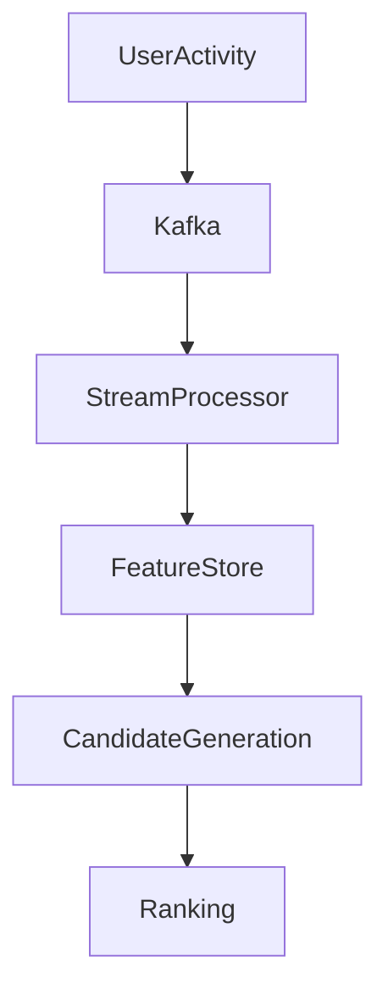
**Step 3 — Deep Dive on Key Components** (15 min)
- **Candidate Generation (Retrieval)**: Fast, lightweight model (Two-Tower/Matrix Factorization) to get top 1000 items.
- **Ranking**: Heavy deep learning model (DLRM) to score the top 1000 items using real-time context.

**Step 4 — Trade-offs & Scaling** (5 min)
- Pre-computing embeddings vs real-time inference.

**⚠️ Common mistakes:** Using a heavy model for the entire catalog.
**💡 What makes a great answer:** Explaining how the real-time feature store (Redis) updates user embeddings on-the-fly.

### Q: Design an AI-powered search engine for an e-commerce platform
**🎯 What's being tested:** E-commerce taxonomy, hybrid search, learning-to-rank.
**💬 How to structure your answer:**

**Step 1 — Requirements & Scope** (2 min)
- Handle typos, semantic queries ("red dress for summer"), filters (size, price).

**Step 2 — High-Level Architecture** (5 min)
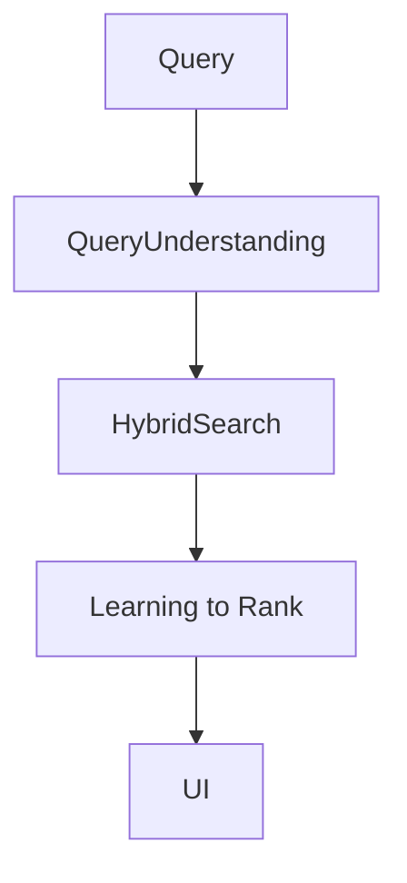
**Step 3 — Deep Dive on Key Components** (15 min)
- **Query Understanding**: NER to extract filters (Color: Red, Season: Summer).
- **Hybrid Retrieval**: BM25 for exact match (SKUs) + Vector Search for semantics.
- **Post-filtering**: Apply hard constraints (in stock, size) *after* or *during* retrieval using metadata in Vector DB.

**Step 4 — Trade-offs & Scaling** (5 min)
- Pre-filtering vs post-filtering in Vector DBs. Pre-filtering can cause empty results if the filter is too strict.

**⚠️ Common mistakes:** Forgetting that e-commerce requires exact matches (brand names, SKUs).
**💡 What makes a great answer:** Using personalized Learning-to-Rank (LTR) as the final re-ranking step.

---

## Section 4: Content Generation

### Q: Design a Text-to-Image Generation Service (Midjourney-like)
**🎯 What's being tested:** Diffusion models, asynchronous processing, GPU queuing.
**💬 How to structure your answer:**

**Step 1 — Requirements & Scope** (2 min)
- Accept prompt, generate 4 variants, handle high traffic, content moderation.

**Step 2 — High-Level Architecture** (5 min)
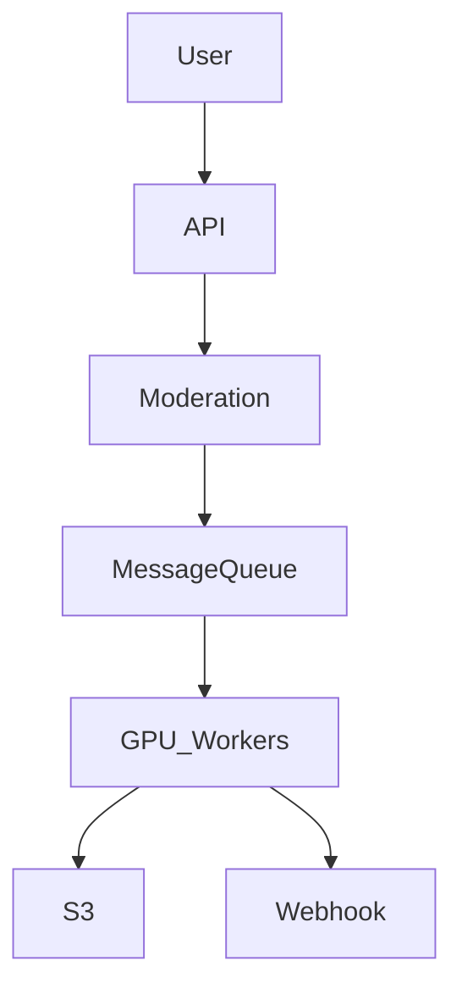
**Step 3 — Deep Dive on Key Components** (15 min)
- **Queueing & Async**: Generating images takes 5-15 seconds. Connection must be async (WebSockets or Polling).
- **Diffusion Pipeline**: Text Encoder (CLIP) -> U-Net (Denoising) -> VAE Decoder.
- **Safety**: NSFW filters on both the input prompt and output image.

**Step 4 — Trade-offs & Scaling** (5 min)
- Step count vs Quality. Serving LCMs (Latent Consistency Models) for faster generation with fewer steps.

**⚠️ Common mistakes:** Designing it as a synchronous REST API.
**💡 What makes a great answer:** Discussing dynamic batching of diffusion steps across different requests.

### Q: Design a Video Generation Service (Sora-like)
**🎯 What's being tested:** Spatiotemporal consistency, distributed inference, massive data handling.
**💬 How to structure your answer:**

**Step 1 — Requirements & Scope** (2 min)
- Generate 10-second HD video from text. Latency is minutes.

**Step 2 — High-Level Architecture** (5 min)
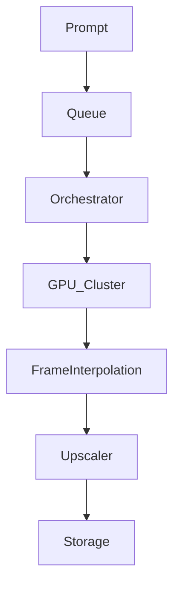
**Step 3 — Deep Dive on Key Components** (15 min)
- **Distributed Inference**: Video generation requires model parallelism.
- **Temporal Consistency**: 3D attention mechanisms (Spatiotemporal patches).
- **Pipeline**: Base generation -> Frame Interpolation (fps increase) -> Upscaling (resolution increase).

**Step 4 — Trade-offs & Scaling** (5 min)
- Compute costs are astronomical. Requires strict rate limiting and user quotas.

**⚠️ Common mistakes:** Treating it like image generation. Video requires temporal dimensions and massive VRAM.
**💡 What makes a great answer:** Breaking the generation pipeline into cascaded models (base model + spatial upscaler + temporal interpolator).

### Q: Design a Music Generation Service (Suno-like)
**🎯 What's being tested:** Audio generation, transformers vs diffusion for audio, streaming output.
**💬 How to structure your answer:**

**Step 1 — Requirements & Scope** (2 min)
- Generate 3-minute songs with vocals.

**Step 2 — High-Level Architecture** (5 min)
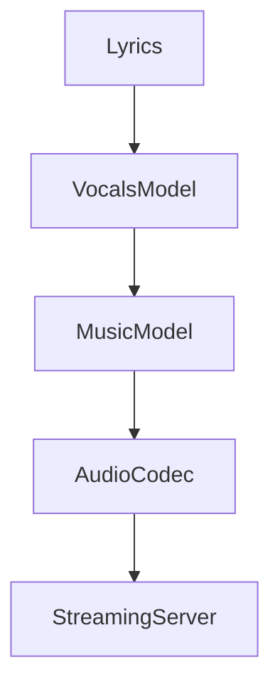
**Step 3 — Deep Dive on Key Components** (15 min)
- **Audio Tokens**: Using neural audio codecs (EnCodec) to compress raw audio waveforms into discrete tokens.
- **Auto-regressive Generation**: Generating audio tokens sequentially, allowing for streaming the song to the user before generation is complete.

**Step 4 — Trade-offs & Scaling** (5 min)
- Streaming latency vs buffer size.

**⚠️ Common mistakes:** Trying to generate raw waveforms directly (too high dimensionality).
**💡 What makes a great answer:** Explaining the use of semantic tokens (lyrics/melody) mapping to acoustic tokens.

---

## Section 5: Enterprise AI Systems

### Q: Design an AI system for automated code migration / HR / Legal / Medical / Extraction / Fraud
*(Due to breadth, these share a common structural pattern which is adapted based on domain)*

**🎯 What's being tested:** Domain adaptation, security, compliance, and integrating AI into traditional business logic.
**💬 How to structure your answer:**

**Step 1 — Requirements & Scope** (2 min)
- High accuracy, audibility, strict data privacy (HIPAA/SOC2), human-in-the-loop (HITL).

**Step 2 — High-Level Architecture** (5 min)
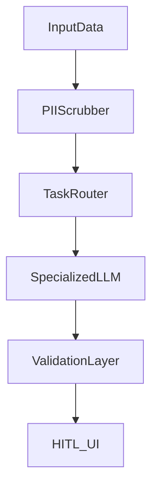

**Step 3 — Deep Dive on Key Components** (15 min)
- **Code Gen/Migration**: AST parsing, dependency graph resolution, iterative compiling in sandboxes.
- **Medical/Legal**: RAG with domain-specific ontologies. Strict citation requirements (every claim must link to source text).
- **Data Extraction**: Multimodal layout parsing (handling tables, checkboxes in PDFs) using Vision-Language Models (VLMs) -> structured JSON output -> Pydantic validation.
- **Fraud Detection**: Graph neural networks (for transaction networks) combined with LLMs for unstructured rationale generation.

**Step 4 — Trade-offs & Scaling** (5 min)
- False Positives vs False Negatives. In medical/fraud, false negatives are fatal; tune thresholds to over-flag for human review.

**⚠️ Common mistakes:** Trusting the LLM output without deterministic validation layers.
**💡 What makes a great answer:** Implementing a "Confidence Score" and routing low-confidence outputs to a human review queue.

---

## Section 6: Production Concerns

### Q: How do you design for latency vs quality trade-offs?
**💬 Approach:** Use semantic caching (fast, cheap). Use model routing (small models for simple tasks, large for complex). Speculative decoding (small model drafts, large model verifies).

### Q: Caching strategies for LLM apps?
**💬 Approach:** Exact match cache (Redis). Semantic cache (Vector DB - if cosine similarity > 0.95, return cached). Prompt caching (KV cache reuse for system prompts).

### Q: Rate limiting and cost management?
**💬 Approach:** Token-bucket algorithm based on *tokens*, not just requests. Gateway enforces tenant-level quotas.

### Q: Failover, High Availability, Graceful Degradation?
**💬 Approach:** Active-active multi-region deployments. Circuit breakers on API calls. If LLM is down, fallback to heuristic rules or cached responses. If heavy model is down, fallback to quantized local model.

### Q: Capacity planning?
**💬 Approach:** Calculate Peak Tokens Per Second (TPS). Map to GPU memory bandwidth and compute limits. Account for KV cache VRAM per concurrent user.

---

## Section 7: Specialized Designs

### Q: Design a multi-tenant AI chatbot platform
**🎯 What's being tested:** Data isolation and scalable RAG.
**💬 Structure:** Use namespace-separated Vector DBs per tenant. Dynamic system prompt injection based on Tenant ID.

### Q: AI meeting summarizer for thousands of meetings
**🎯 What's being tested:** Batch processing and long-context handling.
**💬 Structure:** Async processing pipeline. Audio chunking -> Whisper transcription -> Map-Reduce summarization for long transcripts.

### Q: AI notification prioritization
**🎯 What's being tested:** Personalization and lightweight classification.
**💬 Structure:** Fast BERT-style classifier on incoming streams. Ranks based on user preference embeddings.

### Q: Multi-agent workflow system
**🎯 What's being tested:** Directed Acyclic Graphs (DAGs) for agents.
**💬 Structure:** Use a state machine (LangGraph). Nodes are agents, edges are conditional routing logic based on LLM outputs.

### Q: Real-time AI transcription for concurrent streams
**🎯 What's being tested:** Streaming audio buffers and WebRTC.
**💬 Structure:** Client sends audio chunks via WebSockets. Server runs streaming ASR (e.g., Whisper streaming). Uses VAD (Voice Activity Detection) to drop silence and save compute.

### Q: Handling conflicting information in RAG
**🎯 What's being tested:** Advanced retrieval and provenance.
**💬 Structure:** Add metadata (timestamp, source authority score). Instruct the LLM to analyze conflicts and present both sides with citations, prioritizing higher-authority sources.
