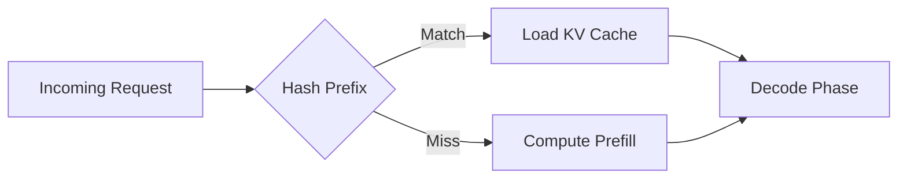
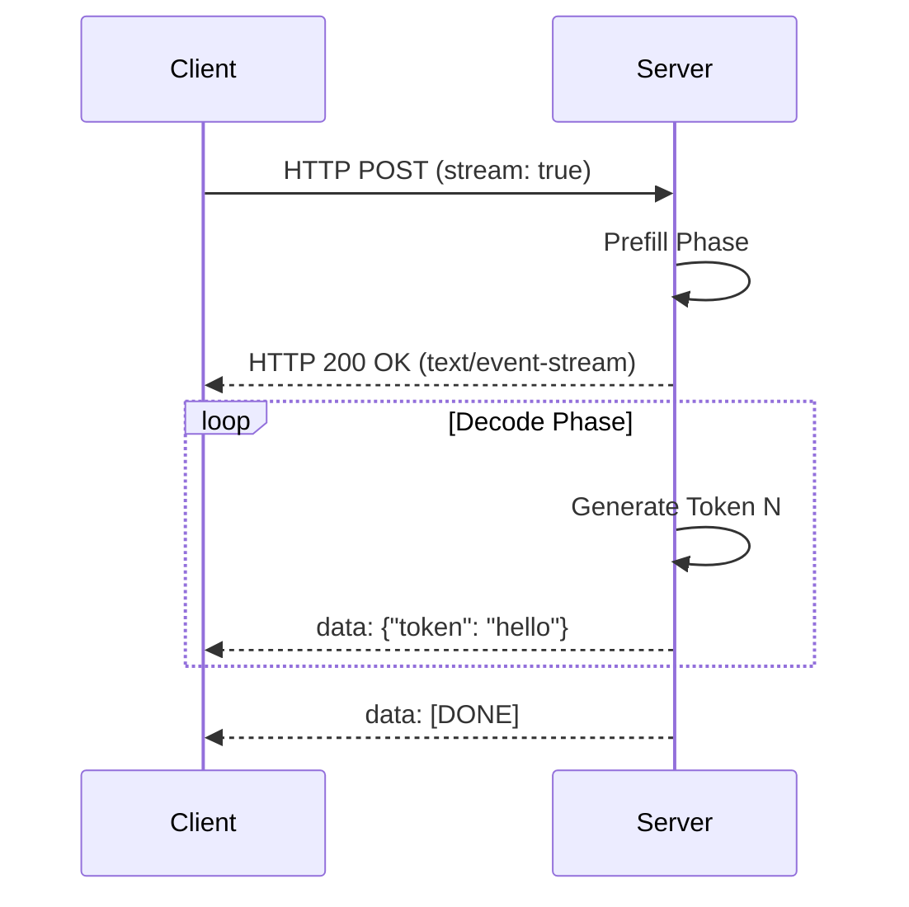
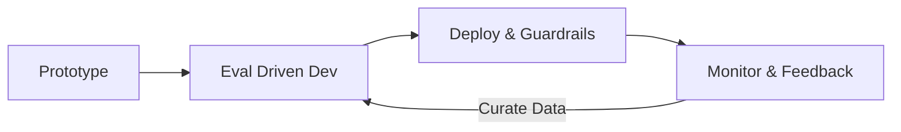
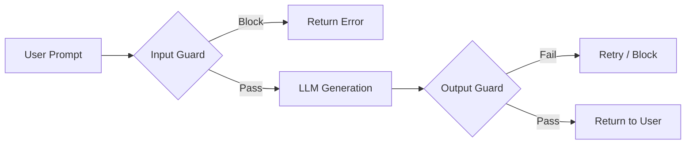
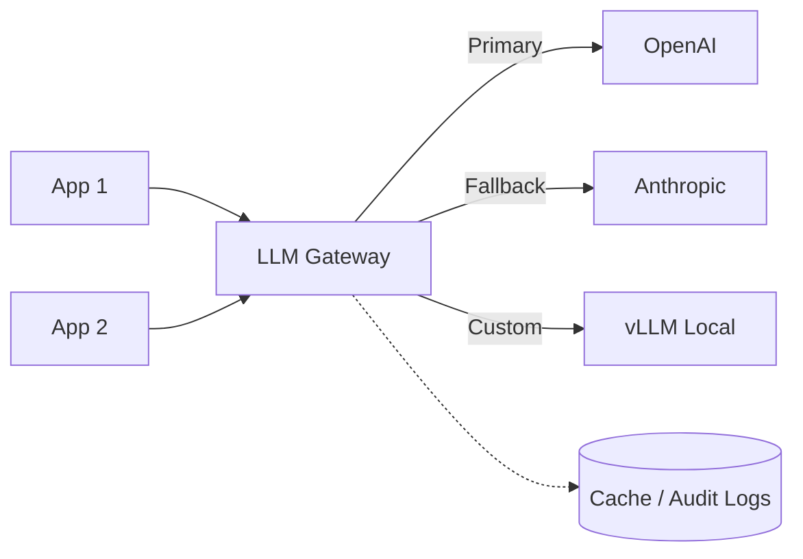
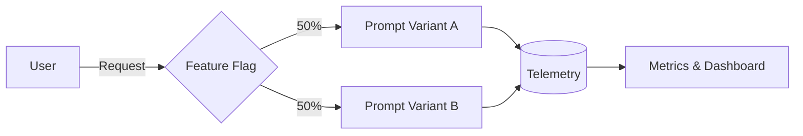

# LLMOps & Production AI — Interview Training Notes

## Table of Contents
- [Section 1: Inference Fundamentals](#section-1-inference-fundamentals)
- [Section 2: Inference Engines & Serving](#section-2-inference-engines--serving)
- [Section 3: LLMOps Fundamentals](#section-3-llmops-fundamentals)
- [Section 4: Monitoring & Observability](#section-4-monitoring--observability)
- [Section 5: Guardrails & Safety](#section-5-guardrails--safety)
- [Section 6: Cost & Performance](#section-6-cost--performance)
- [Section 7: Versioning & Deployment](#section-7-versioning--deployment)
- [Section 8: Fallback & Resilience](#section-8-fallback--resilience)
- [Section 9: Scenario Questions](#section-9-scenario-questions)

---
## Section 1: Inference Fundamentals

### Q: Prefill vs Decode — what's the difference and why does it matter?

**🎯 What the interviewer is testing:** Deep understanding of the LLM generation process and its performance characteristics (TTFT vs TPOT).

**💬 How to answer:**
"In LLM inference, generation happens in two distinct phases: Prefill and Decode. 
**Prefill** is the initial phase where the model processes the entire input prompt in parallel to compute the initial KV (Key-Value) cache. It's compute-bound and optimized for high parallel throughput. 
**Decode** is the subsequent autoregressive phase where the model generates tokens one by one. Each step uses the KV cache from the prefill and previous decode steps. It is heavily memory-bandwidth bound because you have to load the model weights for every single token generated.

This distinction matters because they require different optimization strategies. Prefill drives Time To First Token (TTFT), while decode drives Time Per Output Token (TPOT). Serving engines often separate these phases (e.g., split-node architectures or chunked prefill) to prevent long prefills from stalling concurrent decodes."

**🔗 Follow-ups the interviewer might ask:**
- What bottleneck does Decode hit? → Memory bandwidth (loading weights for every token).
- How do we optimize them together? → Continuous batching and chunked prefill.

**⚠️ Common mistakes:** Treating inference as a single homogeneous compute process.
**💡 What makes a great answer:** Mentioning KV cache dynamics and explicitly linking prefill to TTFT and decode to TPOT.

---
### Q: How does Prompt Caching work?

**🎯 What the interviewer is testing:** Understanding of how to optimize redundant context in API calls and serving.

**💬 How to answer:**
"Prompt caching reuses the computed KV cache for shared prefixes across multiple API calls, bypassing the expensive prefill phase for identical context. When a user sends a prompt, the system hashes the prompt prefix. If a match is found in the cache, it loads the corresponding KV cache states directly into GPU memory. 

In production, this is crucial for applications like RAG or agents with huge system prompts. Instead of recomputing the same 10k-token system prompt for every user request, we compute it once and append the user's specific query to the cached state, drastically reducing TTFT and compute costs."



**🔗 Follow-ups the interviewer might ask:**
- Does the shared prefix have to be at the exact beginning? → Yes, autoregressive models depend strictly on absolute position.
- How does RadixAttention in SGLang help? → It uses a radix tree to cache prefix KV states across partial matches efficiently.

**⚠️ Common mistakes:** Confusing prompt caching with standard API response caching (like Redis).
**💡 What makes a great answer:** Differentiating between exact response caching and KV-cache state caching (prefix caching).

---
### Q: How does Token Streaming work?

**🎯 What the interviewer is testing:** UX optimization for generative AI and understanding of SSE (Server-Sent Events).

**💬 How to answer:**
"Token streaming is the mechanism of sending generated tokens to the client as soon as they are produced, rather than waiting for the entire sequence to finish. Because the decode phase generates tokens one at a time autoregressively, we can yield these tokens over an HTTP connection using Server-Sent Events (SSE).

This fundamentally shifts the perceived latency for the user from the total generation time (which could be seconds) to the Time To First Token (TTFT, which is usually hundreds of milliseconds). It’s essential for chat interfaces to keep users engaged."



**🔗 Follow-ups the interviewer might ask:**
- What protocol is used? → Server-Sent Events (SSE) or WebSockets.
- How do you handle moderation with streaming? → Buffer tokens on the server for a few words to run lightweight moderation, or use asynchronous moderation.

**⚠️ Common mistakes:** Assuming streaming reduces total compute time (it only reduces perceived latency).
**💡 What makes a great answer:** Explaining the architectural requirement of chunked transfer encoding and SSE.

---
### Q: How do you implement streaming responses for real-time AI applications?

**🎯 What the interviewer is testing:** Practical implementation knowledge of HTTP streams and async programming.

**💬 How to answer:**
"To implement streaming, I use an asynchronous backend (like FastAPI in Python) and the Server-Sent Events (SSE) protocol. 
1. The client sends a request requesting a stream.
2. The server initiates an async generator function that interfaces with the LLM's streaming API (e.g., `openai.ChatCompletion.create(stream=True)`).
3. The server yields formatted SSE strings (`data: {chunk}\n\n`) as chunks arrive.
4. The client consumes the stream using the Fetch API or an EventSource object, appending the chunks to the UI in real-time.

For robust production implementation, I ensure proper connection drop handling so that if a user disconnects, the server immediately cancels the underlying LLM generation to save costs."

**🔗 Follow-ups the interviewer might ask:**
- How do you handle load balancing with SSE? → Ensure the load balancer supports long-lived connections (e.g., configuring timeouts properly).

**⚠️ Common mistakes:** Not mentioning client-disconnect handling, leading to runaway API costs.
**💡 What makes a great answer:** Mentioning resource cleanup on client disconnect.

---
### Q: What are logits, and how are they used in production inference?

**🎯 What the interviewer is testing:** Understanding of the mathematical output of LLMs and how to manipulate generation.

**💬 How to answer:**
"Logits are the raw, unnormalized scores output by the final linear layer of a neural network before the softmax function is applied. In an LLM, there is a logit for every token in the vocabulary. 

In production inference, we use logits to control the model's output behavior. By applying techniques like temperature scaling (dividing logits by a temperature value), Top-K, or Top-p (nucleus sampling), we adjust the probability distribution before sampling. We can also use logit bias to mathematically force or ban specific tokens—for instance, setting a token's logit to negative infinity ensures it will never be generated."

**🔗 Follow-ups the interviewer might ask:**
- How does temperature > 1 affect logits? → It flattens the distribution, making lower-probability tokens more likely, increasing randomness.
- How do you enforce JSON output using logits? → By masking out (setting to -inf) the logits of any tokens that would violate the JSON grammar at the current generation step.

**⚠️ Common mistakes:** Confusing logits with probabilities.
**💡 What makes a great answer:** Connecting logits directly to constrained generation (like JSON enforcing).

---
## Section 2: Inference Engines & Serving

### Q: How do you serve LLMs in production?

**🎯 What the interviewer is testing:** High-level architecture of scalable AI deployment.

**💬 How to answer:**
"Serving LLMs in production requires a specialized stack because of the massive memory footprint and autoregressive nature of the models. 
I typically structure it in three layers:
1. **Model Engine:** Using optimized inference engines like vLLM, TensorRT-LLM, or SGLang, which handle PagedAttention, continuous batching, and kernel optimizations.
2. **Serving API:** Wrapping the engine in an API layer (often OpenAI-compatible) using FastAPI or Triton Inference Server.
3. **Infrastructure/Orchestration:** Deploying on Kubernetes with GPU node pools, using an API Gateway for rate limiting, auth, and routing, and autoscaling based on queue length rather than just CPU/Memory."

**🔗 Follow-ups the interviewer might ask:**
- Why not just use Flask/FastAPI with raw HuggingFace transformers? → Standard HF transformers do not use continuous batching or PagedAttention, leading to terrible throughput and OOM errors.

**⚠️ Common mistakes:** Suggesting basic web servers without an optimized inference engine.
**💡 What makes a great answer:** Distinguishing between the HTTP layer and the underlying inference engine.

---
### Q: How does vLLM work?

**🎯 What the interviewer is testing:** Knowledge of state-of-the-art inference optimization, specifically memory management.

**💬 How to answer:**
"vLLM is a high-throughput memory-efficient inference engine. Its core innovation is **PagedAttention**. 
In standard inference, the KV cache grows dynamically and is pre-allocated contiguously, leading to severe memory fragmentation (up to 60% waste). PagedAttention solves this by borrowing from OS virtual memory concepts. It divides the KV cache into fixed-size blocks (pages) that don't need to be contiguous in GPU memory. 
Additionally, vLLM implements **Continuous Batching**, meaning it dynamically injects new requests into the batch as soon as others finish their decode steps, maximizing GPU utilization rather than waiting for all sequences in a batch to finish."

```mermaid
flowchart TD
    A[Incoming Requests] --> B[Continuous Batching Scheduler]
    B --> C[PagedAttention Manager]
    C --> D[Block Table (Virtual to Physical)]
    D --> E[GPU Physical Memory Blocks]
    C --> F[Decode Execution]
```

**🔗 Follow-ups the interviewer might ask:**
- How does continuous batching improve throughput? → It eliminates the "bubble" where a batch waits for the longest sequence to finish.

**⚠️ Common mistakes:** Mentioning vLLM without explaining PagedAttention.
**💡 What makes a great answer:** Using the OS virtual memory analogy.

---
### Q: How does SGLang work?

**🎯 What the interviewer is testing:** Knowledge of cutting-edge optimization beyond basic vLLM.

**💬 How to answer:**
"SGLang (Structured Generation Language) is an inference framework optimized for complex, multi-step LLM interactions. Its key innovation is **RadixAttention**, which maintains an LRU cache of the KV cache using a radix tree. 

If multiple requests share identical prefixes (like a system prompt, a few-shot example, or iterative branching in agentic workflows), SGLang automatically finds the longest common prefix in the radix tree and reuses that KV cache. It drastically improves performance for constrained generation (like JSON) and agentic workflows where identical context is passed repeatedly."

**🔗 Follow-ups the interviewer might ask:**
- How does it compare to vLLM's prefix caching? → SGLang's RadixAttention was built from the ground up for granular, tree-based prefix matching, making it superior for complex branching logic compared to vLLM's standard block matching.

**⚠️ Common mistakes:** Assuming it's just another vLLM clone.
**💡 What makes a great answer:** Highlighting the specific use case: agent workflows and multi-turn prompt structures.

---
### Q: What is model quantization? (INT8, INT4, FP16, BF16)

**🎯 What the interviewer is testing:** Trade-offs between memory, speed, and accuracy in model weights.

**💬 How to answer:**
"Quantization is the process of reducing the precision of a model's weights and activations to save memory and increase inference speed, at a slight cost to accuracy.
- **FP16 / BF16 (16-bit):** The standard for production today. BF16 has a larger dynamic range than FP16, preventing overflow issues.
- **INT8 (8-bit):** Cuts memory in half compared to 16-bit. Methods like SmoothQuant handle outliers to maintain accuracy.
- **INT4 (4-bit):** Methods like AWQ and GPTQ pack weights into 4 bits. This allows huge models (like a 70B parameter model) to fit on a single GPU.

In production, I choose based on the bottleneck: if we are heavily memory bandwidth-bound (common in decode), INT4/INT8 quantization provides massive speedups because we load less data per token."

**🔗 Follow-ups the interviewer might ask:**
- What is the difference between PTQ and QAT? → Post-Training Quantization happens after training; Quantization-Aware Training simulates quantization during training for better accuracy.

**⚠️ Common mistakes:** Thinking quantization only saves disk space, missing the GPU VRAM and bandwidth benefits.
**💡 What makes a great answer:** Explaining that quantization speeds up the *decode* phase by reducing memory bandwidth pressure.

---
### Q: Cloud vs on-device Model Deployment for AI applications

**🎯 What the interviewer is testing:** Architectural decision-making based on latency, privacy, and cost constraints.

**💬 How to answer:**
"The choice between Cloud and On-device deployment hinges on latency, privacy, compute constraints, and connectivity.
**Cloud Deployment (e.g., AWS, GCP):**
- *Pros:* Access to massive GPUs, allows serving state-of-the-art models (100B+ params), centralized updates.
- *Cons:* High operational cost, network latency (TTFT includes round-trip time), privacy concerns with sensitive user data.
**On-device Deployment (e.g., CoreML, ONNX on mobile/laptops):**
- *Pros:* Zero network latency, guaranteed data privacy, works offline, zero marginal server cost per user.
- *Cons:* Limited to smaller models (e.g., 2B-8B params quantized to INT4), battery drain, fragmentation across device capabilities.

In modern apps, I often recommend a **hybrid approach**: run a small quantized router model on-device for basic tasks and privacy-sensitive data, and fall back to the cloud for complex reasoning."

**🔗 Follow-ups the interviewer might ask:**
- How do you optimize for on-device? → Use formats like GGUF or CoreML, aggressive quantization (INT4), and frameworks like MLX (for Apple Silicon).

**⚠️ Common mistakes:** Ignoring the battery and thermal constraints of on-device inference.
**💡 What makes a great answer:** Proposing the hybrid routing approach.

---
## Section 3: LLMOps Fundamentals

### Q: Explain the AI product lifecycle from ideation to production.

**🎯 What the interviewer is testing:** Holistic view of building AI products, moving beyond just prompting.

**💬 How to answer:**
"The LLMOps lifecycle is iterative and data-centric. I structure it in four phases:
1. **Ideation & Prototyping:** Define the use case. Build a baseline using a frontier model (e.g., GPT-4) and basic prompt engineering. 
2. **Evaluation & Optimization:** Build an evaluation dataset. If the baseline fails, iterate via advanced prompting, RAG, or fine-tuning. Establish automated evals (LLM-as-a-judge, exact match).
3. **Deployment:** Wrap the optimized pipeline in an API. Set up the serving infrastructure (vLLM, gateway, caching).
4. **Monitoring & Continuous Learning:** Deploy with guardrails. Monitor for hallucinations, latency, and drift. Collect user feedback (thumbs up/down) to curate datasets for future fine-tuning."



**🔗 Follow-ups the interviewer might ask:**
- How do you know when to move from prompting to fine-tuning? → When prompting maxes out on accuracy, becomes too expensive/slow (huge context), or struggles with strict syntax formatting.

**⚠️ Common mistakes:** Treating it like standard software engineering without emphasizing Evaluation.
**💡 What makes a great answer:** Highlighting "Evaluation" as the bridge between prototype and production.

---
### Q: What is LLMOps, and how does it differ from traditional MLOps?

**🎯 What the interviewer is testing:** Understanding the paradigm shift from training models to orchestrating API-driven pipelines.

**💬 How to answer:**
"LLMOps is the set of practices for operationalizing Large Language Models. 
While traditional MLOps focuses heavily on data prep, feature engineering, and training models from scratch, LLMOps is fundamentally **orchestration and evaluation-centric**. 
- **Model ownership:** In MLOps, you own the model. In LLMOps, you often rely on external APIs or pre-trained open-weights.
- **Evaluation:** MLOps uses deterministic metrics (F1, RMSE). LLMOps deals with open-ended generation, requiring LLM-as-a-judge or semantic similarity.
- **Pipeline:** LLMOps involves complex pipelines like RAG (vector DBs, chunking) and Agentic loops, whereas MLOps is usually a single inference pass."

**🔗 Follow-ups the interviewer might ask:**
- Does fine-tuning fit into LLMOps? → Yes, but typically Parameter-Efficient Fine-Tuning (PEFT) on top of foundations, not from scratch.

**⚠️ Common mistakes:** Just listing MLOps tools.
**💡 What makes a great answer:** Highlighting the shift from "deterministic training" to "probabilistic orchestration & evaluation".

---
### Q: What is CI/CD for AI applications, and how does it differ from traditional CI/CD?

**🎯 What the interviewer is testing:** Knowledge of testing non-deterministic systems in deployment pipelines.

**💬 How to answer:**
"Traditional CI/CD tests deterministic logic (unit tests, integration tests). CI/CD for AI must account for the non-deterministic nature of LLMs.
When a PR is opened (changing a prompt, chunking strategy, or model version), the CI pipeline runs an **Evaluation Suite**:
1. It runs the new pipeline against a golden dataset.
2. It calculates metrics (relevance, hallucination rate, syntax adherence) using programmatic checks and LLM-as-a-judge.
3. The PR only passes if the aggregate score doesn't regress compared to the `main` branch.
CD then involves deploying the changes gradually, often via shadow deployment or A/B testing, because offline evals rarely perfectly map to online user behavior."

**🔗 Follow-ups the interviewer might ask:**
- How do you prevent slow CI times if evals take hours? → Run a small subset of evals on every commit, and the full suite nightly or pre-merge.

**⚠️ Common mistakes:** Saying you just run unit tests on the Python wrapper code.
**💡 What makes a great answer:** Explicitly mentioning "Eval Suites as CI gates".

---
### Q: What is model versioning, and how do you handle model rollbacks?

**🎯 What the interviewer is testing:** Safely managing changing model behaviors in production.

**💬 How to answer:**
"Model versioning tracks the specific weights (or API endpoints) and the associated configurations (prompts, temperature) as a single artifact. 
Because a new model version might perform better on average but catastrophically fail on specific edge cases, versioning is critical.

To handle rollbacks:
1. Never hardcode model versions like `gpt-4`. Always use explicit versions like `gpt-4-0613` or a tagged alias in your router.
2. If a new version causes a spike in errors or negative user feedback, the API gateway or routing layer simply points the `production` alias back to the previous version ID.
3. Rollbacks should be instant, decoupling the model deployment from the application code deployment."

**🔗 Follow-ups the interviewer might ask:**
- What if the new model requires a different prompt format? → Version the prompt and the model tightly together in a registry.

**⚠️ Common mistakes:** Overcomplicating it with container redeployments instead of routing changes.
**💡 What makes a great answer:** Emphasizing the coupling of prompts to specific model versions.

---
### Q: What is the role of feature flags in AI deployments?

**🎯 What the interviewer is testing:** Risk mitigation for production AI features.

**💬 How to answer:**
"Feature flags are essential in AI deployments for decoupling code rollout from feature release and managing risk. 
Because AI features can have unpredictable costs, latencies, or safety issues, I use feature flags to:
1. **Targeted Rollout:** Enable the new AI feature (e.g., a new RAG pipeline) for 5% of users to monitor cost and hallucination rates before full launch.
2. **Kill Switches:** Instantly disable the AI feature and fallback to a deterministic UI if we detect an active prompt injection attack or if the LLM provider goes down.
3. **A/B Testing:** Route traffic between two different prompt variants or models dynamically without redeploying code."

**🔗 Follow-ups the interviewer might ask:**
- How do feature flags interact with caching? → Cache keys must include the flag state so users don't get crossed responses.

**⚠️ Common mistakes:** Treating flags just as boolean toggles for the whole app.
**💡 What makes a great answer:** Using flags as a cost-control and emergency kill-switch mechanism.

---
## Section 4: Monitoring & Observability

### Q: How do you monitor LLM applications in production?

**🎯 What the interviewer is testing:** Operational awareness of the full AI stack.

**💬 How to answer:**
"Monitoring LLM apps requires looking at three distinct layers:
1. **Operational Metrics:** Standard APM metrics—latency (TTFT, TPOT), throughput (requests/sec), error rates, and API costs.
2. **Data & Quality Metrics:** Logging inputs/outputs to detect prompt injections, tracking token counts, and measuring output length anomalies.
3. **User Feedback (Business Metrics):** Capturing explicit feedback (thumbs up/down, regeneration rates) and implicit feedback (did the user copy the code snippet? Did they abandon the chat?).

I pipe these into dashboards (Datadog, LangSmith, or custom Grafana) and set alerts on spikes in TTFT or sudden drops in user acceptance rates."

**🔗 Follow-ups the interviewer might ask:**
- How do you monitor hallucinations in real-time? → It's hard in real-time. Use asynchronous LLM-as-a-judge on a sample of production logs.

**⚠️ Common mistakes:** Only mentioning CPU/Memory monitoring.
**💡 What makes a great answer:** Separating operational metrics from qualitative/feedback metrics.

---
### Q: What is LLM observability?

**🎯 What the interviewer is testing:** Understanding the difference between monitoring (is it broken?) and observability (why is it broken?).

**💬 How to answer:**
"LLM observability is the ability to deeply inspect and debug complex, multi-step AI pipelines. While monitoring tells you a request took 15 seconds, observability tells you *why*.
In systems like RAG or Agents, a single request involves multiple LLM calls, vector searches, and tool executions. Observability relies on **distributed tracing** (e.g., OpenTelemetry). 

A good observability stack records the exact prompt sent, the documents retrieved from the vector DB, the model's intermediate thoughts, and the final generation, linking them all with a shared `trace_id`. This allows developers to see if a bad answer was caused by bad retrieval or a model hallucination."

**🔗 Follow-ups the interviewer might ask:**
- What tools do you use? → LangSmith, Phoenix (Arize), or standard OpenTelemetry with custom spans.

**⚠️ Common mistakes:** Using "observability" as a synonym for "logging."
**💡 What makes a great answer:** Highlighting distributed tracing for multi-step agentic/RAG workflows.

---
### Q: How do you implement logging and tracing for LLM applications?

**🎯 What the interviewer is testing:** Implementation details of tracing frameworks.

**💬 How to answer:**
"I implement tracing by wrapping application logic with OpenTelemetry (OTel) or a specialized SDK like Langfuse.
1. **Tracing Initiation:** When a request hits the edge, a `trace_id` is generated.
2. **Span Creation:** Every major step (e.g., `Retrieve_Docs`, `Generate_Response`) gets a `span_id` linked to the trace.
3. **Payload Capture:** I log the actual text payloads (prompts, tool inputs/outputs, model responses) as span attributes, along with token usage and latency.
4. **Export:** This data is asynchronously exported to a backend.

Critically, before logging the payloads, I implement a PII redaction layer (using regex or lightweight NLP models) to ensure sensitive user data doesn't leak into observability tools."

**🔗 Follow-ups the interviewer might ask:**
- Isn't logging full prompts expensive? → Yes, for high volume, you sample logs (e.g., log 5% of successful requests, but 100% of errors/thumbs-downs).

**⚠️ Common mistakes:** Not mentioning PII redaction or sampling strategies.
**💡 What makes a great answer:** Mentioning PII redaction and async exporters so tracing doesn't block the critical path.

---
### Q: What are the key SLAs and metrics for production AI systems?

**🎯 What the interviewer is testing:** Quantitative metrics for evaluating serving health.

**💬 How to answer:**
"For production AI, I track these core SLA metrics:
1. **Time To First Token (TTFT):** Critical for user perception. SLA is usually < 500ms for chat UI.
2. **Time Per Output Token (TPOT):** Determines reading speed. SLA is typically < 50ms per token (around 20 tokens/sec, faster than human reading speed).
3. **End-to-End Latency:** Important for non-streaming, background tasks.
4. **Availability / Error Rate:** Percentage of requests that fail due to rate limits or model timeouts (target > 99.9%).
5. **Concurrency / Throughput:** Requests or tokens per second per GPU, measuring system utilization."

**🔗 Follow-ups the interviewer might ask:**
- If TTFT is high but TPOT is low, what is the issue? → Prefill bottleneck (heavy system prompts, slow vector DB retrieval).

**⚠️ Common mistakes:** Using standard web metrics (response time) without breaking it into TTFT/TPOT.
**💡 What makes a great answer:** Defining TPOT in relation to human reading speed (user experience).

---
## Section 5: Guardrails & Safety

### Q: What are guardrails for LLMs, and how do you implement them?

**🎯 What the interviewer is testing:** Knowledge of defending against hallucinations, toxicity, and jailbreaks.

**💬 How to answer:**
"Guardrails are programmable constraints placed around an LLM pipeline to ensure safety, formatting, and relevance. 
I implement them using a layered architecture:
1. **Input Guardrails:** Scan the user prompt before hitting the LLM. I use lightweight classifiers (like Llama-Guard or regex) to block prompt injections, PII, and off-topic questions.
2. **Output Guardrails:** Evaluate the LLM's response before showing it to the user. This checks for hallucination (e.g., self-reflection checks against RAG context), toxicity, or JSON schema validation.

Frameworks like NeMo Guardrails or Outlines can be used. If a guardrail is triggered, the system either gracefully refuses or initiates a quick retry with a corrective prompt."



**🔗 Follow-ups the interviewer might ask:**
- Do guardrails add latency? → Yes. Input guardrails block the prefill, so I use fast, small models (BERT-sized) or parallelize checks where possible.

**⚠️ Common mistakes:** Relying solely on the LLM's internal alignment (system prompts) to behave.
**💡 What makes a great answer:** Separating input vs. output guardrails.

---
### Q: How do you implement content filtering for AI outputs?

**🎯 What the interviewer is testing:** Specific techniques for moderation and safety.

**💬 How to answer:**
"Content filtering requires a balance between accuracy and latency.
For synchronous filtering, I use an asynchronous pipeline: as tokens stream from the LLM, they are buffered into sentences. These sentences are evaluated by a fast, local classification model (e.g., a DistilBERT trained on toxicity or proprietary APIs like Azure Content Safety). 
If a toxic sentence is detected, the stream to the user is immediately cut off and replaced with a standard refusal message.
For strict environments, I also use regex blacklists for specific restricted terminology, which run in microseconds."

**🔗 Follow-ups the interviewer might ask:**
- How do you handle false positives? → Provide a feedback mechanism for users to flag over-censorship, and regularly review blocked logs to fine-tune the filter thresholds.

**⚠️ Common mistakes:** Waiting for the entire response to finish before filtering, ruining streaming UX.
**💡 What makes a great answer:** Explaining how to moderate *during* a streaming response.

---
### Q: How do you handle PII and sensitive data in LLM inputs and outputs?

**🎯 What the interviewer is testing:** Security engineering in AI.

**💬 How to answer:**
"Handling PII requires strict data anonymization before data leaves the trust boundary.
1. **Redaction Pipeline:** Before a prompt is sent to a cloud LLM, it passes through an NLP library (like Microsoft Presidio) that detects entities (SSN, emails, names).
2. **Tokenization/Masking:** We replace PII with tokens (e.g., `[USER_NAME_1]`, `[EMAIL_1]`).
3. **LLM Processing:** The LLM processes the masked data and generates a response using the placeholder tokens.
4. **Re-hydration:** Before returning the response to the user, we swap the tokens back to their original values.
If data is too sensitive to leave the network, we must use a self-hosted open-weights model."

**🔗 Follow-ups the interviewer might ask:**
- What if the LLM hallucinates the mask format? → Use rigid system prompting and output guardrails to ensure the exact mask string is preserved.

**⚠️ Common mistakes:** Assuming cloud provider SLAs (like "OpenAI won't train on API data") are sufficient for all compliance (like HIPAA).
**💡 What makes a great answer:** The Masking -> Processing -> Re-hydration workflow.

---
### Q: How do you implement structured output from LLMs reliably in production?

**🎯 What the interviewer is testing:** Constrained generation techniques.

**💬 How to answer:**
"Prompting an LLM to output JSON and hoping it works is not robust for production. I implement structured output at the inference engine level using **Constrained Decoding** (via tools like Outlines, Guidance, or vLLM's guided decoding).
Here’s how it works: you provide a JSON Schema or Pydantic model. During the decode phase, the engine dynamically builds a finite state machine (FSM) or regex mask. At every token generation step, it sets the logits of any token that violates the schema to negative infinity. 
This guarantees 100% syntactic correctness without relying on the model's intelligence, eliminating parse errors downstream."

**🔗 Follow-ups the interviewer might ask:**
- What are the downsides of constrained decoding? → It can sometimes degrade the model's reasoning capability if forced into a rigid structure too early, and building the FSM adds a slight compute overhead.

**⚠️ Common mistakes:** Relying on basic system prompts ("Output only JSON") and regex cleanup scripts.
**💡 What makes a great answer:** Explaining logit masking / finite state machines during decode.

---
## Section 6: Cost & Performance

### Q: How do you estimate the cost of running an AI-powered feature in production?

**🎯 What the interviewer is testing:** Unit economics of AI.

**💬 How to answer:**
"To estimate costs, I model the unit economics per transaction.
1. **Calculate Token Volume:** Estimate average input tokens (system prompt + context + user query) and average output tokens per request.
2. **Apply Pricing:** Multiply by the provider's cost per 1M input/output tokens (e.g., $5/1M in, $15/1M out). 
3. **Add Ancillary Costs:** Include vector database read/write costs for RAG, embedding API costs, and cloud egress.
4. **Scale:** Multiply the cost-per-transaction by the expected Monthly Active Users (MAU) and queries-per-user.
For self-hosted models, I calculate the hourly cost of the GPU instances, estimate the peak throughput (requests/sec) the cluster can handle, and derive the cost-per-request to compare against API pricing."

**🔗 Follow-ups the interviewer might ask:**
- How do you factor in caching? → Apply a cache hit rate percentage to discount the input token cost.

**⚠️ Common mistakes:** Forgetting that output tokens are generally 2x-4x more expensive than input tokens.
**💡 What makes a great answer:** Contrasting API unit economics with self-hosted fixed infrastructure costs.

---
### Q: How do you optimize LLM inference costs in production?

**🎯 What the interviewer is testing:** Cost reduction strategies without destroying UX.

**💬 How to answer:**
"I use a tiered approach to cost optimization:
1. **Semantic Caching:** Cache common responses in a Vector DB or Redis. If a query is 95% similar to a past query, return the cached answer (cost = $0).
2. **Model Routing:** Don't send trivial tasks to GPT-4. Route basic queries (summarization, simple extraction) to a smaller, cheaper model (GPT-4o-mini or a local 8B model), saving 90% of the cost.
3. **Prompt Optimization:** Minimize input context. Use RAG to only inject relevant chunks instead of full documents. Implement Prompt Caching to reuse KV states for large system prompts.
4. **Output Constraint:** Enforce `max_tokens` and use early stopping conditions so the model doesn't generate unnecessary text."

**🔗 Follow-ups the interviewer might ask:**
- How do you decide which model to route to? → Train a lightweight classifier to predict task complexity.

**⚠️ Common mistakes:** Only mentioning switching to a cheaper model (which hurts quality).
**💡 What makes a great answer:** Caching and Model Routing represent the highest ROI optimizations.

---
### Q: How do you implement rate limiting and throttling for LLM APIs?

**🎯 What the interviewer is testing:** API management and protecting backend resources.

**💬 How to answer:**
"Standard request-based rate limiting isn't enough for LLMs because a single request can consume 10 tokens or 100,000 tokens.
I implement **Token-based Rate Limiting** using a Token Bucket algorithm backed by Redis.
- Users are allocated a budget of Tokens Per Minute (TPM) and Requests Per Minute (RPM).
- Before sending the request, we quickly calculate the input tokens (using `tiktoken`). If it exceeds the bucket, we return a `429 Too Many Requests`.
- After generation, we deduct the actual output tokens used from their bucket.
This protects our upstream API budgets and prevents a single malicious user from bankrupting the system with max-context queries."

**🔗 Follow-ups the interviewer might ask:**
- What if the generation takes longer than the timeout? → Stream the response and deduct tokens periodically, or deduct a reserved maximum upfront and refund the unused amount later.

**⚠️ Common mistakes:** Implementing only request-per-minute (RPM) limits.
**💡 What makes a great answer:** Specifically highlighting Token-based limits (TPM) and the deduct/refund mechanic.

---
### Q: What is a gateway pattern for LLM API management?

**🎯 What the interviewer is testing:** Enterprise architecture for centralized AI control.

**💬 How to answer:**
"An LLM Gateway (like LiteLLM or Kong) acts as a reverse proxy between application code and various LLM providers (OpenAI, Anthropic, local vLLM).
It centralizes several critical cross-cutting concerns:
1. **Unified API:** Apps use one standard SDK format, and the gateway translates it to vendor-specific formats.
2. **Routing & Fallbacks:** If OpenAI goes down or hits rate limits, the gateway automatically routes the request to Anthropic or Azure without application code changes.
3. **Centralized Auth & Billing:** It manages vendor API keys and tracks costs per internal team/app.
4. **Caching & Rate Limiting:** Implements semantic caching and token-based rate limiting globally."



**🔗 Follow-ups the interviewer might ask:**
- Does a gateway add latency? → Minimal (a few ms), which is negligible compared to LLM generation times.

**⚠️ Common mistakes:** Confusing an LLM Gateway with a standard API Gateway (like AWS API Gateway).
**💡 What makes a great answer:** Mentioning automatic provider fallbacks and centralized billing.

---
### Q: How do you manage secrets and API keys securely in LLM applications?

**🎯 What the interviewer is testing:** Security fundamentals.

**💬 How to answer:**
"API keys should never exist in application code or environment variables on edge devices.
1. **Centralization:** I use an LLM Gateway or backend service. The frontend authenticates via standard JWT/OAuth, and the backend securely attaches the LLM provider API keys.
2. **Secret Managers:** Keys are stored in AWS Secrets Manager or HashiCorp Vault, and injected into the backend containers at runtime via IAM roles.
3. **Key Rotation & Isolation:** Use separate API keys for dev, staging, and production. Rotate keys regularly. Use provider-level spending limits on each key to contain the blast radius of a leak."

**🔗 Follow-ups the interviewer might ask:**
- How do you trace usage back to specific users if everyone uses the same API key? → Pass a `user_id` parameter in the API payload so the provider logs it, or track it internally in the gateway.

**⚠️ Common mistakes:** Storing keys in `.env` files deployed to production.
**💡 What makes a great answer:** Tying key management back to spending limits and blast radius containment.

---
## Section 7: Versioning & Deployment

### Q: How do you implement A/B testing for LLM systems?

**🎯 What the interviewer is testing:** Data-driven product iteration.

**💬 How to answer:**
"A/B testing for LLMs requires comparing two variants (e.g., Prompt A vs Prompt B, or Model A vs Model B) in production.
1. **Routing:** The API Gateway reads a feature flag and routes 50% of users to Variant A and 50% to Variant B.
2. **Telemetry:** Every trace is tagged with the variant ID.
3. **Evaluation:** We measure specific business metrics (e.g., thumbs up rate, task completion time, conversion rate). 
Crucially, because LLMs are non-deterministic, we need a large sample size and must monitor for degradation in edge cases (e.g., Variant B is faster but hallucinates 5% more often, measured via async LLM-as-a-judge on the logs)."



**🔗 Follow-ups the interviewer might ask:**
- How do you ensure a fair test? → Ensure the user base is randomized but consistent (sticky sessions), so a user doesn't switch variants mid-conversation.

**⚠️ Common mistakes:** A/B testing offline. A/B testing is strictly a production technique.
**💡 What makes a great answer:** Highlighting the need to tie A/B tests to actual business metrics, not just AI metrics.

---
### Q: How do you version and manage prompts in production?

**🎯 What the interviewer is testing:** Software engineering rigor applied to unstructured text.

**💬 How to answer:**
"Treat prompts as code. 
1. **Prompt Registry:** Store prompts externally from the main application code, using a tool like LangSmith, Langfuse, or even a structured YAML repository.
2. **Semantic Versioning:** Version prompts (e.g., `v1.2.0`). Minor updates are tweaks; major updates involve structural changes or variable additions.
3. **Coupling:** A specific prompt version is often tightly coupled to a specific model version (e.g., a prompt that works for Claude might fail for GPT-4). Track this dependency.
4. **Hot-swapping:** By pulling prompts dynamically from a registry via an SDK, we can update prompts in production and rollback instantly without redeploying the backend microservices."

**🔗 Follow-ups the interviewer might ask:**
- What's the downside of pulling prompts dynamically? → Added latency and dependency on the registry's uptime. Mitigation: cache prompts locally in memory.

**⚠️ Common mistakes:** Hardcoding prompts into Python strings scattered across the codebase.
**💡 What makes a great answer:** Treating prompts as externalized configuration that can be hot-swapped.

---
### Q: How do you handle model updates and migrations without downtime?

**🎯 What the interviewer is testing:** Zero-downtime deployment strategies.

**💬 How to answer:**
"I use a **Shadow Deployment** followed by a **Canary Release**.
1. **Shadowing:** Deploy the new model (e.g., Llama-3 replacing Llama-2) in parallel. Duplicate incoming production traffic to both models, but only return the old model's response to the user. Asynchronously compare the new model's latency and outputs to ensure stability.
2. **Canary:** Once verified, use the API Gateway to route a small percentage (e.g., 5%) of live traffic to the new model.
3. **Monitor:** Watch error rates, TTFT, and user feedback.
4. **Scale:** Gradually increase the dial to 100%, and finally decommission the old model."

**🔗 Follow-ups the interviewer might ask:**
- What if the new model is an API (like GPT-4 to GPT-4o)? → Same strategy, controlled via gateway routing rather than infrastructure scaling.

**⚠️ Common mistakes:** In-place replacement of weights causing service interruption.
**💡 What makes a great answer:** The Shadow Deployment step, which safely tests the model against real-world data distributions.

---
### Q: How do you handle long contexts efficiently in production?

**🎯 What the interviewer is testing:** Optimizing RAG and massive token inputs.

**💬 How to answer:**
"Long context drastically increases prefill time, TTFT, and cost. I handle it through a combination of application and engine optimizations.
1. **Context Compression:** Instead of dumping entire documents into the prompt, use a strong RAG pipeline. Implement reranking (e.g., Cohere Rerank) to trim the top 100 retrieved chunks down to the 5 most relevant.
2. **Summarization:** Cascade models. Use a small, cheap model to summarize large documents, and pass the summary to the large reasoning model.
3. **Prefix Caching:** Structure prompts so that static context (system instructions, static documents) is at the very beginning of the prompt. Engines like vLLM will cache this KV state, making subsequent queries extremely fast."

**🔗 Follow-ups the interviewer might ask:**
- What is the "Lost in the Middle" phenomenon? → LLMs often ignore information placed in the middle of a massive context window. Reranking helps by putting the most relevant info at the beginning/end.

**⚠️ Common mistakes:** Assuming a 1M token context window means you should just send 1M tokens every time.
**💡 What makes a great answer:** Addressing both the application side (RAG/Reranking) and the infrastructure side (Prefix Caching).

---
### Q: What is semantic routing, and how do you implement it in a multi-model system?

**🎯 What the interviewer is testing:** Advanced orchestration and cost optimization.

**💬 How to answer:**
"Semantic routing directs user queries to the most appropriate model based on the query's intent or complexity, balancing cost, speed, and accuracy.
Implementation involves a lightweight routing layer:
1. **Embedding/Classification:** When a query arrives, it is embedded using a fast encoder, or passed to a tiny classifier model.
2. **Rules Engine:** We define semantic boundaries. For example, if the query is a friendly greeting or simple summarization, route it to a fast, cheap model (Llama-3-8B). If it involves heavy coding or reasoning, route it to GPT-4.
3. **Execution:** The router forwards the request accordingly.
This prevents using a sledgehammer (GPT-4) to crack a nut (saying 'hello')."

```mermaid
flowchart TD
    Q[User Query] --> R[Semantic Router / Classifier]
    R -- "Simple / Chit-Chat" --> M1[Cheap Model (Llama-8B)]
    R -- "Complex Math/Code" --> M2[Large Model (GPT-4)]
    R -- "Sensitive PII" --> M3[Local Secure Model]
```

**🔗 Follow-ups the interviewer might ask:**
- Does the router add latency? → Yes, but using a fast embedding model or regex heuristics keeps it under 50ms, which is vastly outweighed by the savings in inference time.

**⚠️ Common mistakes:** Sending everything to one massive model.
**💡 What makes a great answer:** Providing specific examples of intents that map to different models.

---
## Section 8: Fallback & Resilience

### Q: How do you implement fallback strategies when the primary model is unavailable or rate-limited?

**🎯 What the interviewer is testing:** High availability and fault tolerance.

**💬 How to answer:**
"I build resilience at the API Gateway layer using an automated fallback chain.
If the primary model (e.g., OpenAI GPT-4) returns a 429 (Rate Limit) or 500/503 (Server Error), or times out:
1. **Immediate Retry:** The gateway performs one quick retry with exponential backoff for transient errors.
2. **Cross-Provider Fallback:** If it still fails, the gateway automatically routes the identical payload to a secondary provider with similar capabilities (e.g., Anthropic Claude 3.5 Sonnet).
3. **Graceful Degradation:** If all cloud providers fail, fall back to a smaller self-hosted model to provide a basic response.
4. **Circuit Breaker:** If a provider is continuously failing, the gateway trips a circuit breaker to stop sending requests there for a few minutes, protecting the system from cascading delays."

**🔗 Follow-ups the interviewer might ask:**
- How do you handle different prompt formats between providers? → Use an abstraction library like LiteLLM that standardizes inputs and translates them on the fly.

**⚠️ Common mistakes:** Implementing fallbacks in frontend code or without timeouts, causing infinite hanging.
**💡 What makes a great answer:** Mentioning the Circuit Breaker pattern.

---
## Section 9: Scenario Questions

### Q: Your LLM API has latency spikes during peak hours. How do you stabilize it?

**🎯 What's being tested:** Performance debugging and scaling.

**💬 How to approach this:**
1. **Diagnose first:** Look at APM traces. Is the latency in TTFT (prefill) or TPOT (decode)? Is the queue backing up?
2. **Root causes:** 
   - Hitting provider rate limits (causing retries).
   - Self-hosted GPUs are saturated, causing massive queueing delays.
   - Sudden influx of extremely long context queries causing memory fragmentation.
3. **Solutions:**
   - If using APIs: Provision dedicated throughput/PTU or load balance across multiple regions/accounts via a gateway.
   - If self-hosted: Ensure continuous batching is enabled. Scale out GPU nodes horizontally based on queue depth.
4. **Prevention:** Implement token-based rate limiting to prevent noisy neighbors and enforce `max_tokens` limits.

**⚠️ Trap to avoid:** Just saying "add more GPUs" without diagnosing if the bottleneck is compute or network.
**💡 Pro tip:** Scaling based on "queue depth" rather than CPU utilization is crucial for LLMs.

---
### Q: Your LLM costs are too high in production. How do you reduce costs without degrading quality?

**🎯 What's being tested:** Cost optimization strategies.

**💬 How to approach this:**
1. **Diagnose first:** Review billing dashboards to see if costs are driven by input tokens (long contexts), output tokens (long generations), or overall volume.
2. **Root causes:** Sending unnecessary RAG context, bloated system prompts, or using a massive model for trivial tasks.
3. **Solutions:**
   - Implement **Semantic Routing**: Send 60% of simpler queries to a cheaper model.
   - Implement **Prompt Caching**: Reuse KV cache for large system prompts.
   - **Optimize RAG**: Improve chunking and reranking to send only the top 3 chunks instead of 10.
4. **Prevention:** Implement token budgets per user/tenant and monitor daily spend anomalies.

**⚠️ Trap to avoid:** Suggesting a switch to an inferior model for *all* requests, which violates the "without degrading quality" constraint.
**💡 Pro tip:** Output tokens are expensive—enforce strict formatting and brevity in system prompts.

---
### Q: Your application is hitting LLM provider rate limits during peak hours. How do you handle it?

**🎯 What's being tested:** Resilient API design.

**💬 How to approach this:**
1. **Diagnose first:** Check if you are hitting Requests Per Minute (RPM) or Tokens Per Minute (TPM) limits.
2. **Root causes:** Uncapped user growth, background batch jobs running during peak hours, or a malicious user scraping your app.
3. **Solutions:**
   - **Immediate:** Implement multi-region load balancing (e.g., routing between Azure East US and West US) to pool rate limits.
   - **Mid-term:** Move asynchronous/background tasks (like summarization) to off-peak hours using a message queue.
4. **Prevention:** Buy Provisioned Throughput (PTU) for guaranteed capacity, and implement client-side token rate-limiting to throttle heavy users before they hit the provider.

**⚠️ Trap to avoid:** Using simple retries without exponential backoff, which makes rate-limiting worse.
**💡 Pro tip:** Separating synchronous user traffic from background batch jobs.

---
### Q: Your application depends on one LLM provider. How do you switch providers without downtime?

**🎯 What's being tested:** Migration and Gateway patterns.

**💬 How to approach this:**
1. **Diagnose first:** Understand the differences in capabilities, context windows, and pricing between Provider A and Provider B.
2. **Root causes:** Need to mitigate vendor lock-in.
3. **Solutions:**
   - Introduce an **LLM Gateway** (like LiteLLM) to abstract the vendor SDKs.
   - Run a **Shadow Deployment**: mirror traffic to Provider B asynchronously and evaluate output quality and latency.
   - Map prompt differences: adjust system prompts specifically for Provider B's quirks.
   - Do a **Weighted Rollout**: route 5% of traffic to Provider B, monitor metrics, and gradually dial to 100%.
4. **Prevention:** Keep the API abstraction layer permanent to allow seamless switching to Provider C in the future.

**⚠️ Trap to avoid:** Doing a hard cutover on Friday afternoon.
**💡 Pro tip:** Emphasizing that prompts are often provider-specific and require re-evaluation.

---
### Q: Your AI system handles 100 requests/sec but crashes at 5000. How do you scale for concurrent requests?

**🎯 What's being tested:** High-throughput system architecture.

**💬 How to approach this:**
1. **Diagnose first:** Where is it crashing? Out of Memory (OOM) on GPUs? Connection drops on the API Gateway? Database connection pool exhaustion?
2. **Root causes:** Lack of continuous batching, memory fragmentation, or synchronous blocking IO in the application layer.
3. **Solutions:**
   - **Engine layer:** Switch to vLLM/TensorRT-LLM for PagedAttention to prevent VRAM fragmentation.
   - **App layer:** Ensure the backend is fully asynchronous (FastAPI/Go) so waiting for LLM generation doesn't block worker threads.
   - **Infra layer:** Implement autoscaling based on the number of requests waiting in the queue.
4. **Prevention:** Load test regularly using tools configured with varied prompt lengths.

**⚠️ Trap to avoid:** Vertical scaling (getting a bigger GPU). You must scale horizontally and optimize memory.
**💡 Pro tip:** Identifying asynchronous IO as critical for handling thousands of open SSE connections.

---
### Q: A traffic spike brings down your AI system. How do you handle peak traffic?

**🎯 What's being tested:** Incident response and load shedding.

**💬 How to approach this:**
1. **Diagnose first:** Identify if it's legitimate traffic or a DDoS/bot attack.
2. **Root causes:** Overwhelmed infrastructure, API rate limits, or exhausted GPU memory.
3. **Solutions:**
   - **Immediate Mitigation (Load Shedding):** Start returning 429s to non-critical background jobs to preserve capacity for live users. Enable semantic caching aggressively to serve repeated queries instantly.
   - **Failover:** Route spillover traffic to a cloud provider if your self-hosted cluster is full.
4. **Prevention:** Implement strict API rate limiting, robust autoscaling, and queue-based processing for non-immediate tasks.

**⚠️ Trap to avoid:** Trying to process everything and letting the whole system crash.
**💡 Pro tip:** "Load Shedding" — intentionally dropping lower-priority traffic to keep the core service alive.

---
### Q: One LLM provider outage took down your entire system. How do you eliminate single points of failure?

**🎯 What's being tested:** Fault tolerance and Fallbacks.

**💬 How to approach this:**
1. **Diagnose first:** Confirm the outage on the provider's status page.
2. **Root causes:** Hardcoded dependencies on a single provider's API.
3. **Solutions:**
   - Implement an **LLM Gateway** with automated fallback routing.
   - Configure a primary provider (e.g., OpenAI) and secondary providers (Anthropic, Google).
   - If a request fails with a 5xx error, the gateway instantly retries the payload against the secondary provider.
4. **Prevention:** Regularly run chaos engineering drills (e.g., block the OpenAI endpoint in staging) to ensure fallbacks trigger correctly.

**⚠️ Trap to avoid:** Writing custom retry logic directly in frontend applications.
**💡 Pro tip:** Chaos engineering to verify fallback paths actually work.

---
### Q: Your multi-LLM pipeline fails when one model in the chain breaks. How do you handle orchestration failure?

**🎯 What's being tested:** Resilient pipeline design (Agentic/RAG workflows).

**💬 How to approach this:**
1. **Diagnose first:** Use distributed tracing to pinpoint exactly which node in the chain failed (e.g., the summarizer node or the extraction node).
2. **Root causes:** Brittle sequential dependencies, strict schema parsing failures, or timeouts.
3. **Solutions:**
   - **Retries:** Wrap brittle nodes in retry blocks with structural validation (e.g., retry up to 3 times if JSON parse fails).
   - **Default values:** If an enrichment node fails, catch the exception, apply a default/null value, and let the rest of the pipeline proceed.
   - **Parallelization:** If steps are independent (e.g., checking toxicity and generating a summary), run them in parallel so one slow node doesn't block the whole chain.
4. **Prevention:** Implement extensive unit tests for edge cases and use constrained decoding to prevent parsing failures.

**⚠️ Trap to avoid:** Letting an unhandled exception in a minor step crash the entire user response.
**💡 Pro tip:** Using the Saga pattern or state machines (like LangGraph) to manage complex agent states and recovery.

---
### Q: Your AI pipeline has zero visibility into which step is failing. How do you add observability?

**🎯 What's being tested:** Implementation of tracing in complex pipelines.

**💬 How to approach this:**
1. **Diagnose first:** Acknowledge that basic logs (print statements) are insufficient for multi-step AI.
2. **Root causes:** Lack of correlated trace IDs across microservices.
3. **Solutions:**
   - Integrate an **LLM Observability tool** (LangSmith, Langfuse, or OpenTelemetry).
   - Generate a unique `trace_id` at the API edge.
   - Wrap every step (Retrieve, Prompt, Generate) in a span linked to the `trace_id`.
   - Log inputs, outputs, latencies, and token counts as metadata on each span.
4. **Prevention:** Make observability SDK integration a required CI/CD check for any new AI service.

**⚠️ Trap to avoid:** Over-logging everything, which creates a huge data storage bill.
**💡 Pro tip:** Standardize on OpenTelemetry so you aren't locked into a specific vendor.

---
### Q: You quantized your LLM, but accuracy dropped significantly. How do you minimize quantization loss?

**🎯 What's being tested:** Deep knowledge of model optimization limitations.

**💬 How to approach this:**
1. **Diagnose first:** Measure the exact accuracy drop using your automated eval suite. Is it failing on reasoning, or just outputting garbage?
2. **Root causes:** Aggressive post-training quantization (PTQ) clipped critical outlier weights, severely damaging the model's reasoning capability.
3. **Solutions:**
   - Use better quantization algorithms: Switch from basic naive INT8 to **AWQ** (Activation-aware Weight Quantization) or **GPTQ**, which protect salient (important) weights.
   - Use a higher precision format: Back off from INT4 to INT8, or use FP8 if hardware supports it.
   - Implement **Quantization-Aware Training (QAT)** instead of PTQ, allowing the model to adapt to the lower precision during fine-tuning.
4. **Prevention:** Always run full regression evals when changing weight precision.

**⚠️ Trap to avoid:** Assuming all 4-bit quantizations are equal.
**💡 Pro tip:** Mentioning the preservation of "outlier weights," which are critical in large language models.

---
### Q: One failing AI component can take down your entire platform. How do you design graceful degradation?

**🎯 What's being tested:** Systems thinking and user experience during outages.

**💬 How to approach this:**
1. **Diagnose first:** Identify tight coupling between AI features and core application logic.
2. **Root causes:** Synchronous, blocking calls to AI APIs holding up critical database transactions or UI renders.
3. **Solutions:**
   - **Decouple:** Make AI features asynchronous. If the AI summary generation fails, the rest of the dashboard should still load successfully, with a simple UI state indicating "Summary unavailable."
   - **Fallbacks:** If a complex Agent pipeline goes down, fall back to a simple keyword search or deterministic logic.
   - **Timeouts & Circuit Breakers:** Wrap AI calls in strict timeouts (e.g., 5 seconds). If it hangs, cut it off and return the degraded experience.
4. **Prevention:** Architect the UI to treat AI as progressive enhancement, not a fundamental dependency.

**⚠️ Trap to avoid:** Displaying standard 500 error pages to users when an ancillary AI feature fails.
**💡 Pro tip:** Framing AI as "progressive enhancement" to the core software product.
