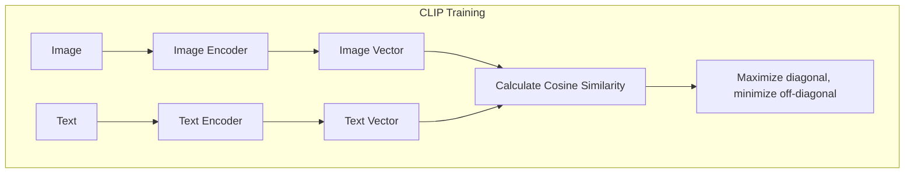
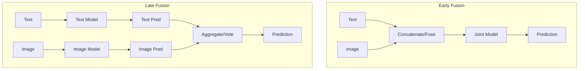
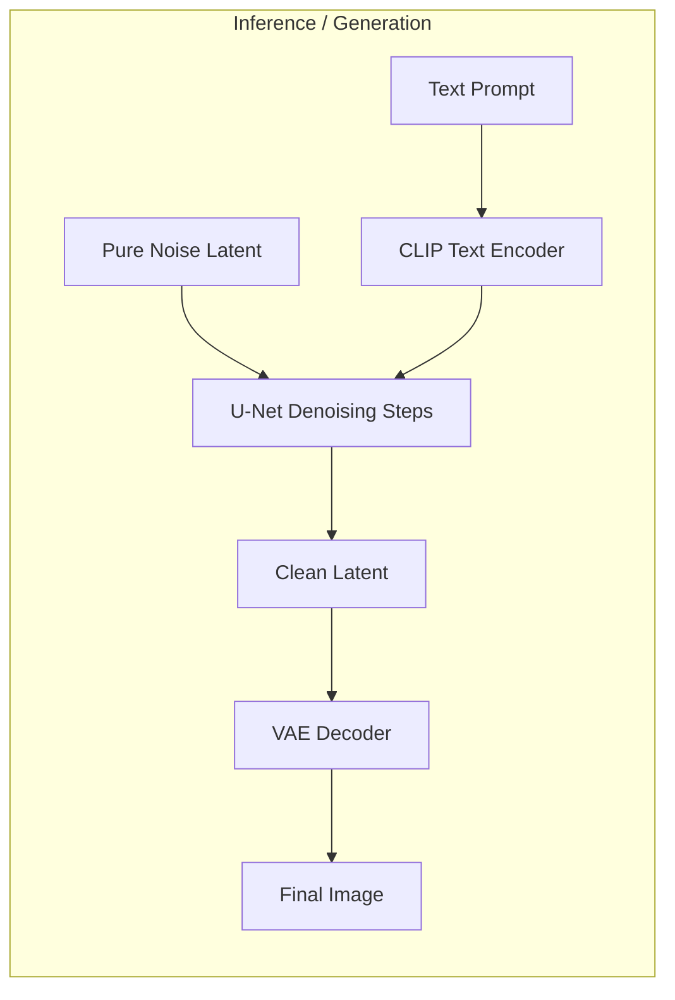
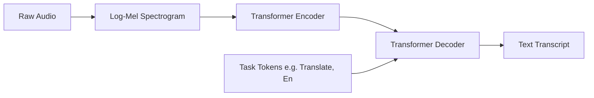
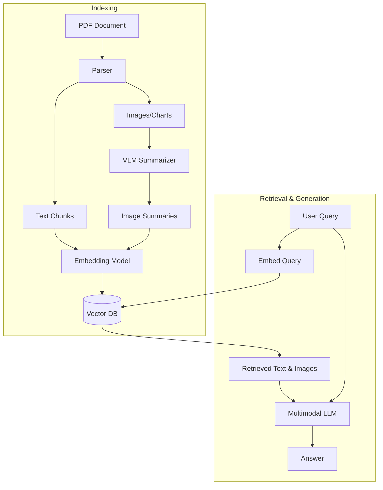

# Multimodal AI — Interview Training Notes

## Table of Contents
- [Section 1: Multimodal Fundamentals](#section-1-multimodal-fundamentals)
- [Section 2: Generation Models](#section-2-generation-models)
- [Section 3: Multimodal Applications](#section-3-multimodal-applications)
- [Section 4: Production Multimodal](#section-4-production-multimodal)
- [Section 5: Scenario Questions](#section-5-scenario-questions)

## Section 1: Multimodal Fundamentals

---
### Q: What are Multimodal AI models, and how do they process different types of data?

**🎯 What the interviewer is testing:** Core understanding of multimodal architecture.

**💬 How to answer:**
Multimodal AI models process and integrate multiple types of data modalities (text, images, audio, video) to make predictions or generate content. They typically work by projecting different modalities into a shared latent space where semantically similar concepts (e.g., the word "dog" and an image of a dog) are positioned close together. 
They process data using specialized encoders for each modality (e.g., ViT for images, Transformer for text) and then use a fusion mechanism to combine the representations.

**🔗 Follow-ups the interviewer might ask:**
- Why is projecting to a shared space important? → It enables cross-modal tasks like text-to-image search or zero-shot image classification.

**⚠️ Common mistakes:** Assuming there is a single architecture; multimodal covers a wide spectrum from contrastive models (CLIP) to generative models (Diffusion/Multimodal LLMs).

**💡 What makes a great answer:** Highlighting the challenge of modality alignment—getting text and image representations to "speak the same language."
---

---
### Q: How do vision-language models process images?

**🎯 What the interviewer is testing:** Knowledge of image tokenization and embedding.

**💬 How to answer:**
Vision-Language Models (VLMs) process images by converting them into sequences of embeddings, similar to how text is tokenized. 
The standard approach (popularized by Vision Transformers or ViT) involves:
1. Splitting the image into fixed-size patches (e.g., 16x16 pixels).
2. Linearly projecting each patch into a vector (patch embedding).
3. Adding positional embeddings so the model knows where each patch belongs in the original image.
4. Feeding this sequence of patches through Transformer encoder blocks.


**🔗 Follow-ups the interviewer might ask:**
- How do VLMs handle varying image sizes? → By resizing or padding images to a fixed resolution, or dynamically adapting the number of patches (though this complicates positional embeddings).

**⚠️ Common mistakes:** Believing VLMs still primarily use CNNs for extraction; modern VLMs heavily favor ViT architectures.

**💡 What makes a great answer:** Mentioning that image patch embeddings are concatenated with text embeddings in multimodal LLMs to allow cross-attention.
---

---
### Q: How does CLIP work, and why is it important for multi-modal AI?

**🎯 What the interviewer is testing:** Understanding of contrastive learning and foundational multimodal models.

**💬 How to answer:**
CLIP (Contrastive Language-Image Pretraining) by OpenAI is a foundational model that connects text and images. 
It is trained using contrastive learning on millions of image-text pairs from the internet. 
- It has an Image Encoder (ViT or ResNet) and a Text Encoder (Transformer).
- During training, it maximizes the cosine similarity between the embeddings of the correct (image, text) pair in a batch, while minimizing the similarity for incorrect pairs.
- **Importance:** CLIP provides a highly robust, zero-shot shared latent space used as the backbone for image search, zero-shot classification, and guiding generative models like Stable Diffusion.



**🔗 Follow-ups the interviewer might ask:**
- How do you use CLIP for zero-shot classification? → Encode the target image, then encode text prompts like "A photo of a [class]" for all possible classes, and pick the class with the highest cosine similarity.

**⚠️ Common mistakes:** Thinking CLIP generates images; it only embeds and aligns them.

**💡 What makes a great answer:** Explaining that CLIP's contrastive loss matrix is what makes it so efficient at learning robust semantic alignments.
---

---
### Q: What are the key architectures for multi-modal models?

**🎯 What the interviewer is testing:** Broad knowledge of multimodal design patterns.

**💬 How to answer:**
There are three primary architectural paradigms:
1. **Contrastive Models (e.g., CLIP, ALIGN):** Use separate encoders aligned via contrastive loss. Great for retrieval and zero-shot classification.
2. **Generative Multimodal LLMs (e.g., GPT-4V, LLaVA):** Use an image encoder (like CLIP's vision tower) combined with a projection layer that maps image features directly into the input space of a pre-trained LLM. The LLM then generates text autoregressively.
3. **Diffusion Models (e.g., Stable Diffusion):** Use a text encoder to condition a UNet that iteratively denoises an image latent space.

```mermaid
flowchart TD
    subgraph VLM Architecture (e.g. LLaVA)
    I[Image] --> VE[Vision Encoder e.g. CLIP]
    VE --> P[Projection Layer / MLP]
    P --> T[Visual Tokens]
    Txt[Text Prompt] --> TE[Text Tokenizer]
    TE --> TT[Text Tokens]
    T & TT --> LLM[Large Language Model]
    LLM --> O[Text Output]
    end
```

**🔗 Follow-ups the interviewer might ask:**
- What is the purpose of the projection layer in LLaVA? → To align the dimensions of the vision encoder's output with the embedding space of the LLM.

**⚠️ Common mistakes:** Confusing the architectures for understanding (VLMs) vs. generation (Diffusion).

**💡 What makes a great answer:** Highlighting that the current trend leverages pre-trained unimodal models (like a frozen LLM and frozen ViT) and trains a lightweight adapter between them.
---

---
### Q: Explain Multimodal Fusion Techniques: Early Fusion vs Late Fusion.

**🎯 What the interviewer is testing:** Understanding of feature integration strategies.

**💬 How to answer:**
Fusion determines when and how different modalities are combined:
- **Early Fusion (Feature-level):** Combine raw data or low-level features immediately (e.g., concatenating image and text tokens) before passing them through the main model. Allows deep cross-modal interactions but is computationally heavy and struggles if modalities have vastly different representations.
- **Late Fusion (Decision-level):** Process each modality independently through separate models, then combine their final predictions or high-level embeddings (e.g., averaging scores). It is easier to implement and train, but misses complex interactions between the modalities.



**🔗 Follow-ups the interviewer might ask:**
- What is intermediate/cross-attention fusion? → Using cross-attention layers in the middle of the network to let modalities attend to each other dynamically (common in modern transformers).

**⚠️ Common mistakes:** Assuming early fusion is always better; late fusion often provides stronger baselines with less compute.

**💡 What makes a great answer:** Mentioning that modern Multimodal LLMs often use early fusion by concatenating token sequences, but rely on intermediate cross-attention mechanisms.
---

## Section 2: Generation Models

---
### Q: How does image generation work with diffusion models (Stable Diffusion, DALL-E, Flux)?

**🎯 What the interviewer is testing:** Deep understanding of generative AI mechanics.

**💬 How to answer:**
Diffusion models generate images by learning to reverse a noise-adding process.
1. **Forward Process:** Gradually add Gaussian noise to a real image until it becomes pure static.
2. **Reverse Process:** Train a neural network (typically a U-Net) to predict the noise added at each step.
3. **Latent Diffusion (e.g., Stable Diffusion):** To save compute, this process happens in a compressed latent space using an Autoencoder (VAE), not pixel space.
4. **Conditioning:** Text prompts are encoded (via CLIP text encoder) and injected into the U-Net via Cross-Attention layers, guiding the denoising process toward the described image.



**🔗 Follow-ups the interviewer might ask:**
- What is Classifier-Free Guidance (CFG)? → A technique used during generation to push the image closer to the text prompt by extrapolating between a conditioned prediction and an unconditioned prediction.

**⚠️ Common mistakes:** Confusing diffusion models with GANs; Diffusion is iterative denoising, GANs are adversarial generator-discriminator pairs.

**💡 What makes a great answer:** Highlighting the critical role of Latent space in making these models computationally feasible for consumer hardware.
---

---
### Q: What is text-to-speech (TTS), and what models are used for it?

**🎯 What the interviewer is testing:** Knowledge of audio generation.

**💬 How to answer:**
TTS converts text into natural-sounding speech. Modern TTS pipelines typically involve:
1. **Text Analysis:** Converting raw text into linguistic features or phonemes.
2. **Acoustic Modeling:** Mapping phonemes to acoustic features (mel-spectrograms).
3. **Vocoding:** Converting the mel-spectrogram into raw audio waveforms.
**Models:** FastSpeech 2 (for acoustic modeling), HiFi-GAN (vocoder), and end-to-end models like VITS. Modern approaches use LLM-like architectures (e.g., Bark, ElevenLabs) that treat audio as discrete tokens to generate highly expressive, zero-shot voices.

**🔗 Follow-ups the interviewer might ask:**
- How do you clone a voice? → Extract speaker embeddings from a brief audio sample and condition the acoustic model on those embeddings during generation.

**⚠️ Common mistakes:** Overlooking the vocoder step, which is crucial for high-fidelity audio generation.

**💡 What makes a great answer:** Referencing the shift from traditional pipeline TTS to autoregressive language modeling approaches for audio.
---

---
### Q: How does speech-to-text (Whisper) work?

**🎯 What the interviewer is testing:** Knowledge of ASR (Automatic Speech Recognition).

**💬 How to answer:**
Whisper is an end-to-end Transformer-based model trained on massive amounts of weakly supervised audio data.
- **Input:** Raw audio is converted to a log-mel spectrogram.
- **Encoder:** Processes the spectrogram to extract acoustic features.
- **Decoder:** Autoregressively predicts text tokens.
Whisper is unique because it handles language identification, translation, and transcription within a single model by using special task tokens in the prompt.



**🔗 Follow-ups the interviewer might ask:**
- How does Whisper handle noisy environments? → Because it was trained on diverse, real-world internet audio rather than clean studio datasets, it is highly robust to noise and accents.

**⚠️ Common mistakes:** Thinking Whisper requires an external language detector or punctuation model (it predicts punctuation inherently).

**💡 What makes a great answer:** Highlighting Whisper's reliance on large-scale weak supervision rather than perfectly aligned datasets.
---

---
### Q: What is text-to-video generation, and what are the current state-of-the-art approaches?

**🎯 What the interviewer is testing:** Awareness of frontier multimodal research (e.g., Sora).

**💬 How to answer:**
Text-to-video generation extends image generation to the temporal dimension, ensuring visual consistency across frames.
**Approaches:**
1. **Video Diffusion Models:** Extend U-Net with 3D or temporal convolution/attention layers to denoise multiple frames simultaneously.
2. **Spacetime Patches (e.g., Sora):** Treats video as sequences of 3D spacetime patches (like ViT patches but with a time dimension) and processes them using a Diffusion Transformer (DiT).
Challenges include maintaining temporal consistency (avoiding flickering or morphing) and handling large computational requirements.

**🔗 Follow-ups the interviewer might ask:**
- Why is video generation so much harder than image generation? → Because of the massive increase in dimensionality and the requirement for physical consistency over time.

**⚠️ Common mistakes:** Assuming video generation is just generating independent images and stitching them together.

**💡 What makes a great answer:** Referencing Diffusion Transformers (DiTs) as the emerging architecture replacing U-Nets for high-resolution video.
---

## Section 3: Multimodal Applications

---
### Q: What is multi-modal RAG, and how does it differ from text-only RAG?

**🎯 What the interviewer is testing:** Application architecture for complex document retrieval.

**💬 How to answer:**
Multimodal RAG retrieves and reasons over both text and non-text elements (images, charts, tables) from documents. 
Unlike text-only RAG, which fails on PDFs containing crucial visual data, Multimodal RAG preserves visual context.
**Implementation:**
1. Parse the document to extract text and images.
2. Create joint embeddings (using models like CLIP) or generate text summaries of the images using a VLM.
3. Store in a vector database.
4. On query, retrieve relevant text AND images, and pass both to a Multimodal LLM to generate the final answer.



**🔗 Follow-ups the interviewer might ask:**
- What if the image embedding space doesn't align well with complex queries? → Using a VLM to generate a rich text summary of the image during indexing often yields better retrieval performance than raw CLIP embeddings.

**⚠️ Common mistakes:** Using standard OCR to extract text from charts and throwing away the visual layout.

**💡 What makes a great answer:** Discussing the trade-off between embedding raw images vs. embedding VLM-generated image summaries.
---

---
### Q: How do you build a system that processes both images and text?

**🎯 What the interviewer is testing:** System design for multimodal applications.

**💬 How to answer:**
A robust system requires:
1. **API Gateway:** Accepts multipart payloads (text + image files).
2. **Preprocessing:** Resizes images to meet model constraints and tokenizes text.
3. **Model Layer:** Routes to a multimodal model (e.g., GPT-4V or LLaVA API).
4. **Orchestration:** LangChain or LlamaIndex can be used to manage the multimodal prompt templates.
5. **Storage:** Store images in an object store (S3) and pass URLs or base64 strings to the model to avoid heavy payloads in the application logic.

**🔗 Follow-ups the interviewer might ask:**
- How do you handle latency? → Process images asynchronously or use lower-resolution modes if fine detail isn't required.

**⚠️ Common mistakes:** Passing massive high-res images directly in base64 without downscaling.

**💡 What makes a great answer:** Highlighting cost and latency optimizations, such as using OpenAI's "low detail" mode for simple image routing tasks.
---

---
### Q: What are multi-modal embeddings, and how are they used for cross-modal search?

**🎯 What the interviewer is testing:** Understanding of vector search in multimodal spaces.

**💬 How to answer:**
Multimodal embeddings map different data types (e.g., text and images) into a single, shared continuous vector space. 
For cross-modal search (e.g., searching for images using a text query):
1. **Indexing:** Pass all images through the model's image encoder and store the resulting vectors in a vector database (e.g., Pinecone, Milvus).
2. **Querying:** Pass the user's text query through the same model's text encoder to get a text vector.
3. **Retrieval:** Calculate cosine similarity between the text vector and the image vectors to return the closest matches.

**🔗 Follow-ups the interviewer might ask:**
- What is the limitation of CLIP for this? → CLIP struggles with fine-grained details, text reading (OCR), and complex compositional relationships (e.g., "A red cube on top of a blue sphere").

**⚠️ Common mistakes:** Assuming you need a translation step (image-to-text) before searching.

**💡 What makes a great answer:** Emphasizing that cross-modal search is purely mathematical (vector distance) and requires no intermediate translation, making it very fast.
---

---
### Q: What is visual question answering (VQA)?

**🎯 What the interviewer is testing:** Knowledge of specific multimodal tasks.

**💬 How to answer:**
VQA is a task where a model is given an image and a natural language question about the image, and it must generate the correct answer. 
It requires the model to perform object detection, spatial reasoning, and natural language understanding simultaneously. Modern solutions use Multimodal LLMs (like LLaVA or Qwen-VL) which are fine-tuned specifically on instruction-following datasets containing image-question-answer triplets.

**🔗 Follow-ups the interviewer might ask:**
- How is VQA evaluated? → Using datasets like VQA v2, measuring exact match accuracy or semantic similarity.

**⚠️ Common mistakes:** Thinking VQA is just image captioning; it requires targeted reasoning based on the specific question.

**💡 What makes a great answer:** Pointing out that VQA often suffers from "language priors" (the model answers based on common text patterns rather than actually looking at the image).
---

---
### Q: What is document understanding, and how do models parse documents with layouts?

**🎯 What the interviewer is testing:** OCR and Document AI.

**💬 How to answer:**
Document Understanding involves extracting information from visually rich documents (receipts, invoices, forms) where layout matters.
- **Traditional pipeline:** OCR (extracts text) + Heuristics/NLP (extracts entities).
- **Modern Multimodal approach:** Models like Donut or LayoutLM process the document as an image *and* text simultaneously. LayoutLM embeds the 2D bounding box coordinates of text tokens, allowing the Transformer to understand spatial relationships (e.g., aligning a "Total" label with the number next to it).

**🔗 Follow-ups the interviewer might ask:**
- Why not just use GPT-4V for all documents? → Cost and latency. Specialized models like LayoutLM are much cheaper and often more accurate for structured document extraction.

**⚠️ Common mistakes:** Relying purely on raw text extraction, which destroys table and form structures.

**💡 What makes a great answer:** Mentioning LayoutLM and the importance of 2D positional embeddings.
---

---
### Q: How do you handle video understanding with AI?

**🎯 What the interviewer is testing:** Scaling multimodal techniques to time-series visual data.

**💬 How to answer:**
Video understanding requires processing spatiotemporal data.
- **Frame Sampling:** Due to compute limits, uniformly sample frames (e.g., 1 frame per second) instead of processing every frame.
- **Encoding:** Pass sampled frames through a Vision Encoder to get a sequence of embeddings.
- **Temporal Modeling:** Use sequence models (Transformers or Temporal Convolutional Networks) to aggregate frame embeddings and understand motion/events.
- **Audio Fusion:** Extract the audio track, process via Whisper, and fuse text tokens with the visual tokens for comprehensive understanding.

**🔗 Follow-ups the interviewer might ask:**
- How do you search within a video? → Embed both frames and spoken audio into a vector DB, allowing search by visual content or spoken dialogue.

**⚠️ Common mistakes:** Trying to feed raw 60fps video directly into a Transformer.

**💡 What makes a great answer:** Highlighting the multimodal nature of video (vision + audio + subtitles).
---

## Section 4: Production Multimodal

---
### Q: How do you evaluate multi-modal AI systems?

**🎯 What the interviewer is testing:** MLOps and evaluation metrics for generative models.

**💬 How to answer:**
Evaluation depends on the task:
- **Retrieval:** Recall@K, Mean Reciprocal Rank (MRR).
- **Generation (Images):** FID (Fréchet Inception Distance) measures realism; CLIP Score measures text-image alignment (how well the image matches the prompt).
- **VQA/Reasoning:** Human evaluation, exact match on structured datasets, or LLM-as-a-judge (using GPT-4 to grade the output of a smaller VLM).
- **Safety:** Rate of NSFW generation or bias.

**🔗 Follow-ups the interviewer might ask:**
- Why is FID criticized? → It relies on an outdated classifier (InceptionNet) and doesn't always correlate with human perception of quality.

**⚠️ Common mistakes:** Using BLEU/ROUGE to evaluate image descriptions, which fails to capture semantic meaning.

**💡 What makes a great answer:** Acknowledging that automatic metrics for generative models are flawed and human preference (Elo rating) is the gold standard.
---

---
### Q: What are the challenges of real-time multi-modal AI processing?

**🎯 What the interviewer is testing:** Systems engineering for low-latency AI.

**💬 How to answer:**
Real-time processing faces significant bottlenecks:
- **Compute:** Vision encoders (ViT) are highly FLOP-intensive.
- **Network I/O:** Transmitting high-res images or audio streams introduces latency.
- **Memory:** Multimodal LLMs have massive KV caches.
**Solutions:** Use edge AI (running smaller models on-device), streaming protocols (WebSockets) for audio/video chunks, and aggressively downsample/quantize data before inference.

**🔗 Follow-ups the interviewer might ask:**
- How do you reduce VLM latency? → Reduce image resolution or use techniques that compress visual tokens (e.g., Q-Former in BLIP-2).

**⚠️ Common mistakes:** Ignoring network payload sizes and focusing only on model inference speed.

**💡 What makes a great answer:** Suggesting pipelining (e.g., processing audio chunk 1 while receiving audio chunk 2).
---

---
### Q: How do you fine-tune a vision-language model?

**🎯 What the interviewer is testing:** Practical model adaptation.

**💬 How to answer:**
Full fine-tuning of a VLM is incredibly expensive. Best practices involve Parameter-Efficient Fine-Tuning (PEFT):
1. **Freeze the Encoders:** Keep the Vision Encoder (CLIP) and the LLM backbone frozen.
2. **Train the Adapter:** Only train the projection layer (MLP) that maps vision features to the LLM space.
3. **LoRA (Low-Rank Adaptation):** Apply LoRA specifically to the attention layers of the LLM to adapt it to domain-specific instructions without catastrophic forgetting.
You need a dataset of `(image, instruction, expected_output)` pairs.

**🔗 Follow-ups the interviewer might ask:**
- What if the model needs to recognize a completely new visual concept (like a specific manufacturing defect)? → You may need to unfreeze the last few layers of the vision encoder as well.

**⚠️ Common mistakes:** Assuming you must train the model end-to-end from scratch.

**💡 What makes a great answer:** Explicitly mentioning the freezing of unimodal backbones and training only the cross-modal adapters.
---

---
### Q: What are the latency and cost considerations for multi-modal AI in production?

**🎯 What the interviewer is testing:** Pragmatic engineering and ROI optimization.

**💬 How to answer:**
Multimodal models are exponentially more expensive than text models.
- **Token Costs:** Images are converted to hundreds of tokens (e.g., a high-res image might be 1000+ tokens). This scales cost and latency linearly for autoregressive generation.
- **Caching:** KV cache size balloons quickly, leading to OOM (Out of Memory) errors on GPUs and reducing batch size.
- **Optimization:** Use lower resolution inputs, prompt caching (if supported by the API/vLLM), and route simpler queries to smaller models (e.g., LLaVA-7B instead of GPT-4V).

**🔗 Follow-ups the interviewer might ask:**
- How do you estimate cost for an image via API? → APIs usually charge a base fee per image plus additional cost based on resolution (number of 512x512 tiles).

**⚠️ Common mistakes:** Treating an image as a single token; it is almost always expanded into a sequence of tokens.

**💡 What makes a great answer:** Highlighting the memory bandwidth bottleneck in serving Multimodal LLMs.
---

---
### Q: How do you handle multi-modal content moderation?

**🎯 What the interviewer is testing:** AI Safety applied to non-text modalities.

**💬 How to answer:**
Content moderation must happen across all modalities simultaneously.
- **Images:** Run inputs and outputs through specialized NSFW, gore, and CSAM classifiers.
- **Text:** Filter prompts for jailbreaks and toxicity.
- **Cross-modal:** Some content is only toxic when combined (e.g., a benign image of a public figure paired with a defamatory text overlay). This requires a multimodal classifier (VLM) specifically fine-tuned for trust and safety to evaluate the image-text pair together.

**🔗 Follow-ups the interviewer might ask:**
- How do you moderate video? → Sample frames and moderate them as images, and extract audio to moderate via text.

**⚠️ Common mistakes:** Moderating image and text separately and assuming that's sufficient (missing cross-modal toxicity).

**💡 What makes a great answer:** Defining "Cross-modal toxicity" and the necessity of joint evaluation.
---

## Section 5: Scenario Questions

---
### Q: Your vision-language model generates factually incorrect image descriptions. How do you fix it?

**🎯 What's being tested:** Mitigating multimodal hallucinations.

**💬 How to approach this:**
1. **Diagnose first:** Check if the hallucination is caused by low image resolution (model can't see the detail) or strong language priors (model assumes a desk has a computer on it).
2. **Root causes:** Over-reliance on LLM weights rather than visual evidence.
3. **Solutions:**
   - Prompt engineering: "Describe ONLY what is clearly visible. Do not guess."
   - Increase image resolution / tiling to provide more visual tokens.
   - Use decoding techniques like DoLa (Decoding by Contrasting Layers) or classifier-free guidance to heavily weight the visual conditioning.
4. **Prevention:** Fine-tune with a dataset containing hard negative examples and explicit "I cannot see this" labels.

**⚠️ Trap to avoid:** Just changing the temperature to 0 (it helps, but won't solve structural hallucinations).

**💡 Pro tip:** Mentioning that language priors dominate when the visual signal is weak.
---

---
### Q: Your VLM answers single-image questions but fails on multi-page documents. How do you fix it?

**🎯 What's being tested:** Handling long-context visual reasoning.

**💬 How to approach this:**
1. **Diagnose first:** VLM runs out of context window or loses attention across multiple images.
2. **Root causes:** Concatenating 10 page images results in 10,000+ tokens, leading to the "lost in the middle" phenomenon and OOM errors.
3. **Solutions:**
   - **Visual RAG:** Use a dense retriever (like ColPali) to find the single most relevant page/crop based on the query, and only pass that to the VLM.
   - **Hierarchical Summarization:** Have a small model summarize each page, then pass the summaries to the VLM.
4. **Prevention:** Architect systems to treat multi-page docs as a retrieval problem first, generation problem second.

**⚠️ Trap to avoid:** Trying to force feed a 100-page PDF into GPT-4V directly.

**💡 Pro tip:** ColPali (vision-based document retrieval) is the cutting-edge solution for this exact problem.
---

---
### Q: Your multimodal LLM ignores the image and generates descriptions from text alone. How do you fix it?

**🎯 What's being tested:** Troubleshooting modality imbalance.

**💬 How to approach this:**
1. **Diagnose first:** The text modality dominates the visual modality during generation.
2. **Root causes:** The model is under-trained on the vision alignment layer, or the text prompt is too leading.
3. **Solutions:**
   - **Prompting:** Restructure the prompt. Place the image tokens *after* the text instruction, forcing the model to attend to the image right before generating.
   - **Fine-tuning:** Adjust the loss function to heavily penalize ignoring visual tokens.
   - **Architecture:** Increase the dimensionality or expressiveness of the visual projection layer.
4. **Prevention:** During training, randomly drop the text prompt to force the model to rely on visual features.

**⚠️ Trap to avoid:** Assuming the model is broken; it's often just a symptom of the LLM backbone being extremely strong.

**💡 Pro tip:** Token positioning matters immensely in multimodal prompting.
---

---
### Q: Your diffusion model ignores precise control requirements in text prompts. How do you improve controllability?

**🎯 What's being tested:** Advanced image generation techniques (ControlNet).

**💬 How to approach this:**
1. **Diagnose first:** Text prompts are notoriously bad for specifying exact layouts, poses, or structural boundaries.
2. **Root causes:** Text is ambiguous; cross-attention layers struggle to map text spatially.
3. **Solutions:**
   - **Use ControlNet:** Add a parallel network that takes spatial conditions (edge maps, depth maps, human pose skeletons) and injects them into the U-Net.
   - **IP-Adapter:** Use image prompts for stylistic control rather than just text.
4. **Prevention:** Design the UX to allow users to provide reference images or sketches alongside text.

**⚠️ Trap to avoid:** Trying to fix this purely through longer, more descriptive text prompts.

**💡 Pro tip:** ControlNet is the industry standard for production image generation workflows requiring precision.
---

---
### Q: Your diffusion model generates sharp but repetitive images. How do you balance quality vs diversity?

**🎯 What's being tested:** Understanding Classifier-Free Guidance (CFG).

**💬 How to approach this:**
1. **Diagnose first:** The model suffers from mode collapse or the CFG scale is set too high.
2. **Root causes:** High CFG forces the model to adhere strictly to the prompt, which often converges on the most statistically common, "safe" image in the training distribution.
3. **Solutions:**
   - **Lower the CFG Scale:** (e.g., from 10 down to 4). This increases diversity at the cost of slight adherence to the prompt.
   - **Dynamic CFG:** Scale down the CFG in the later denoising steps to allow fine details to vary.
   - **Prompt variation:** Automatically inject random stylistic keywords or change the seed.
4. **Prevention:** Expose CFG as a parameter to the end-user (e.g., "Creativity Slider").

**⚠️ Trap to avoid:** Assuming the training data is the only issue.

**💡 Pro tip:** Explain the tradeoff: CFG > 1 pushes the prediction away from the unconditional mean, improving quality but killing diversity.
---

---
### Q: Your diffusion model takes too long per image. How do you speed up sampling?

**🎯 What's being tested:** Optimizing generative inference.

**💬 How to approach this:**
1. **Diagnose first:** Standard diffusion requires 20-50 sequential denoising steps, which is slow.
2. **Root causes:** The iterative nature of U-Net inference.
3. **Solutions:**
   - **Better Schedulers/Solvers:** Switch from DDPM to faster schedulers like DPM-Solver++ or Euler Ancestral (reduces steps to 15-20).
   - **Distillation:** Use models like LCM (Latent Consistency Models) or SDXL Turbo/Lightning, which distil the process down to 1-4 steps.
   - **Compilation:** Use TensorRT or torch.compile to optimize the U-Net graph.
4. **Prevention:** Benchmark different samplers during the model selection phase based on your latency budget.

**⚠️ Trap to avoid:** Just buying more expensive GPUs without optimizing the sampling algorithm.

**💡 Pro tip:** Consistency Models are the state-of-the-art for sub-second real-time image generation.
---
