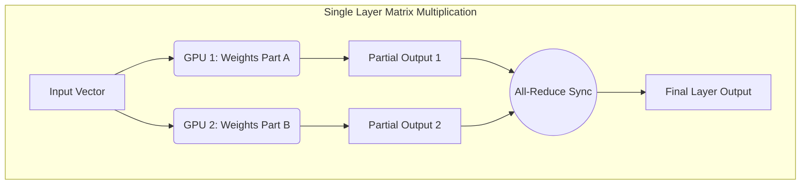
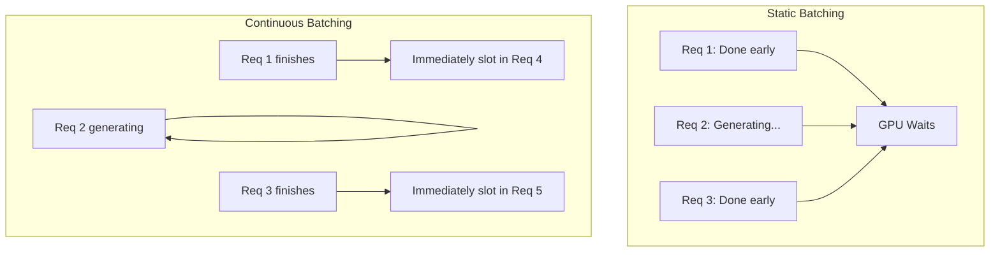
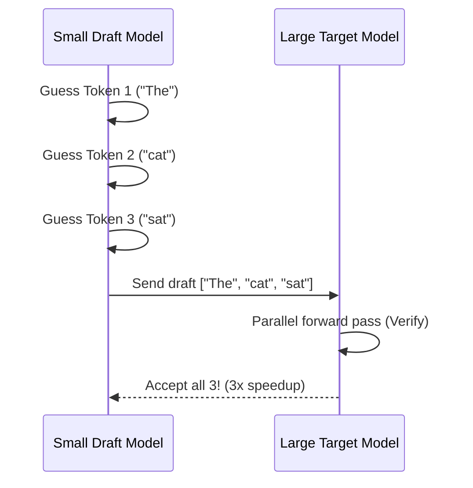
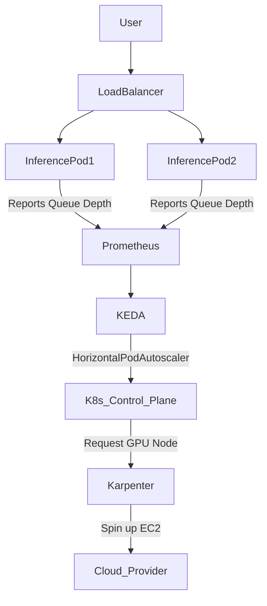
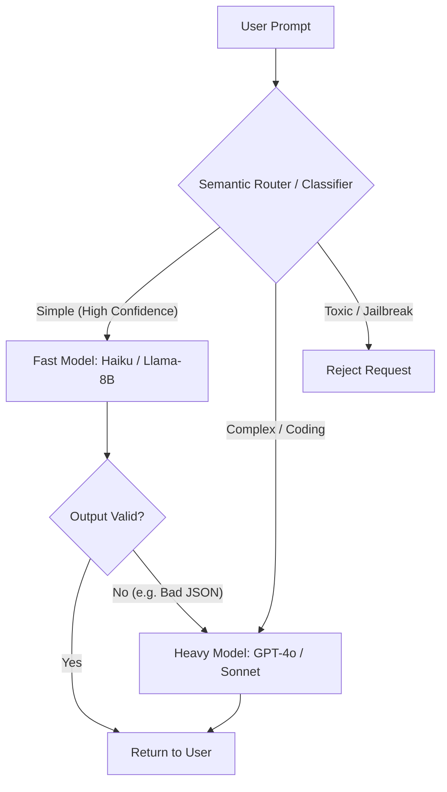

# AI Infrastructure & Scalability — Interview Training Notes

## Table of Contents
- [Section 1: GPU & Hardware](#section-1-gpu--hardware)
- [Section 2: Inference Optimization](#section-2-inference-optimization)
- [Section 3: Quantization & Compression](#section-3-quantization--compression)
- [Section 4: Serving Infrastructure](#section-4-serving-infrastructure)
- [Section 5: Monitoring & Routing](#section-5-monitoring--routing)

## Section 1: GPU & Hardware

---
### Q: How do you select GPUs for LLM inference?

**🎯 What the interviewer is testing:** Your understanding of memory bottlenecks vs. compute bottlenecks and how to match hardware to model requirements.

**💬 How to answer:**
Selecting GPUs for LLM inference primarily comes down to **VRAM capacity**, **Memory Bandwidth**, and **Compute Capability**, balanced against cost. LLM inference is usually memory-bandwidth bound rather than compute bound, especially for single-batch or low-batch-size generation.

1. **Calculate VRAM Requirements:** I start by estimating the memory needed to load the model weights. A 70B parameter model in 16-bit precision requires ~140GB just for weights. Plus, I need 20-30% extra memory for the KV cache and activation memory. So for a 70B model, I need at least two 80GB GPUs (e.g., A100s or H100s) using Tensor Parallelism.
2. **Prioritize Memory Bandwidth:** Since generating tokens requires reading the entire model weight matrix from VRAM into the compute cores for every single token, memory bandwidth determines the maximum tokens/second. The H100 has >3 TB/s, while A100 has ~2 TB/s. I prefer high bandwidth architectures like H100 or H200 for high-throughput serving.
3. **Assess Quantization and Cost:** If I use a quantized model (e.g., INT8 or INT4), the memory footprint halves or quarters. A 70B INT4 model fits on a single 80GB GPU. For cost-sensitive internal tools or low-throughput endpoints, I might choose cheaper GPUs like the L40S or A10, provided the model fits.

**🔗 Follow-ups the interviewer might ask:**
- *What happens if the model doesn't fit on one GPU?* → We use Tensor Parallelism to split the weights across multiple GPUs on the same node, ideally connected by NVLink.
- *Why is inference memory-bandwidth bound?* → The arithmetic intensity (FLOPs per byte of memory read) is very low during the decoding phase, meaning the ALUs spend most of their time waiting for data from VRAM.

**⚠️ Common mistakes:** Recommending the highest compute GPU (like H100) without calculating VRAM first, or ignoring the KV cache overhead.

**💡 What makes a great answer:** Explicitly calculating the VRAM requirement and mentioning the difference between the prefill phase (compute-bound) and decode phase (memory-bandwidth bound).
---

---
### Q: What is model parallelism vs data parallelism in distributed training?

**🎯 What the interviewer is testing:** Distributed systems knowledge and understanding of how to scale training.

**💬 How to answer:**
Data Parallelism and Model Parallelism are two fundamental strategies for training models that are too slow or too large for a single GPU.

- **Data Parallelism (DP):** The model weights are replicated across all GPUs. The training data is split into micro-batches, and each GPU computes gradients on its subset of data. After the forward and backward passes, the GPUs synchronize their gradients (using an All-Reduce operation) and update their weights identically. It's used when the model fits in a single GPU's memory, but training is too slow.
- **Model Parallelism (MP):** The model itself is split across multiple GPUs. This is necessary when a single model is too large to fit in the memory of one GPU. Model Parallelism can be further divided into **Tensor Parallelism** (splitting individual layers) and **Pipeline Parallelism** (splitting across layers).

| Feature | Data Parallelism | Model Parallelism |
| :--- | :--- | :--- |
| **What is split?** | Training Data (Batches) | Model Architecture/Weights |
| **Model Size** | Must fit on 1 GPU | Can be larger than 1 GPU |
| **Communication Overhead** | Gradient sync (All-Reduce) | High-frequency activation sync |
| **Primary Use Case** | Speeding up training | Fitting giant models |

**🔗 Follow-ups the interviewer might ask:**
- *Can you combine them?* → Yes, 3D Parallelism combines Data, Tensor, and Pipeline parallelism to train massive models like GPT-3 or Llama-3.

**⚠️ Common mistakes:** Confusing the types of model parallelism, or assuming data parallelism can help if the model doesn't fit in VRAM.

**💡 What makes a great answer:** Clearly separating the "what is split" aspect and noting that modern training uses both simultaneously.
---

---
### Q: What is tensor parallelism, and how does it help serve large models?

**🎯 What the interviewer is testing:** Knowledge of intra-layer distribution mechanisms and how big models are actually deployed.

**💬 How to answer:**
Tensor Parallelism (TP) is a form of model parallelism where individual layers—specifically the large matrix multiplications in attention and feed-forward networks—are split across multiple GPUs. 

Instead of putting Layer 1 on GPU A and Layer 2 on GPU B, TP splits Layer 1 so that GPU A computes one half of the matrix multiplication and GPU B computes the other half simultaneously. Because the GPUs need to synchronize their partial results (using All-Reduce) immediately after the computation, they must have extremely high-bandwidth connections, like NVLink.

In serving large models (like a 70B parameter LLM), TP is crucial because:
1. It aggregates VRAM across GPUs, allowing the model to fit.
2. It divides the compute and memory read operations for every single token generation, reducing the latency per token compared to pipeline parallelism.



**🔗 Follow-ups the interviewer might ask:**
- *Why not use TP across different servers/nodes?* → The communication overhead of All-Reduce happens for every layer, for every token. Across standard network links (Ethernet/InfiniBand), this would severely bottleneck the system. TP is strictly kept intra-node (same physical server).

**⚠️ Common mistakes:** Describing pipeline parallelism instead of tensor parallelism.

**💡 What makes a great answer:** Emphasizing the intra-layer nature of TP and explicitly mentioning the need for NVLink due to high communication frequency.
---

---
### Q: What is pipeline parallelism?

**🎯 What the interviewer is testing:** Understanding of inter-layer distribution and pipeline bubbles.

**💬 How to answer:**
Pipeline Parallelism (PP) is a strategy where a model is split vertically by its layers across multiple GPUs. For example, in an 80-layer model distributed across 4 GPUs, GPU 1 gets layers 1-20, GPU 2 gets 21-40, and so on.

The challenge with naive pipeline parallelism is that GPU 2 sits idle while GPU 1 processes the data. To fix this, we use micro-batching. We split a large batch into smaller chunks (micro-batches) and push them through the pipeline. While GPU 2 processes micro-batch 1, GPU 1 can process micro-batch 2. 

It is commonly used across different nodes where NVLink isn't available, because communication only happens at the boundaries between layer groups, requiring much less bandwidth than Tensor Parallelism.

```mermaid
gantt
    title Pipeline Parallelism (Micro-batching)
    dateFormat  s
    axisFormat %S
    section GPU 1 (Layers 1-2)
    Batch 1     :active, 0, 1
    Batch 2     :active, 1, 2
    Batch 3     :active, 2, 3
    section GPU 2 (Layers 3-4)
    Bubble      :crit, 0, 1
    Batch 1     :active, 1, 2
    Batch 2     :active, 2, 3
    Batch 3     :active, 3, 4
```



**🔗 Follow-ups the interviewer might ask:**
- *What is a pipeline bubble?* → The idle time at the beginning and end of a training step where some GPUs are waiting for others to finish their micro-batches.
- *How do you reduce the bubble?* → By increasing the number of micro-batches relative to the number of pipeline stages.

**⚠️ Common mistakes:** Failing to mention micro-batching, which is the only thing that makes pipeline parallelism efficient.

**💡 What makes a great answer:** Highlighting the trade-off: PP has lower communication bandwidth requirements than TP but suffers from pipeline bubbles.
---

---
### Q: What is FSDP (Fully Sharded Data Parallel), and how does it differ from DeepSpeed ZeRO?

**🎯 What the interviewer is testing:** Knowledge of state-of-the-art memory-efficient training techniques.

**💬 How to answer:**
FSDP (Fully Sharded Data Parallel) is a PyTorch-native technique that allows training massive models that exceed a single GPU's VRAM, while writing code as if it were simple Data Parallelism. It does this by sharding the model's weights, gradients, and optimizer states across all available GPUs. 

Instead of every GPU holding a full copy of the model (as in standard DDP), each GPU only holds a fraction. During the forward pass, a GPU gathers the required weights from other GPUs just-in-time for a specific layer, computes the output, and then discards the weights to free memory. It does the same for the backward pass.

FSDP is heavily inspired by **DeepSpeed ZeRO (Zero Redundancy Optimizer)**. 
- DeepSpeed ZeRO-3 and FSDP essentially do the same thing: sharding weights, gradients, and optimizer states.
- The main difference is implementation: DeepSpeed is a separate library by Microsoft that patches into PyTorch, while FSDP is natively integrated into PyTorch core. FSDP offers better integration with PyTorch's newer features like `torch.compile`.

**🔗 Follow-ups the interviewer might ask:**
- *Does FSDP increase communication overhead?* → Yes, it trades network communication (gathering weights) for massive memory savings. It requires fast networking (like InfiniBand).

**⚠️ Common mistakes:** Thinking FSDP is model parallelism. It is a form of data parallelism because each GPU still processes its own distinct batch of data; it just borrows weights dynamically.

**💡 What makes a great answer:** Explaining the "just-in-time" weight gathering mechanism.
---

## Section 2: Inference Optimization

---
### Q: How do you improve inference speed in production LLM deployments?

**🎯 What the interviewer is testing:** A holistic view of the LLM serving stack, from hardware to software optimizations.

**💬 How to answer:**
Improving inference speed (both Time-To-First-Token and Inter-Token Latency) requires a multi-layered approach. I categorize optimizations into three buckets: Model Level, System Level, and Hardware Level.

1. **Model-Level (Reducing compute/memory footprint):**
   - **Quantization:** Converting weights to FP8, INT8, or INT4 (e.g., using AWQ or GPTQ) drastically reduces memory bandwidth requirements.
   - **Pruning / Distillation:** Using a smaller model tailored to the specific task.
2. **System-Level (Serving framework optimizations):**
   - **Continuous Batching:** Dynamically adding new requests to the batch as soon as others finish, maximizing GPU utilization.
   - **PagedAttention:** Managing the KV cache like an OS manages virtual memory, eliminating fragmentation and allowing much larger batch sizes. (Often done via vLLM).
   - **Speculative Decoding:** Using a small draft model to generate tokens quickly and verifying them in bulk with the large model.
3. **Hardware-Level:**
   - **Tensor Parallelism:** Splitting the model across multiple GPUs on the same node.
   - Using specialized inference kernels like FlashAttention to speed up the self-attention computation.

**🔗 Follow-ups the interviewer might ask:**
- *Which of these gives the biggest win?* → For throughput, Continuous Batching + PagedAttention (vLLM). For latency, Quantization + FlashAttention.

**⚠️ Common mistakes:** Just listing buzzwords without explaining how they interact, or confusing training optimizations with inference optimizations.

**💡 What makes a great answer:** Categorizing the solutions logically and mentioning industry-standard tools like vLLM or TensorRT-LLM.
---

---
### Q: LLM optimization techniques (overview of all major techniques)

**🎯 What the interviewer is testing:** Breadth of knowledge across the LLM stack.

**💬 How to answer:**
Here is a structured overview of the major optimization techniques used in modern LLM engineering:

1. **Attention Optimizations:**
   - **FlashAttention (1, 2, & 3):** An IO-aware exact attention algorithm that tiles computation to keep data in fast SRAM, reducing slow VRAM reads/writes.
   - **Grouped Query Attention (GQA):** An architectural choice where multiple query heads share a single Key-Value head, massively reducing the KV cache size during inference.
2. **Memory Management:**
   - **PagedAttention:** Paginates the KV cache, allocating memory non-contiguously. This prevents memory fragmentation and allows up to 4x higher throughput.
3. **Throughput Optimizations:**
   - **Continuous Batching (In-flight batching):** Ejects finished requests and slots in new ones at the token level, rather than waiting for an entire batch to finish.
4. **Latency Optimizations:**
   - **Speculative Decoding:** Guessing future tokens using a cheap model and verifying them in parallel with the expensive model.
5. **Compression Techniques:**
   - **Quantization (PTQ/QAT):** Reducing precision to INT8/INT4. 
   - **Sparsity/Pruning:** Removing weights close to zero.

**⚠️ Common mistakes:** Confusing GQA (an architectural change done during pre-training) with FlashAttention (a software kernel optimization).

**💡 What makes a great answer:** Providing a mental map of where each optimization sits (architecture, kernel, serving framework).
---

---
### Q: How does continuous batching improve LLM inference throughput?

**🎯 What the interviewer is testing:** Understanding of serving mechanics and why static batching fails for LLMs.

**💬 How to answer:**
Continuous batching (or in-flight batching) solves the extreme inefficiency of static batching in LLMs. 

With static batching, if you batch 4 requests together, the GPU must wait for the longest sequence to finish generating before it can process a new batch. If three requests generate 10 tokens and one generates 100 tokens, the GPU sits mostly idle for 90 generation steps.

Continuous batching operates at the **iteration level** (per-token). As soon as Request A emits its end-of-sequence (EOS) token, the server evicts it from the batch and instantly slots in a new Request E from the queue. The GPU is constantly kept at maximum batch capacity, leading to 10x-20x improvements in throughput (tokens per second per GPU).



**🔗 Follow-ups the interviewer might ask:**
- *What's the challenge in implementing this?* → You have to handle requests that are in the "prefill" phase (processing the prompt) simultaneously with requests in the "decode" phase (generating one token), which have drastically different compute profiles.

**⚠️ Common mistakes:** Saying continuous batching reduces latency. It often slightly *increases* inter-token latency but massively increases *throughput* (total requests processed).

**💡 What makes a great answer:** Contrasting prefill and decode phases and explaining how continuous batching orchestrates them.
---

---
### Q: What is speculative decoding, and how does it speed up inference?

**🎯 What the interviewer is testing:** Knowledge of advanced latency reduction techniques.

**💬 How to answer:**
Speculative decoding speeds up inference (specifically Inter-Token Latency) by taking advantage of the fact that LLMs have excess compute capacity during single-batch decoding.

Because memory bandwidth is the bottleneck, running a forward pass to check 4 tokens takes almost the same time as checking 1 token. Speculative decoding works by:
1. **Drafting:** A small, fast model (e.g., 1B parameters) guesses the next $K$ tokens (e.g., 4 tokens) sequentially.
2. **Verification:** The large target model (e.g., 70B parameters) takes these 4 draft tokens and runs a *single* parallel forward pass to verify them.
3. **Acceptance:** If the target model agrees with the draft tokens, we've generated 4 tokens in the time it usually takes to generate 1. If it disagrees at token 3, it rejects tokens 3 and 4, corrects token 3, and the process restarts.

Because the verification step is highly parallelized, this heavily reduces latency without changing the mathematical output of the target model at all.



**🔗 Follow-ups the interviewer might ask:**
- *When does speculative decoding perform poorly?* → On highly complex reasoning tasks or coding tasks where the small draft model's accuracy is too low, leading to constant rejections and wasted compute.

**⚠️ Common mistakes:** Stating that speculative decoding alters the final output or degrades quality. It guarantees mathematically identical outputs to the target model.

**💡 What makes a great answer:** Explaining *why* it works at the hardware level—leveraging the memory-bandwidth bound nature of the decode phase to do parallel verification for "free."
---

---
### Q: What is KV cache, and how do you manage memory for it?

**🎯 What the interviewer is testing:** Deep understanding of the Transformer architecture's inference bottleneck.

**💬 How to answer:**
The KV (Key-Value) cache is a memory optimization used during the auto-regressive generation phase of LLMs. 
Instead of recalculating the Key and Value matrices for all previous tokens every time a new token is generated (which is computationally expensive O(N^2)), we store the computed Keys and Values in GPU VRAM. As new tokens are generated, we only compute the K and V for the new token and append it to the cache.

**Managing KV Cache Memory:**
The KV cache grows dynamically with sequence length and batch size. Unmanaged, it causes Out-Of-Memory (OOM) errors. We manage it using:
1. **PagedAttention:** (via vLLM) Allocates memory in non-contiguous blocks to prevent fragmentation.
2. **Quantization:** Storing the KV cache in FP8 or INT8 instead of FP16.
3. **Architectural choices:** Using Grouped Query Attention (GQA) or Multi-Query Attention (MQA), which drastically reduces the number of Key/Value heads that need to be stored.
4. **Context Window Limits:** Enforcing strict max-token limits at the serving layer.

**🔗 Follow-ups the interviewer might ask:**
- *What happens when the KV cache fills up?* → The server must swap blocks to CPU RAM, or preempt/drop the request entirely.

**⚠️ Common mistakes:** Confusing model weights memory with KV cache memory. Model weights are static; KV cache grows linearly with context length.

**💡 What makes a great answer:** Mentioning GQA (Grouped Query Attention) as the primary architectural way we've solved huge KV caches in modern models like Llama-3.
---

---
### Q: What is Paged Attention?

**🎯 What the interviewer is testing:** Knowledge of vLLM and modern memory management.

**💬 How to answer:**
PagedAttention is the core algorithm behind the vLLM serving framework, designed to solve memory fragmentation in the KV cache.

Before PagedAttention, KV caches were stored in contiguous blocks of VRAM. Because the final length of a generated response is unknown, systems had to pre-allocate maximum memory (e.g., 2048 tokens) for every request. This led to massive internal fragmentation (wasted pre-allocated space) and external fragmentation, meaning only small batch sizes could be supported.

PagedAttention borrows the concept of **virtual memory and paging from operating systems**. It splits the KV cache into fixed-size blocks (e.g., 16 tokens). These blocks do not need to be contiguous in physical VRAM. The system maps a logical token sequence to physical blocks using a block table. 

This eliminates wasted memory, allows the system to pack the KV cache tightly, and enables up to 4x higher batch sizes and throughput.

```mermaid
graph LR
    subgraph Logical View (Sequence)
    T1[Tokens 1-16] --> T2[Tokens 17-32] --> T3[Tokens 33-48]
    end
    
    subgraph Block Table
    Map1[Logical 0 -> Physical Block 5]
    Map2[Logical 1 -> Physical Block 1]
    Map3[Logical 2 -> Physical Block 8]
    end
    
    subgraph Physical VRAM
    B1[Block 1]
    B2[Empty]
    B5[Block 5]
    B8[Block 8]
    end
    
    T1 -.-> Map1 -.-> B5
    T2 -.-> Map2 -.-> B1
    T3 -.-> Map3 -.-> B8
```

**🔗 Follow-ups the interviewer might ask:**
- *Does PagedAttention help with shared prefixes (system prompts)?* → Yes! Because it uses a block table, multiple requests can point to the same physical blocks for shared system prompts, saving massive amounts of memory (Prefix Caching).

**⚠️ Common mistakes:** Explaining it as an optimization for model weights instead of the KV cache.

**💡 What makes a great answer:** Mentioning the OS virtual memory analogy and the side-benefit of Prefix Caching.
---

---
### Q: How does GGUF work?

**🎯 What the interviewer is testing:** Knowledge of local/edge LLM deployment ecosystems.

**💬 How to answer:**
GGUF (GPT-Generated Unified Format) is a file format created by the llama.cpp community specifically for running LLMs efficiently on consumer hardware (CPUs, Mac M-series chips, and consumer GPUs).

It works by packaging the entire model—including quantized weights, architecture metadata, and the tokenizer—into a single binary file. 

The primary advantage of GGUF is that it is optimized for **memory mapping (mmap)**. The model can be loaded directly from disk to memory instantly without parsing overhead. GGUF heavily utilizes quantization (like 4-bit integer quantization) to shrink models so a 7B parameter model can run comfortably on a laptop with 8GB of RAM.

**🔗 Follow-ups the interviewer might ask:**
- *How is it different from safetensors?* → Safetensors is an ecosystem-agnostic format primarily used by HuggingFace for secure tensor storage (often unquantized). GGUF is specifically designed for the llama.cpp ecosystem, optimized for heavy quantization and CPU/Apple Silicon execution.

**⚠️ Common mistakes:** Assuming GGUF is a serving framework. It is purely a file format.

**💡 What makes a great answer:** Pointing out that packaging the tokenizer *with* the model in GGUF eliminates the "missing tokenizer config" nightmares common with raw PyTorch weights.
---

## Section 3: Quantization & Compression

---
### Q: What is model quantization (INT8, INT4, FP16, BF16), and how does it affect quality?

**🎯 What the interviewer is testing:** Understanding of precision tradeoffs and post-training quantization methods.

**💬 How to answer:**
Quantization is the process of reducing the precision of the numbers used to represent a model's weights and/or activations, reducing memory usage and speeding up inference.

- **FP16 / BF16 (16-bit):** The standard precision for modern LLM training and baseline inference. Almost no loss in quality compared to FP32.
- **INT8 (8-bit):** Cuts memory in half. Methods like SmoothQuant or bitsandbytes preserve >99% of model accuracy.
- **INT4 (4-bit):** Cuts memory by 4x. Methods like AWQ or GPTQ are used. There is a slight but noticeable degradation in complex reasoning and coding tasks.

**How it affects quality:**
Lower precision means lower dynamic range and rounding errors. LLMs often have "outlier features"—specific activations that are massive in magnitude. Naive quantization clips these outliers, destroying model performance. Modern techniques (like AWQ) work by identifying these critical outlier weights and keeping them in higher precision or scaling them so they survive quantization.

| Format | Bits | Memory for 70B | Quality Degradation | Primary Use Case |
| :--- | :--- | :--- | :--- | :--- |
| FP16/BF16 | 16 | ~140 GB | None (Baseline) | Cloud / High Quality |
| INT8 | 8 | ~70 GB | Negligible | Cloud Cost Saving |
| INT4 | 4 | ~35 GB | Minor to Moderate | Edge / Consumer GPUs |

**🔗 Follow-ups the interviewer might ask:**
- *What is the difference between PTQ and QAT?* → PTQ (Post-Training Quantization) quantizes an already trained model. QAT (Quantization-Aware Training) simulates quantization during training so the model learns to adapt to the lower precision, yielding better quality.

**⚠️ Common mistakes:** Forgetting that activations must also be quantized or handled carefully, not just the weights.

**💡 What makes a great answer:** Mentioning the "outlier feature" problem and how modern algorithms like AWQ solve it.
---

---
### Q: How do you optimize inference for edge and mobile deployment?

**🎯 What the interviewer is testing:** Dealing with extreme resource constraints.

**💬 How to answer:**
Edge deployment (phones, IoT, laptops) involves strict limits on RAM (often 4GB-8GB), battery power, and compute. I would approach this by:

1. **Extreme Quantization:** Using GGUF formats with 4-bit or even 3-bit quantization (e.g., Q4_K_M) to compress models like Llama-3 8B to under 5GB.
2. **Small Language Models (SLMs):** Deploying models purposefully built for the edge, such as Phi-3 (3.8B) or Qwen-2 (1.5B).
3. **Hardware-Specific Runtimes:** 
   - Using **llama.cpp** for CPU and Apple Metal execution.
   - Using **ExecuTorch** (PyTorch's edge library) or **CoreML** for iOS devices to leverage the Neural Engine (NPU).
4. **KV Cache Limits:** Enforcing strict context windows (e.g., max 2048 tokens) so the dynamic KV cache doesn't cause an OOM crash on a smartphone.

**💡 Pro tip:** Mentioning the NPU (Neural Processing Unit) found in modern mobile chips and how leveraging it saves battery life compared to running on the mobile GPU.
---

---
### Q: What is model sharding, and when would you use it?

**🎯 What the interviewer is testing:** Differentiating between standard distributed serving and simple file chunking.

**💬 How to approach this:**
"Model sharding" can mean two things depending on the context:

1. **At the File System Level:** Sharding a massive `model.safetensors` file into multiple 5GB chunks (e.g., `model-0001-of-0005.safetensors`). 
   - *When to use it:* To make downloading faster (parallel downloads), prevent RAM spikes when loading files, and avoid Git/OS file size limits.
2. **At the Infrastructure Level (Tensor Parallelism):** Sharding the model's weight matrices across multiple GPUs (e.g., DeepSpeed or Megatron-LM).
   - *When to use it:* When the model requires more VRAM than a single GPU can provide, ensuring you aggregate the VRAM and memory bandwidth of multiple GPUs.

**⚠️ Trap to avoid:** Assuming sharding automatically means distributed inference. On HuggingFace, it almost always refers to file chunking.
---

## Section 4: Serving Infrastructure

---
### Q: How do you implement auto-scaling for AI workloads?

**🎯 What the interviewer is testing:** Systems design and Kubernetes/cloud orchestration expertise.

**💬 How to answer:**
Auto-scaling AI workloads is fundamentally different from scaling standard web services because GPU nodes take a long time to boot (sometimes 5-10 minutes) and model weights take time to load into VRAM.

1. **Metric Selection:** I don't use CPU utilization. Instead, I scale based on **Queue Length** or **Concurrent Requests per Replica**. For example, if a vLLM pod can handle 50 concurrent requests, a queue length > 50 should trigger a scale-up.
2. **Infrastructure setup:**
   - **KEDA (Kubernetes Event-driven Autoscaling):** I use KEDA to watch the Prometheus metrics for my inference queue (e.g., in Redis or Kafka).
   - **Cluster Autoscaler / Karpenter:** When KEDA requests new pods and no GPUs are available, Karpenter provisions new GPU EC2 instances rapidly.
3. **Handling Cold Starts:** I maintain a small buffer of "warm" over-provisioned pods. I also implement model weights caching on the node's local NVMe SSDs so that new pods pulling the 100GB model don't saturate the network and start up faster.



**🔗 Follow-ups the interviewer might ask:**
- *How do you handle scale-down without dropping in-flight requests?* → Implement graceful termination. The pod receives a SIGTERM, stops accepting new requests from the load balancer, finishes generating the current tokens, and then shuts down.
---

---
### Q: What is the role of load balancing in AI serving infrastructure?

**🎯 What the interviewer is testing:** Request routing complexity in stateful or long-running architectures.

**💬 How to answer:**
Standard round-robin load balancing is terrible for LLMs because request compute costs are highly asymmetrical (a "hello" prompt takes 5ms, a huge document summarization takes 5 seconds). 

The role of an AI load balancer is to maximize GPU utilization across the cluster.
1. **Token-Aware Routing:** The load balancer should ideally know the current token-generation load of each replica, not just active connections.
2. **Prefix-Aware Routing:** Advanced balancers (like those in SGLang or vLLM enterprise) route requests with the same system prompt or long context (e.g., a specific PDF) to the same GPU pod. This ensures the pod's PagedAttention KV cache can reuse the cached prefix, reducing time-to-first-token to near zero.
3. **Streaming Support:** The LB must support long-lived HTTP/2 or WebSocket connections to stream SSE (Server-Sent Events) tokens back to the user without timing out.

**💡 What makes a great answer:** Emphasizing Prefix-Aware routing (affinity routing based on the prompt), which is a massive differentiator in modern AI infrastructure.
---

---
### Q: How do you manage GPU memory for serving multiple models?

**🎯 What the interviewer is testing:** Multi-tenant AI serving strategies.

**💬 How to answer:**
Running multiple models (e.g., an Embedding model, a Llama-3 8B, and a Whisper model) on the same GPU cluster efficiently requires avoiding VRAM fragmentation and context switching.

1. **LoRA Adapters (The most efficient way):** If the models share a base architecture (e.g., you have 5 different fine-tunes of Llama-3), you load the base model weights into VRAM *once*. You then use a framework like LoRAX or vLLM to dynamically swap the small LoRA adapters (megabytes in size) into VRAM on a per-request basis. This allows serving 100s of models on one GPU.
2. **Bin Packing:** If models are completely different architectures, I use a framework like NVIDIA Triton Inference Server. Triton can load multiple disparate models onto a single GPU, strictly allocating a VRAM budget to each and managing the concurrent CUDA streams.
3. **Offloading:** For models used infrequently, I use a framework that keeps weights in System RAM and swaps them to GPU VRAM only when requested (though this incurs latency penalties).

**⚠️ Common mistakes:** Suggesting running multiple raw PyTorch scripts on the same GPU, which will immediately cause CUDA OOM errors due to PyTorch caching allocators colliding.
---

---
### Q: How do you implement request queuing and priority scheduling for AI services?

**🎯 What the interviewer is testing:** Dealing with high concurrency and VIP users.

**💬 How to answer:**
I implement queuing architecture outside of the GPU layer to protect the inference servers from being overwhelmed.

1. **Message Broker Layer:** Incoming requests land in a queue (e.g., Redis, Kafka, or RabbitMQ). 
2. **Priority Queues:** I create distinct queues (e.g., `vip-tier`, `standard-tier`, `batch-jobs`). The inference workers pull from `vip-tier` first. If `vip-tier` is empty, they pull from `standard-tier`. 
3. **Continuous Batching Integration:** The worker pulls enough requests to fill its PagedAttention memory budget. If a high-priority request comes in while a batch is processing, advanced frameworks can preempt (pause) a low-priority request, swap its KV cache out to CPU, and swap the high-priority request in.
4. **Timeouts & Shedding:** If a request sits in the queue longer than the client's timeout (e.g., 30s), the queue drops it so the GPU doesn't waste compute generating a response the client already gave up on.

**💡 Pro tip:** Mentioning preemption and KV cache swapping shows a very deep understanding of how vLLM handles priority under load.
---

---
### Q: What are the cost trade-offs between self-hosted and API-based AI inference?

**🎯 What the interviewer is testing:** Business acumen and infrastructure economics.

**💬 How to answer:**
The decision comes down to **Utilization Rates**, **Data Privacy**, and **Customization**.

- **API-based (OpenAI, Anthropic):**
  - *Costs:* You pay strictly per token (OpEx). Zero DevOps overhead. 
  - *When to use:* Best for spiky, unpredictable workloads, early product stages, or when you need state-of-the-art models (GPT-4o) that are closed-source.
- **Self-Hosted (AWS EC2, RunPod, On-Prem):**
  - *Costs:* You pay per hour for the GPU (CapEx/fixed OpEx), regardless of whether it's generating tokens or sitting idle. 
  - *When to use:* Highly cost-effective *if* you have sustained, high-volume traffic (high utilization). It is also mandatory for strict data privacy/compliance (HIPAA), or if you need to serve fine-tuned open-source models with zero latency jitter.

**Rule of Thumb:** If your GPU utilization is below 30%, APIs are cheaper. If you have a constant stream of requests keeping GPUs at 80%+ utilization, self-hosting is significantly cheaper.
---

---
### Q: How do you handle cold start latency for serverless AI deployments?

**🎯 What the interviewer is testing:** Real-world serverless GPU pain points.

**💬 How to answer:**
Cold starts in serverless AI (like AWS SageMaker Serverless, Modal, or Baseten) happen because a new GPU must be provisioned, the container pulled, and gigabytes of weights downloaded and loaded into VRAM. This can take 30s to 5 minutes.

1. **Pre-warming / Provisioned Concurrency:** Keep at least 1 replica "warm" at all times. This costs money but guarantees 0s cold start for the baseline load.
2. **Optimized Weights Loading:**
   - Store weights in a fast, localized storage system (like an in-VPC S3 endpoint).
   - Use **safetensors** or **GGUF** formats which allow memory-mapping (mmap).
   - Stream the weights directly into VRAM rather than downloading to disk first.
3. **Container Image Optimization:** Strip the Docker image down to the bare minimum (distroless) to speed up container pull times.

**💡 Pro tip:** Mentioning `mmap` (memory mapping) as a way to avoid double-copying weights from disk to RAM to VRAM is a major differentiator.
---

---
### Q: How do you implement model caching to reduce redundant computations?

**🎯 What the interviewer is testing:** Strategies for reducing LLM API costs and latency.

**💬 How to approach this:**
Caching for LLMs happens at two levels: Semantic (Application) and Prompt (Infrastructure).

1. **Semantic Caching (Application Layer):**
   - I use a vector database (e.g., Redis VL, Pinecone) or a framework like GPTCache.
   - When a user asks a question, I embed the query and perform a similarity search against previously answered queries. If the similarity score is > 0.95, I return the cached response.
   - *Pros:* Zero token generation, ultra-fast. *Cons:* Can return inaccurate responses if the nuance of the prompt is slightly different.
2. **Prefix/Prompt Caching (Infrastructure Layer):**
   - Implemented via the serving framework (vLLM, SGLang). The system automatically retains the KV cache blocks for common system prompts or retrieved context.
   - *Pros:* Mathematically exact output, massive reduction in Time-To-First-Token.

**⚠️ Trap to avoid:** Relying solely on exact-match string caching, which rarely hits in LLM applications due to user phrasing variations.
---

---
### Q: What is the difference between synchronous and asynchronous inference, and when do you use each?

**🎯 What the interviewer is testing:** API design and user experience for slow workloads.

**💬 How to answer:**

- **Synchronous Inference:** The client opens an HTTP connection and blocks until the model returns the final answer (or streams the tokens back). 
  - *Use Case:* Chatbots, real-time code autocomplete, dynamic UI generation. Needs ultra-low latency.
- **Asynchronous Inference (Batching):** The client submits a job, gets a `job_id`, and later polls or receives a webhook when the job is done. The infrastructure processes these jobs in massive batches in the background to maximize throughput.
  - *Use Case:* Large scale document summarization, nightly RAG pipeline ingestion, dataset generation. Latency doesn't matter, only cost and throughput.

**💡 What makes a great answer:** Pointing out that Asynchronous inference allows you to utilize heavily discounted spot-instance GPUs, slashing compute costs by up to 70%.
---

## Section 5: Monitoring & Routing

---
### Q: How do you monitor and profile LLM inference in production (TTFT, inter-token latency, GPU utilization)?

**🎯 What the interviewer is testing:** SRE and observability skills specific to AI.

**💬 How to answer:**
Traditional web metrics (RPS, HTTP latency) are insufficient for LLMs. I monitor three pillars using a stack like Prometheus, Grafana, and OpenTelemetry:

1. **Performance Metrics (Latency):**
   - **TTFT (Time To First Token):** Measures the prefill phase. High TTFT means the server is overloaded with new requests.
   - **TPOT (Time Per Output Token):** Measures the decode phase. High TPOT means the GPU is memory-bandwidth bottlenecked or the batch size is too large.
   - **Generation Length:** Monitoring average sequence length to predict KV cache pressure.
2. **Resource Metrics (Hardware):**
   - **GPU Compute Utilization (SM active):** Are we actually using the compute cores?
   - **GPU VRAM Utilization:** Tracking the exact split between Model Weights and KV Cache.
   - **KV Cache Eviction Rate:** If requests are being dropped or swapped due to memory limits.
3. **Quality Metrics (Application):**
   - Token-level streaming errors, rate limit 429s, and semantic feedback (thumbs up/down).

**⚠️ Common mistakes:** Using average latency for LLMs. Because output length dictates latency, average latency is a meaningless metric. You *must* measure TTFT and TPOT.
---

---
### Q: What is model routing at the infrastructure level, and how do you route requests based on complexity and cost?

**🎯 What the interviewer is testing:** Cost optimization architectures (e.g., Semantic Routing).

**💬 How to answer:**
Model routing is the practice of dynamically directing user queries to different models based on the query's difficulty, required speed, or cost constraints, rather than sending everything to the most expensive model (like GPT-4).

1. **How it works:** An API gateway or routing layer intercepts the prompt. A fast, cheap classifier (often a small BERT model, an embedding-based semantic router, or a fast LLM like Llama-3-8B) evaluates the prompt.
2. **Routing Logic:**
   - *Simple queries* (e.g., "What is the capital of France?") → Routed to a fast, cheap model (e.g., Llama-3 8B or GPT-3.5).
   - *Complex queries* (e.g., "Write a Python script to parallelize this async database connection...") → Routed to the heavyweight model (e.g., GPT-4o or Claude 3.5 Sonnet).
3. **Fallback Routing:** If the cheap model generates an output with low confidence or fails a structural validator (like JSON schema parsing), the router automatically retries the prompt on the expensive model.



**💡 What makes a great answer:** Mentioning that routing also acts as an AI firewall (guardrails) by catching jailbreaks or toxic prompts using a cheap classifier *before* they hit the expensive LLM.
---
