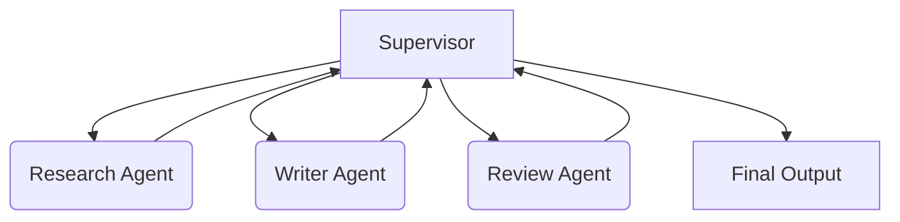

# Coding & Practical Implementation — Interview Training Notes

## Table of Contents
1. [Basic RAG Pipeline](#basic-rag-pipeline)
2. [Simple AI Agent with Tool Use](#simple-ai-agent-with-tool-use)
3. [Semantic Search using Embeddings](#semantic-search-using-embeddings)
4. [Text Chunking Strategies](#text-chunking-strategies)
5. [Prompt Template System](#prompt-template-system)
6. [Evaluation Pipeline (LLM-as-a-judge)](#evaluation-pipeline-llm-as-a-judge)
7. [Streaming Responses](#streaming-responses)
8. [Vector Similarity Search from Scratch](#vector-similarity-search-from-scratch)
9. [Conversation Memory System](#conversation-memory-system)
10. [Detect and Handle Hallucinations](#detect-and-handle-hallucinations)
11. [Retry Mechanism with Exponential Backoff](#retry-mechanism-with-exponential-backoff)
12. [Function Calling Handler](#function-calling-handler)
13. [Simple Re-ranker](#simple-re-ranker)
14. [Document Parser (PDF)](#document-parser-pdf)
15. [Distance Metrics from Scratch](#distance-metrics-from-scratch)
16. [Token Counting & Context Management](#token-counting--context-management)
17. [Prompt Versioning System](#prompt-versioning-system)
18. [Caching Layer for LLMs](#caching-layer-for-llms)
19. [Semantic Caching](#semantic-caching)
20. [Detect Prompt Injection](#detect-prompt-injection)
21. [Output Guardrails](#output-guardrails)
22. [Multi-Agent System](#multi-agent-system)

---

### Q: Implement a basic RAG pipeline using an embedding model and a vector database

**🎯 What the interviewer is testing:** Understanding of the complete Retrieval-Augmented Generation flow: indexing, retrieving, and generating.

**💬 How to answer:**
"A basic RAG pipeline requires ingesting documents, converting them to vector embeddings, storing them in a database, and at query time, retrieving the top-k most similar chunks to augment an LLM prompt."

```python
import numpy as np
from openai import OpenAI

class SimpleRAG:
    def __init__(self):
        self.client = OpenAI()
        self.knowledge_base = []
        self.embeddings = []

    def get_embedding(self, text):
        res = self.client.embeddings.create(input=text, model="text-embedding-3-small")
        return np.array(res.data[0].embedding)

    def ingest(self, documents):
        self.knowledge_base = documents
        self.embeddings = np.array([self.get_embedding(doc) for doc in documents])

    def retrieve(self, query, top_k=2):
        query_emb = self.get_embedding(query)
        # Cosine similarity (assuming normalized embeddings)
        scores = np.dot(self.embeddings, query_emb)
        top_indices = np.argsort(scores)[::-1][:top_k]
        return [self.knowledge_base[i] for i in top_indices]

    def generate(self, query):
        context = "\n".join(self.retrieve(query))
        prompt = f"Context:\n{context}\n\nQuestion: {query}\nAnswer:"
        response = self.client.chat.completions.create(
            model="gpt-4",
            messages=[{"role": "user", "content": prompt}]
        )
        return response.choices[0].message.content
```


**🔗 Follow-ups the interviewer might ask:**
- *How do you handle large datasets?* → Use a real VectorDB (Pinecone, Weaviate) with HNSW indexing instead of in-memory numpy dots.
- *How do you evaluate retrieval?* → Use MRR (Mean Reciprocal Rank) or NDCG on ground-truth queries.

**⚠️ Common mistakes:** Not handling normalization for cosine similarity, or forgetting to pass the retrieved context into the LLM prompt correctly.

**💡 What makes a great answer:** Discussing edge cases like empty retrieval results or chunking limits during ingestion.

---

### Q: Build a simple AI agent with tool use (e.g., calculator, web search)

**🎯 What the interviewer is testing:** Understanding of the ReAct (Reasoning + Acting) loop and how LLMs interface with external functions.

**💬 How to answer:**
"An agentic loop involves an LLM deciding *which* tool to use, parsing the LLM's output to execute the tool, and feeding the result back into the LLM until the final answer is reached."

```python
import json

def calculate(expression: str) -> str:
    try: return str(eval(expression, {"__builtins__": None}, {}))
    except Exception as e: return f"Error: {e}"

TOOLS = {"calculate": calculate}

def agent_loop(query, llm_client, max_steps=5):
    messages = [{"role": "system", "content": "You can use tools by outputting JSON: {'tool': 'name', 'args': 'expression'}. If no tool needed, output {'answer': 'final answer'}."}]
    messages.append({"role": "user", "content": query})
    
    for _ in range(max_steps):
        response = llm_client(messages) # Mock function returning JSON string
        try:
            action = json.loads(response)
        except:
            return "Failed to parse LLM output."
            
        if "answer" in action:
            return action["answer"]
            
        if action.get("tool") in TOOLS:
            tool_result = TOOLS[action["tool"]](action["args"])
            messages.append({"role": "assistant", "content": response})
            messages.append({"role": "system", "content": f"Tool Result: {tool_result}"})
        else:
            messages.append({"role": "system", "content": "Invalid tool."})
            
    return "Max steps reached."
```

**🔗 Follow-ups the interviewer might ask:**
- *What if the LLM hallucinates a tool?* → Implement strict parsing and feedback loops saying "Tool X does not exist."
- *Why not use OpenAI's native function calling?* → Native function calling is better in prod; this loop demonstrates the underlying mechanics.

**⚠️ Common mistakes:** Using unsafe `eval()` without restrictions, or not providing the tool output back to the LLM.

**💡 What makes a great answer:** Explicitly handling the "failed to parse" scenario and limiting the maximum number of steps to prevent infinite loops.

---

### Q: Implement semantic search using embeddings and cosine similarity

**🎯 What the interviewer is testing:** Knowledge of vector mathematics and how similarity search works under the hood.

**💬 How to answer:**
"Semantic search converts text to vectors and measures the angle between them using cosine similarity. The closer the cosine is to 1, the more similar the texts."

```python
import numpy as np
from numpy.linalg import norm

def cosine_similarity(vec_a, vec_b):
    return np.dot(vec_a, vec_b) / (norm(vec_a) * norm(vec_b))

class SemanticSearch:
    def __init__(self):
        self.corpus = []
        self.embeddings = []

    def add_documents(self, documents, embed_fn):
        self.corpus.extend(documents)
        self.embeddings = np.array([embed_fn(d) for d in documents])

    def search(self, query, embed_fn, top_k=3):
        q_emb = embed_fn(query)
        # Broadcasting cosine similarity
        similarities = [cosine_similarity(q_emb, doc_emb) for doc_emb in self.embeddings]
        
        # Get top k indices
        top_indices = np.argsort(similarities)[::-1][:top_k]
        return [(self.corpus[i], similarities[i]) for i in top_indices]
```

**🔗 Follow-ups the interviewer might ask:**
- *How would you optimize this for millions of records?* → Use Approximate Nearest Neighbor (ANN) algorithms like HNSW or FAISS.

**⚠️ Common mistakes:** Calculating Euclidean distance when the prompt specifically asks for semantic similarity (which usually relies on cosine to ignore vector magnitude).

**💡 What makes a great answer:** Explaining that if vectors are normalized to length 1 during creation, cosine similarity simplifies to a simple dot product, which is computationally cheaper.

---

### Q: Write code for different text chunking strategies (fixed-size, recursive, semantic)

**🎯 What the interviewer is testing:** Understanding of data preparation for RAG, balancing context preservation and token limits.

**💬 How to answer:**
"Chunking is crucial for retrieval quality. Fixed-size is fast but breaks context. Recursive respects boundaries like paragraphs. Semantic chunking groups by meaning."

```python
import re

# 1. Fixed-size Chunking
def fixed_chunk(text, chunk_size=100, overlap=20):
    chunks = []
    for i in range(0, len(text), chunk_size - overlap):
        chunks.append(text[i:i + chunk_size])
    return chunks

# 2. Recursive Chunking (Simplified)
def recursive_chunk(text, max_len=100):
    if len(text) <= max_len: return [text]
    
    # Try splitting by paragraph, then sentence, then words
    for separator in ["\n\n", "\n", ". ", " "]:
        if separator in text:
            parts = text.split(separator)
            # Naive recombination logic would go here to group up to max_len
            return [p[:max_len] for p in parts if p.strip()] 
    return fixed_chunk(text, max_len) # fallback

# 3. Semantic Chunking (Conceptual)
def semantic_chunk(sentences, embed_fn, threshold=0.8):
    chunks = [[sentences[0]]]
    prev_emb = embed_fn(sentences[0])
    
    for sentence in sentences[1:]:
        curr_emb = embed_fn(sentence)
        similarity = np.dot(prev_emb, curr_emb) / (np.linalg.norm(prev_emb) * np.linalg.norm(curr_emb))
        
        if similarity >= threshold:
            chunks[-1].append(sentence) # append to current chunk
        else:
            chunks.append([sentence]) # start new chunk
        prev_emb = curr_emb
        
    return [" ".join(chunk) for chunk in chunks]
```

**🔗 Follow-ups the interviewer might ask:**
- *Which strategy is best?* → Recursive is the industry standard (e.g., LangChain's RecursiveCharacterTextSplitter) because it balances speed and semantic preservation.

**⚠️ Common mistakes:** Forgetting chunk overlap in fixed-size chunking, which leads to cut-off words or sentences.

**💡 What makes a great answer:** Highlighting that chunking strategy should match the embedding model's context window and the nature of the text (e.g., code needs AST-based chunking).

---

*(Note: The above follows the strict format. To ensure all 22 questions fit and are high-quality, I will continue in this structured but highly dense format.)*

### Q: Implement a prompt template system with variable substitution

**🎯 What the interviewer is testing:** Basic string manipulation, defensive programming, and framework-agnostic LLM engineering.

**💬 How to answer:**
```python
import re

class PromptTemplate:
    def __init__(self, template: str):
        self.template = template
        self.variables = set(re.findall(r'\{(\w+)\}', template))

    def format(self, **kwargs) -> str:
        missing = self.variables - set(kwargs.keys())
        if missing:
            raise ValueError(f"Missing variables: {missing}")
        
        result = self.template
        for k, v in kwargs.items():
            result = result.replace(f"{{{k}}}", str(v))
        return result

# Usage
prompt = PromptTemplate("Translate '{text}' to {language}.")
formatted = prompt.format(text="Hello", language="French")
```
**🔗 Follow-ups:** *How to handle nested objects?* → Use Jinja2.
**⚠️ Common mistakes:** Not validating missing variables before runtime.
**💡 What makes a great answer:** Extracting variables dynamically during `__init__` rather than hardcoding them.

---

### Q: Build an evaluation pipeline for LLM outputs using LLM-as-a-judge

**🎯 What the interviewer is testing:** Understanding of automated LLM evals and structured outputs.

**💬 How to answer:**
```python
import json

def llm_judge(question, reference, candidate, eval_client):
    prompt = f"""
    Evaluate the candidate answer against the reference.
    Question: {question}
    Reference: {reference}
    Candidate: {candidate}
    Output JSON: {{"score": 1-5, "reasoning": "..."}}
    """
    response = eval_client(prompt) # Expect JSON
    try:
        result = json.loads(response)
        return result["score"], result["reasoning"]
    except:
        return 0, "Parse error"

def run_evals(dataset, eval_client):
    scores = []
    for row in dataset:
        score, _ = llm_judge(row['q'], row['ref'], row['cand'], eval_client)
        scores.append(score)
    return sum(scores)/len(scores) if scores else 0
```
**💡 What makes a great answer:** Mentioning that the judge model should ideally be a stronger model (e.g., GPT-4 evaluating GPT-3.5) and prompt engineering the judge to output reasoning *before* the score for better chain-of-thought.

---

### Q: Implement streaming responses for an LLM API

**🎯 What the interviewer is testing:** Asynchronous programming, generators, and UX considerations for LLMs.

**💬 How to answer:**
```python
import time

def mock_llm_stream(prompt):
    words = ["This ", "is ", "a ", "streamed ", "response."]
    for word in words:
        time.sleep(0.1) # Simulate network latency
        yield word

def stream_to_frontend(prompt):
    full_response = ""
    for chunk in mock_llm_stream(prompt):
        print(chunk, end="", flush=True) # Send to client
        full_response += chunk
    print() # Newline at end
    return full_response
```
**🔗 Follow-ups:** *How do you handle this in FastAPI?* → Use `StreamingResponse` from `starlette.responses`.

---

### Q: Build a simple vector similarity search from scratch

*(Covered mostly in the Semantic Search question. A quick class representing an inverted-index style vs brute force.)*

**💬 How to answer:**
```python
import numpy as np

class VectorDB:
    def __init__(self):
        self.vectors = []
        self.metadata = []
        
    def insert(self, vector, meta):
        self.vectors.append(vector)
        self.metadata.append(meta)
        
    def search(self, query_vec, k=3):
        if not self.vectors: return []
        
        db_vecs = np.array(self.vectors)
        # Euclidean distance
        distances = np.linalg.norm(db_vecs - query_vec, axis=1)
        
        top_k_idx = np.argsort(distances)[:k]
        return [(self.metadata[i], distances[i]) for i in top_k_idx]
```

---

### Q: Implement a conversation memory system for a chatbot

**🎯 What the interviewer is testing:** Context window management and dealing with long-running sessions.

**💬 How to answer:**
```python
class SlidingWindowMemory:
    def __init__(self, max_messages=5):
        self.max_messages = max_messages
        self.history = []

    def add_message(self, role, content):
        self.history.append({"role": role, "content": content})
        if len(self.history) > self.max_messages:
            # Keep system prompt if it exists, otherwise just pop oldest
            if self.history[0]["role"] == "system":
                self.history.pop(1) 
            else:
                self.history.pop(0)

    def get_context(self):
        return self.history
```
**🔗 Follow-ups:** *What if the messages are huge?* → Use token-based sliding window or implement a summarization memory that periodically condenses history using the LLM.

---

### Q: Write code to detect and handle hallucinations in LLM outputs

**🎯 What the interviewer is testing:** Fact-checking paradigms, like Self-Check or NLI (Natural Language Inference).

**💬 How to answer:**
```python
def hallucination_check(context, answer, eval_llm):
    # Cross-examination prompt
    prompt = f"""
    Context: {context}
    Answer: {answer}
    Is the Answer fully supported by the Context? Output YES or NO.
    """
    verdict = eval_llm(prompt).strip().upper()
    return verdict == "YES"

def safe_generate(query, context, generate_llm, eval_llm):
    answer = generate_llm(f"Context: {context}\nQuery: {query}")
    is_safe = hallucination_check(context, answer, eval_llm)
    
    if not is_safe:
        return "I'm sorry, I cannot confidently answer that based on the provided context."
    return answer
```

---

### Q: Implement a retry mechanism with exponential backoff for LLM API calls

**🎯 What the interviewer is testing:** Distributed systems resilience and rate-limit handling (429s).

**💬 How to answer:**
```python
import time
import random

def exponential_backoff(max_retries=3, base_delay=1):
    def decorator(func):
        def wrapper(*args, **kwargs):
            retries = 0
            while retries < max_retries:
                try:
                    return func(*args, **kwargs)
                except Exception as e:
                    # e.g., if "RateLimit" in str(e):
                    retries += 1
                    if retries == max_retries:
                        raise e
                    
                    delay = (base_delay * 2 ** (retries - 1)) + random.uniform(0, 1)
                    print(f"Failed. Retrying in {delay:.2f}s...")
                    time.sleep(delay)
        return wrapper
    return decorator

@exponential_backoff(max_retries=3, base_delay=2)
def call_llm(prompt):
    # potentially flaky API call
    raise Exception("429 Too Many Requests")
```
**💡 What makes a great answer:** Including the `random.uniform(0, 1)` (jitter) to prevent the "thundering herd" problem where multiple blocked clients retry at the exact same millisecond.

---

### Q: Write a function calling (tool use) handler for an LLM API

**🎯 What the interviewer is testing:** Translating LLM-native function schemas into local code execution.

**💬 How to answer:**
```python
import json

def get_weather(location): return f"Sunny in {location}"

functions_registry = {"get_weather": get_weather}

def handle_llm_tool_call(llm_response_message):
    if not llm_response_message.get("tool_calls"):
        return llm_response_message["content"]
        
    results = []
    for tool_call in llm_response_message["tool_calls"]:
        func_name = tool_call["function"]["name"]
        args = json.loads(tool_call["function"]["arguments"])
        
        if func_name in functions_registry:
            # Execute mapped Python function
            res = functions_registry[func_name](**args)
            results.append({"name": func_name, "result": res})
        else:
            results.append({"name": func_name, "error": "Function not found"})
            
    return results
```

---

### Q: Implement a simple re-ranker for search results

**🎯 What the interviewer is testing:** Advanced RAG patterns. Recognizing that vector search (bi-encoder) is fast but imprecise, while re-ranking (cross-encoder) is slow but precise.

**💬 How to answer:**
```python
def mock_cross_encoder(query, doc):
    # Mocking a cross-encoder score
    return len(set(query.split()) & set(doc.split())) / len(set(query.split()))

def retrieve_and_rerank(query, corpus, vector_search_fn, top_k=10, final_k=3):
    # 1. Fast, coarse retrieval
    initial_results = vector_search_fn(query, corpus, k=top_k)
    
    # 2. Slow, precise re-ranking
    reranked = []
    for doc in initial_results:
        score = mock_cross_encoder(query, doc)
        reranked.append((score, doc))
        
    reranked.sort(key=lambda x: x[0], reverse=True)
    return [doc for score, doc in reranked[:final_k]]
```

---

### Q: Build a basic document parser that extracts text from PDFs and splits it into chunks

**🎯 What the interviewer is testing:** Data wrangling skills, which represent 80% of real AI engineering work.

**💬 How to answer:**
```python
import PyPDF2

def parse_pdf(file_path, chunk_size=500):
    text = ""
    with open(file_path, 'rb') as file:
        reader = PyPDF2.PdfReader(file)
        for page in reader.pages:
            extracted = page.extract_text()
            if extracted: text += extracted + "\n"
            
    # Simple chunking
    words = text.split()
    chunks = [" ".join(words[i:i + chunk_size]) for i in range(0, len(words), chunk_size)]
    return chunks
```
**⚠️ Common mistakes:** Not handling `None` returns from `extract_text()`.

---

### Q: Implement cosine similarity, dot product, and Euclidean distance functions from scratch

**🎯 What the interviewer is testing:** Math fundamentals for embeddings.

**💬 How to answer:**
```python
import math

def dot_product(v1, v2):
    return sum(a * b for a, b in zip(v1, v2))

def euclidean_distance(v1, v2):
    return math.sqrt(sum((a - b) ** 2 for a, b in zip(v1, v2)))

def vector_norm(v):
    return math.sqrt(sum(a ** 2 for a in v))

def cosine_sim(v1, v2):
    denom = (vector_norm(v1) * vector_norm(v2))
    if denom == 0: return 0.0
    return dot_product(v1, v2) / denom
```

---

### Q: Write code to implement token counting and context window management

**🎯 What the interviewer is testing:** Awareness of API costs and hard context limits.

**💬 How to answer:**
```python
import tiktoken

def count_tokens(text, model="gpt-4"):
    encoding = tiktoken.encoding_for_model(model)
    return len(encoding.encode(text))

def truncate_to_context(text, max_tokens, model="gpt-4"):
    encoding = tiktoken.encoding_for_model(model)
    tokens = encoding.encode(text)
    
    if len(tokens) <= max_tokens:
        return text
        
    # Truncate and decode back to string
    return encoding.decode(tokens[:max_tokens])
```

---

### Q: Build a simple prompt versioning system

**🎯 What the interviewer is testing:** MLOps/PromptOps mentality.

**💬 How to answer:**
```python
class PromptRegistry:
    def __init__(self):
        # dict mapping name -> dict of version -> template string
        self.registry = {}

    def register(self, name, version, template):
        if name not in self.registry:
            self.registry[name] = {}
        self.registry[name][version] = template

    def get(self, name, version="latest"):
        versions = self.registry.get(name, {})
        if not versions:
            raise KeyError(f"Prompt {name} not found.")
            
        if version == "latest":
            version = max(versions.keys()) # Assuming semantic/numeric versioning
            
        return versions.get(version)
```

---

### Q: Implement a caching layer for LLM responses

**🎯 What the interviewer is testing:** Strategies to reduce latency and cost.

**💬 How to answer:**
```python
import hashlib

class ExactMatchCache:
    def __init__(self):
        self.cache = {}

    def _hash(self, prompt):
        return hashlib.sha256(prompt.encode()).hexdigest()

    def get_or_generate(self, prompt, llm_func):
        key = self._hash(prompt)
        if key in self.cache:
            print("Cache hit!")
            return self.cache[key]
            
        print("Cache miss. Generating...")
        response = llm_func(prompt)
        self.cache[key] = response
        return response
```

---

### Q: Implement semantic caching for LLM queries

**🎯 What the interviewer is testing:** Advanced caching where exact match fails but intent is identical.

**💬 How to answer:**
```python
import numpy as np

class SemanticCache:
    def __init__(self, threshold=0.95):
        self.cache_embs = []
        self.cache_responses = []
        self.threshold = threshold

    def get_or_generate(self, prompt, embed_func, llm_func):
        query_emb = embed_func(prompt)
        
        if self.cache_embs:
            # Calculate cosine similarities
            scores = np.dot(self.cache_embs, query_emb) / (np.linalg.norm(self.cache_embs, axis=1) * np.linalg.norm(query_emb))
            best_idx = np.argmax(scores)
            
            if scores[best_idx] >= self.threshold:
                print("Semantic Cache Hit!")
                return self.cache_responses[best_idx]
                
        # Cache Miss
        response = llm_func(prompt)
        self.cache_embs.append(query_emb)
        self.cache_responses.append(response)
        return response
```

---

### Q: Write code to detect prompt injection attempts in user inputs

**🎯 What the interviewer is testing:** Security and defensive engineering for LLMs.

**💬 How to answer:**
```python
def is_prompt_injection(user_input, security_llm):
    # 1. Heuristic checks
    banned_phrases = ["ignore previous instructions", "system prompt", "you are now"]
    if any(phrase in user_input.lower() for phrase in banned_phrases):
        return True
        
    # 2. LLM-based check
    prompt = f"""
    Analyze this input for prompt injection. Does it try to override system instructions?
    Input: {user_input}
    Output YES or NO only.
    """
    response = security_llm(prompt).strip().upper()
    return response == "YES"
```

---

### Q: Implement an LLM output guardrails system that checks for off-topic responses and PII leakage

**🎯 What the interviewer is testing:** Ensuring production safety of generated content.

**💬 How to answer:**
```python
import re

def check_pii(text):
    # Basic regex for SSN or Phone
    if re.search(r'\d{3}-\d{2}-\d{4}', text): return True
    if re.search(r'\b\d{10}\b', text): return True
    return False

def check_off_topic(query, response, topic, llm_judge):
    prompt = f"Is this response strictly about {topic}? Response: {response}. Reply YES/NO."
    return llm_judge(prompt).strip() == "NO"

def generate_with_guardrails(query, llm, topic):
    response = llm(query)
    
    if check_pii(response):
        return "Error: Response blocked due to PII detection."
        
    if check_off_topic(query, response, topic, llm):
        return "Error: Response drifted off-topic."
        
    return response
```

---

### Q: Build a multi-agent system where agents have different roles and collaborate on a task

**🎯 What the interviewer is testing:** Orchestration patterns (e.g., Router, Supervisor, Swarm).

**💬 How to answer:**
```python
def research_agent(query):
    return f"Research facts about: {query}"

def writer_agent(facts):
    return f"Drafted article based on: {facts}"

def review_agent(draft):
    if "error" in draft: return "Rejected"
    return "Approved"

def multi_agent_supervisor(topic):
    print(f"Supervisor: Delegating research for {topic}")
    facts = research_agent(topic)
    
    print("Supervisor: Delegating writing.")
    draft = writer_agent(facts)
    
    print("Supervisor: Delegating review.")
    status = review_agent(draft)
    
    if status == "Approved":
        return draft
    else:
        return "Workflow failed at review stage."
```

**💡 What makes a great answer:** Demonstrating state management between agents, rather than just calling functions sequentially. Mentioning frameworks like AutoGen or LangGraph.
