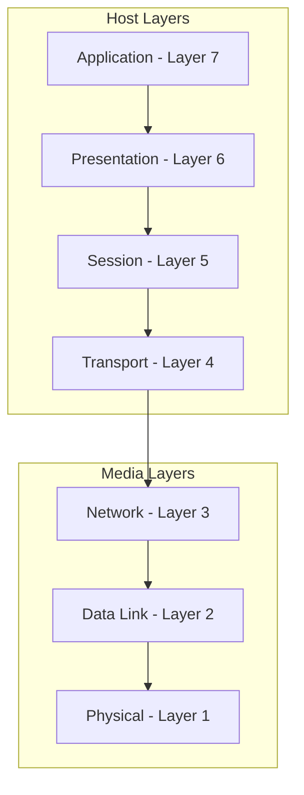
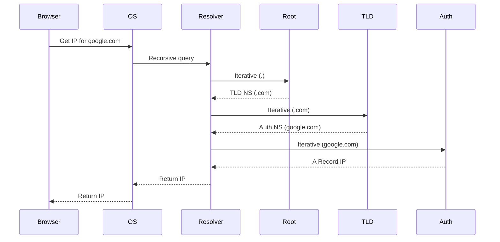
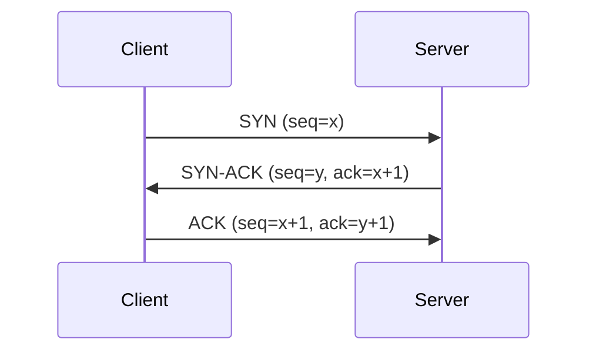

# Computer Networks — Interview Q&A

## Network Models

### OSI Model
The Open Systems Interconnection (OSI) model conceptualizes how networks operate in 7 layers.

- **Application (L7)**: End-user layer. Protocols: HTTP, FTP, SMTP, DNS.
- **Presentation (L6)**: Syntax layer (encryption, compression, formatting). Protocols: SSL/TLS.
- **Session (L5)**: Synch & send to port (session establishment/termination).
- **Transport (L4)**: End-to-end connections and reliability. Protocols: TCP, UDP.
- **Network (L3)**: Packets, routing. Protocols: IPv4, IPv6, ICMP, IPsec.
- **Data Link (L2)**: Frames, MAC addressing. Protocols: Ethernet, Wi-Fi.
- **Physical (L1)**: Physical structure, bits over medium.

### TCP/IP Model
A 4-layer model that predates OSI and is practically used in the internet:
1. Application (Maps to OSI L5-L7)
2. Transport (OSI L4)
3. Internet (OSI L3)
4. Link (OSI L1-L2)

### Q: "What happens when you type google.com in a browser?"
1. **URL parsing**: Browser extracts scheme, host, port, path.
2. **DNS Resolution**: Browser cache -> OS cache -> Router cache -> ISP DNS -> Recursive DNS lookup to get IP.
3. **TCP Connection**: 3-way handshake to the IP at port 443 (HTTPS).
4. **TLS Handshake**: Secure connection established (if HTTPS).
5. **HTTP Request**: GET request sent.
6. **HTTP Response**: Server replies with HTML.
7. **Rendering**: Browser parses HTML, fetches additional assets, constructs DOM/CSSOM, renders page.

---

## Application Layer

### HTTP/HTTPS
- **Methods**: GET, POST, PUT, DELETE, PATCH, OPTIONS, HEAD.
- **Status Codes**: 1xx (Info), 2xx (Success), 3xx (Redirect), 4xx (Client Error), 5xx (Server Error).
- **Headers**: Metadata like `Content-Type`, `Authorization`, `User-Agent`.
- **Cookies vs Sessions**: Cookies are client-side state; sessions are server-side state (often linked via a session ID in a cookie).

### HTTP Evolution
- **HTTP/1.1**: Persistent connections, pipelining (but suffers Head-of-Line blocking at TCP layer).
- **HTTP/2**: Multiplexing over a single TCP connection, binary framing, server push, header compression (HPACK).
- **HTTP/3**: Built on QUIC (over UDP) instead of TCP, eliminating TCP Head-of-Line blocking.

### REST vs GraphQL vs gRPC
- **REST**: Resource-based, standard HTTP verbs.
- **GraphQL**: Query language, client specifies exactly what data it wants, single endpoint.
- **gRPC**: RPC framework using Protobuf over HTTP/2, heavily used in microservices (binary, fast, strongly typed).

### DNS Resolution

- **Records**: A (IPv4), AAAA (IPv6), CNAME (Alias), MX (Mail), NS (Name Server).

---

## Transport Layer

### TCP vs UDP
- **TCP**: Connection-oriented, reliable, ordered, flow/congestion control, slower. Use: Web, Email, File transfer.
- **UDP**: Connectionless, best-effort, unordered, fast. Use: Video streaming, Gaming, DNS.

### TCP Handshake

---
*Other layers, Security, and Practical questions follow standard CS principles. Add notes on Load Balancers (L4 vs L7) and CDNs.*
