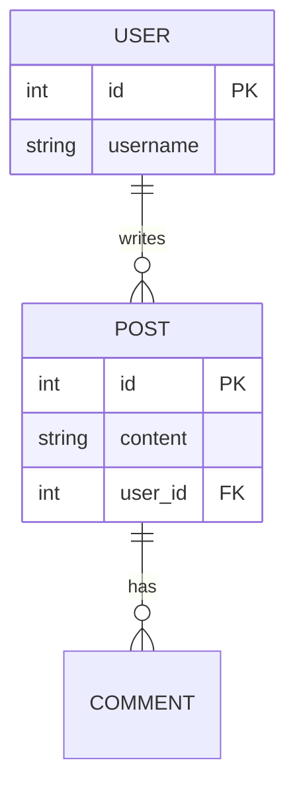
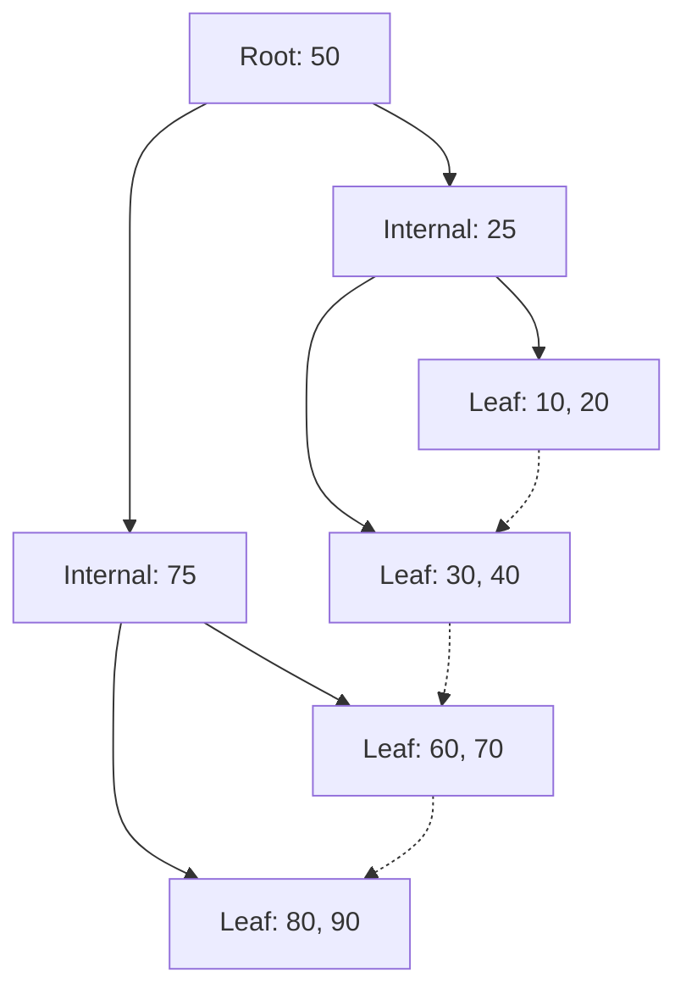

# DBMS — Interview Q&A

## Fundamentals

### Q: DBMS vs File System?
File systems lack structured query languages, data integrity enforcement, concurrency control, and crash recovery mechanisms. DBMS provides ACID guarantees, indexing, and abstract data models.

### Q: Logical vs Physical Data Independence?
- **Logical**: Ability to change the logical schema (e.g., adding a column/table) without changing the application logic/views.
- **Physical**: Ability to change the physical storage (e.g., adding an index, changing storage engine) without affecting the logical schema or queries.

### Q: ER Model Entities & Relationships
- **Entity**: An object with distinct existence (e.g., User).
- **Attribute**: Properties of an entity.
- **Cardinality**: 1:1, 1:N, M:N.

---

## Relational Model & Normalization

### Q: Primary vs Candidate vs Super Key?
- **Super Key**: Any set of attributes that uniquely identifies a row.
- **Candidate Key**: A minimal super key (no unnecessary attributes).
- **Primary Key**: The specific candidate key chosen by the DB designer as the main identifier.

### Q: Explain 1NF, 2NF, 3NF, BCNF?
- **1NF**: Atomic values only (no lists or nested tables).
- **2NF**: 1NF + no partial dependency (non-key attributes depend on the *entire* primary key, matters for composite keys).
- **3NF**: 2NF + no transitive dependency (non-key attributes depend *only* on the primary key, not on other non-key attributes).
- **BCNF**: Stricter 3NF. For every functional dependency X -> Y, X must be a superkey.
- **Follow-up**: "When would you denormalize?" -> For read-heavy applications where complex JOINs are too slow (OLAP). You sacrifice space and write-complexity for read speed.

---

## SQL

### Q: JOINS (Inner, Left, Right, Full, Cross)?
- **INNER**: Returns records with matching values in both tables.
- **LEFT**: All records from left table, matched records from right.
- **RIGHT**: All from right, matched from left.
- **FULL**: All records when there is a match in either left or right.
- **CROSS**: Cartesian product (every row in A with every row in B).

### Q: Views vs Materialized Views?
- **View**: A virtual table defined by a SQL query. The query runs *every time* you query the view. Just a saved shortcut.
- **Materialized View**: The query result is physically stored on disk. Very fast to read, but must be refreshed periodically (stale data). Used for heavy aggregations/dashboards.

### Q: EXPLAIN and Query Debugging?
`EXPLAIN` shows the query execution plan (how the DB plans to execute the query, e.g., Seq Scan vs Index Scan). `EXPLAIN ANALYZE` actually runs the query and compares estimated costs to actual time.
- **Follow-up**: "How do you optimize a slow query?" -> Add missing indexes, rewrite correlated subqueries as JOINs, avoid `SELECT *`, filter early in WHERE instead of HAVING.

### Q: Window Functions vs GROUP BY?
`GROUP BY` aggregates rows into a single summary row per group. Window functions (`ROW_NUMBER()`, `RANK()`, `LAG()`) perform calculations across a set of rows related to the current row, but *retain the individual rows*.

---

## Transactions & Concurrency

### Q: Explain ACID properties?
- **Atomicity**: "All or nothing". Transactions cannot partially complete. (Handled via logs/undo).
- **Consistency**: The database goes from one valid state to another (enforces constraints/triggers).
- **Isolation**: Concurrent transactions don't interfere. It appears as if they ran sequentially.
- **Durability**: Once committed, changes are permanent (written to disk/WAL), even if power fails.

### Q: Concurrency Control - Lock-based vs MVCC?
- **2-Phase Locking (2PL)**: Phase 1 acquires locks, Phase 2 releases them. Guarantees serializability but can cause deadlocks.
- **MVCC (Multi-Version Concurrency Control)**: Instead of locking rows for reads, the DB creates "versions" of data. Readers read an older snapshot; writers create a new version. "Readers don't block writers, writers don't block readers." Used heavily in PostgreSQL.

### Q: Isolation Levels and Read Phenomena?
- **Dirty Read**: Reading uncommitted data from another transaction.
- **Non-Repeatable Read**: Re-reading the same row gives different data because another txn updated it.
- **Phantom Read**: Re-running a query returns a different *set* of rows because another txn INSERTed/DELETEd rows.

| Isolation Level | Dirty Read | Non-Repeatable Read | Phantom Read |
| --- | --- | --- | --- |
| Read Uncommitted | Yes | Yes | Yes |
| Read Committed | No | Yes | Yes |
| Repeatable Read | No | No | Yes (Often No in InnoDB) |
| Serializable | No | No | No |

---

## Storage & Indexing

### Q: B-Tree vs B+ Tree?
- **B-Tree**: Data pointers are stored in all nodes (internal and leaf).
- **B+ Tree**: Data pointers are stored *only* in the leaf nodes. Internal nodes only have keys for routing. Leaf nodes are linked together as a linked list.
- **Why B+ Tree is better for DBs**: Range queries are extremely fast because of the leaf node linked list. Also, internal nodes are smaller (no data), meaning higher branching factor and shallower trees (fewer disk I/Os).

### Q: Clustered vs Non-Clustered Index?
- **Clustered Index**: Determines the physical order of data on disk. Only ONE per table (usually the Primary Key). The leaf node *is* the actual row data.
- **Non-Clustered (Secondary) Index**: A separate structure from the data. The leaf nodes contain pointers (or primary keys) pointing back to the clustered index. You can have multiple per table.

### Q: When would you NOT add an index?
- On a table with heavy writes (INSERT/UPDATE/DELETE), because every index must be updated on write, slowing it down.
- On columns with low cardinality (e.g., a `boolean` status or `gender`). The DB optimizer will likely ignore the index and do a full table scan anyway.

---

## Advanced & Practical

### Q: SQL vs NoSQL? When to use which?
- **SQL (PostgreSQL, MySQL)**: Schema is rigid. Best for ACID compliance, complex relational queries, financial transactions, clear structured data.
- **NoSQL (MongoDB, DynamoDB, Redis)**: Flexible schema. Best for rapid iteration, hierarchical document data, massive horizontal scalability, or simple key-value lookups.
- **Follow-up**: "What about Redis vs Postgres?" -> Redis is an in-memory datastore (sub-millisecond latency), used for caching, pub/sub, or rate-limiting. Postgres is a persistent relational DB.

### Q: What is the N+1 Query Problem?
Usually caused by ORMs (like Django or Hibernate). The system executes 1 query to fetch a list of entities, then N additional queries to fetch a related entity for each item in the list.
- **Fix**: Use `JOIN` or ORM tools like `.select_related()` or `.prefetch_related()` to fetch everything in 1 or 2 queries.

### Q: Sharding vs Partitioning?
- **Partitioning**: Dividing a large table into smaller pieces *within the same database instance* (e.g., partitioning logs by month).
- **Sharding (Horizontal Partitioning)**: Distributing data across *multiple independent database servers* (e.g., users A-M on DB1, N-Z on DB2). Great for scaling out, but makes JOINs across shards almost impossible.

### Q: CAP Theorem?
A distributed system can only provide 2 of the following 3 guarantees:
- **Consistency**: Every read receives the most recent write.
- **Availability**: Every request receives a non-error response (but might not be latest data).
- **Partition Tolerance**: The system continues to operate despite network failures dropping messages between nodes.
- *Reality*: Network partitions are inevitable, so you must choose between Consistency (e.g., fail the request) or Availability (e.g., return stale data).
