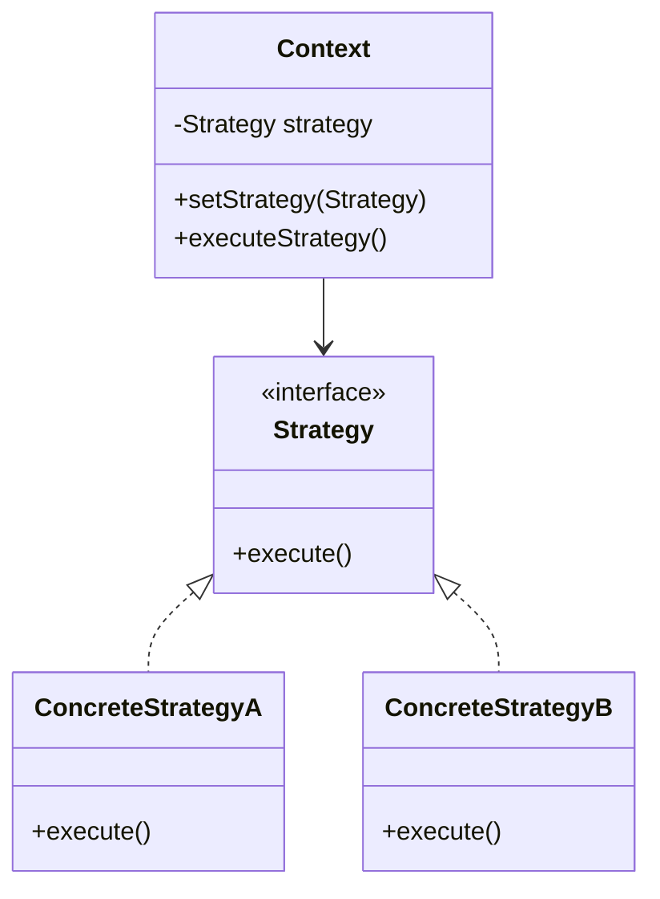

# Object-Oriented Programming — Interview Q&A

## The 4 Pillars

### 1. Encapsulation
Bundling data and methods that operate on that data within a single unit (class), and restricting direct access to some of the object's components.
**Python**:
```python
class Account:
    def __init__(self, balance):
        self.__balance = balance # private

    def get_balance(self):
        return self.__balance
```
**C++**:
```cpp
class Account {
private:
    double balance;
public:
    double getBalance() { return balance; }
};
```

### 2. Abstraction
Hiding complex implementation details and exposing only the essential features.
- Implemented via interfaces or abstract classes.

### 3. Inheritance
Mechanism where a new class derives properties and behavior from an existing class.
- **Diamond Problem**: Multiple inheritance ambiguity. Python uses MRO (C3 Linearization) to resolve this. C++ uses `virtual` inheritance.

### 4. Polymorphism
The ability of different objects to respond to the same method call in their own way.
- Compile-time: Method Overloading (C++), Operator Overloading.
- Run-time: Method Overriding (Virtual functions in C++, implicit in Python).

---

## SOLID Principles
- **S**ingle Responsibility: A class should have one reason to change.
- **O**pen/Closed: Open for extension, closed for modification.
- **L**iskov Substitution: Subtypes must be substitutable for their base types.
- **I**nterface Segregation: Many client-specific interfaces are better than one general interface.
- **D**ependency Inversion: Depend on abstractions, not concretions.

---

## Design Patterns



### Key Patterns
- **Singleton**: Ensure a class only has one instance.
- **Factory**: Create objects without exposing creation logic. *(Used heavily in LLM tools)*
- **Strategy**: Define a family of algorithms, encapsulate each one, and make them interchangeable. *(Used in RAGOS for constraint-aware search plugins)*
- **Observer**: Define a one-to-many dependency between objects.

---

## Interview Questions
**"What design patterns did you use in RAGOS?"**
"In RAGOS, I implemented a plugin architecture. To achieve this, I used the **Strategy Pattern** combined with a **Factory**. The Factory instantiated the correct retrieval or processing strategy based on the constraints of the query, allowing me to swap out embedding models or search logic at runtime without touching the core engine."
