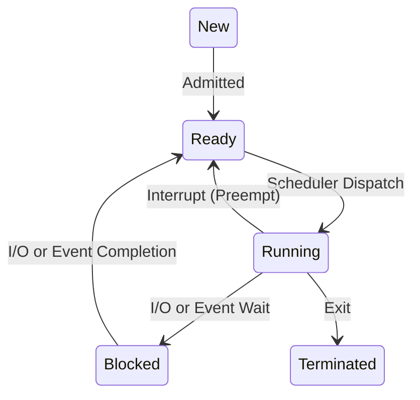
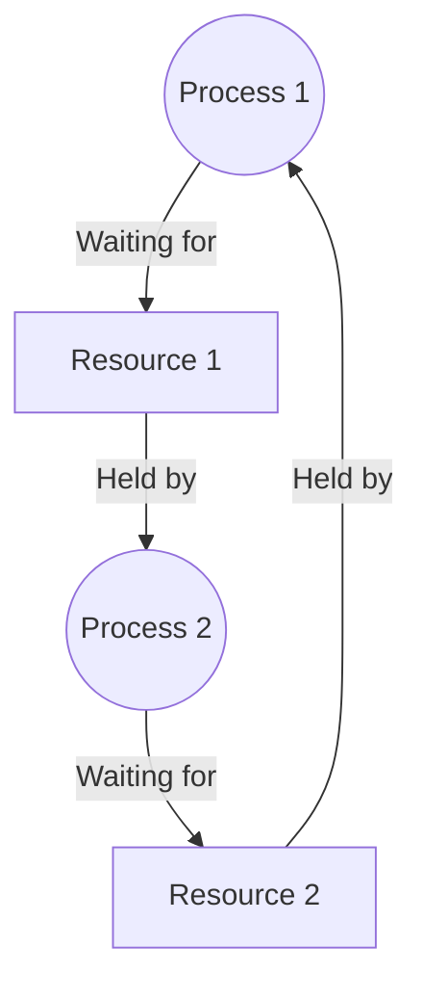

# Operating Systems — Interview Q&A

## Process & Threads

### Q: What is the fundamental difference between a Process and a Thread?
- A **Process** is an executing instance of a program. It provides an isolated execution environment with its own memory space (heap, stack, data, code).
- A **Thread** is the smallest sequence of programmed instructions that can be managed independently by a scheduler. Threads exist *within* a process and share the process's resources (heap, open files, global variables) but have their own stack and registers.
- **Follow-up**: "If threads share heap memory, how do you prevent data corruption?" -> Explain synchronization (mutexes, semaphores).

### Q: What is a context switch? What makes it expensive?
- A context switch is the process of storing the state (context) of an active process/thread and restoring the state of another.
- **Expense factors**:
  1. **Direct costs**: Saving/restoring CPU registers, updating PCB/TCB.
  2. **Indirect costs (The real killer)**: TLB (Translation Lookaside Buffer) flushes, CPU cache invalidation/pollution. When the new process runs, it will experience many cache misses.
- **Follow-up**: "Is switching between threads of the *same* process cheaper?" -> Yes, because they share the same address space. The TLB and cache mostly remain valid.

### Q: User-level vs Kernel-level threads? Multithreading models?
- **User-level**: Managed by a user-space library (e.g., green threads, Go goroutines). Fast to switch (no system calls), but if one blocks on I/O, the kernel blocks the whole process.
- **Kernel-level**: Managed directly by the OS. Slower to switch, but true parallelism on multiple cores; one blocking doesn't block others.
- **Models**:
  - *One-to-One*: 1 User thread mapped to 1 Kernel thread (Linux pthreads).
  - *Many-to-One*: Multiple User threads mapped to 1 Kernel thread (efficient but no true parallelism).
  - *Many-to-Many*: M User threads to N Kernel threads.
- **Follow-up**: "How does Python handle multithreading?" -> Mention the GIL (Global Interpreter Lock) in CPython, meaning threads are kernel-level but execute one at a time.

### Q: What is a Process Control Block (PCB)?
A data structure maintained by the OS for every process. It contains: Process ID, Process State, Program Counter, CPU registers, CPU scheduling info, Memory management info (page tables), and I/O status info (open files list).
- **Follow-up**: "Where is the PCB stored?" -> In Kernel memory.

### Q: Explain Process States and Transitions.
- **New**: Being created.
- **Ready**: Waiting to be assigned to a processor.
- **Running**: Instructions are being executed.
- **Blocked (Waiting)**: Waiting for an event (e.g., I/O).
- **Terminated**: Finished execution.



### Q: What happens when you fork() a process?
`fork()` creates a new process (child) by duplicating the calling process (parent). The child gets a copy of the parent's address space, open file descriptors, and environment. `fork()` returns `0` in the child and the child's PID in the parent. Modern OSes use **Copy-On-Write (COW)** so physical memory isn't actually duplicated until one modifies it.
- **Follow-up**: "What happens to the child's variables if the parent updates a variable right after fork?" -> Nothing, they are logically independent. COW handles the split.

### Q: Zombie vs Orphan Process?
- **Zombie**: A process that has terminated, but its parent hasn't called `wait()` to read its exit status. Its entry remains in the process table.
- **Orphan**: A process whose parent has terminated or died. It is adopted by the `init` (or `systemd`) process, which will periodically `wait()` to clean it up.
- **Follow-up**: "Can you kill a zombie process?" -> No, it's already dead. You must kill the parent or force the parent to reap it.

### Q: Inter-process communication (IPC) methods?
1. **Pipes**: Unidirectional byte stream (standard output to input).
2. **Shared Memory**: Fastest. Processes share a memory segment. Requires synchronization.
3. **Message Queues**: OS-managed linked list of messages.
4. **Sockets**: Used for communication over a network (or locally via Unix domain sockets).
- **Follow-up**: "Which IPC mechanism is the fastest and why?" -> Shared memory, because data doesn't cross the user-kernel boundary during transfers.

---

## CPU Scheduling

### Q: FCFS, SJF, Priority, Round Robin, MLFQ?
- **FCFS** (First-Come, First-Served): Simple FIFO queue. Suffers from Convoy effect.
- **SJF** (Shortest Job First): Optimal for minimal average wait time, but impossible to implement practically (can't predict exact burst time).
- **Priority**: Highest priority runs first. Suffers from starvation.
- **Round Robin (RR)**: Time slicing. Fair, excellent for interactive systems.
- **MLFQ** (Multi-Level Feedback Queue): Multiple queues with different priorities and time slices. Processes move between queues based on behavior (CPU bound vs I/O bound).
- **Follow-up**: "Which scheduler does Linux use?" -> Completely Fair Scheduler (CFS).

### Q: Preemptive vs Non-preemptive scheduling?
- **Preemptive**: OS can forcibly pause a running process (via interrupts) to run another (e.g., Round Robin).
- **Non-preemptive**: A process runs until it yields or blocks for I/O.
- **Follow-up**: "What issues arise with preemptive scheduling?" -> Race conditions on shared data.

### Q: Convoy effect vs Starvation vs Aging?
- **Convoy Effect**: Short processes get stuck waiting behind a long process (common in FCFS).
- **Starvation**: A low-priority process never gets CPU time because higher-priority processes keep arriving.
- **Aging**: The solution to starvation. Gradually increase a process's priority the longer it waits.

---

## Synchronization

### Q: What is a Race Condition and how to prevent it?
When two or more threads/processes access shared data concurrently, and the final state depends on the timing/order of execution. Prevent it by making the operations **atomic** or using synchronization primitives (locks, mutexes) around the **Critical Section**.

### Q: Mutex vs Semaphore vs Monitor?
- **Mutex**: A mutual exclusion lock. Only one thread can acquire it. The thread that locks it *must* unlock it.
- **Semaphore**: A signaling mechanism with a counter. Can be used for resource counting. *Any* thread can increment/decrement it.
- **Monitor**: A high-level language construct (like `synchronized` in Java) that wraps a mutex and condition variables, making it easier to use safely.
- **Follow-up**: "Can a binary semaphore be used exactly like a mutex?" -> Conceptually yes (values 0 or 1), but ownership differs. A mutex has ownership (only the owner can unlock), whereas a semaphore can be released by a different thread.

### Q: Spinlock vs Mutex — when to use which?
- **Spinlock**: The thread loops ("spins") checking if the lock is available. Doesn't yield the CPU. Use when the lock will be held for a *very short* time (avoids context switch overhead).
- **Mutex**: The thread goes to sleep (blocks) if the lock is unavailable. Use when the lock will be held for a long time.
- **Follow-up**: "Would you use a spinlock on a single-core machine?" -> No. If the lock is held by another thread, spinning just wastes the CPU slice since the lock holder can't run to release it.

### Q: Producer-Consumer Problem?
One thread produces data into a bounded buffer, another consumes it. Need to ensure producer doesn't add to a full buffer, and consumer doesn't read an empty one. Solved using two counting semaphores (`empty_slots`, `full_slots`) and a mutex for buffer access.

### Q: Deadlock — conditions, prevention, avoidance?
- **4 Necessary Conditions (Coffman Conditions)**:
  1. *Mutual Exclusion*: Resources are non-shareable.
  2. *Hold and Wait*: Holding a resource while waiting for another.
  3. *No Preemption*: Resources cannot be forcibly taken.
  4. *Circular Wait*: P1 waits for P2, P2 waits for P1.
- **Prevention**: Break any of the 4 conditions (e.g., mandate ordering of lock acquisition to break circular wait).
- **Avoidance**: Banker's Algorithm (OS checks if granting a resource keeps the system in a "safe state").



### Q: What is Priority Inversion?
A low-priority task holds a mutex needed by a high-priority task, but a medium-priority task preempts the low-priority task. The high-priority task is now effectively blocked by a medium-priority task. Solved via **Priority Inheritance** (temporarily boosting the low-priority task's priority).

---

## Memory Management

### Q: Logical vs Physical Address Space?
Logical (Virtual) address is generated by the CPU. Physical address is the actual location in RAM. The Memory Management Unit (MMU) translates logical to physical at runtime.

### Q: Paging — Page Table, TLB, Page Fault?
- **Paging**: Physical memory is divided into fixed-size frames; logical memory into same-sized pages.
- **Page Table**: Array mapping logical pages to physical frames.
- **TLB (Translation Lookaside Buffer)**: A hardware cache for the page table. A TLB hit is very fast.
- **Page Fault**: When the CPU accesses a valid virtual page that is not currently loaded in physical RAM. OS must trap, fetch it from disk, and update the table.

```mermaid
flowchart LR
    CPU -->|Logical Address| TLB
    TLB -->|Hit| PhysicalMemory[Physical Memory]
    TLB -->|Miss| PageTable[Page Table in RAM]
    PageTable -->|Valid| PhysicalMemory
    PageTable -->|Invalid (Page Fault)| Disk[(Disk Swap Space)]
```

### Q: Virtual Memory & Thrashing?
Virtual memory allows execution of processes that are not completely in memory (using demand paging).
- **Thrashing** occurs when a system spends more time swapping pages in/out of disk than executing instructions (high page fault rate). Caused by too many active processes or poor locality of reference.
- **Fix**: Decrease multiprogramming level, or increase RAM.

### Q: Page Replacement Algorithms?
- **FIFO**: Oldest page swapped out. Suffers from Belady's Anomaly (more frames = more faults).
- **LRU (Least Recently Used)**: Great performance, high hardware overhead to track.
- **Optimal**: Replaces page that won't be used for the longest time in the future (impossible, used as benchmark).
- **Clock (Second Chance)**: FIFO variant with a "reference bit" to give recently used pages a second chance (approximates LRU).

### Q: Fragmentation? Internal vs External?
- **Internal**: Allocated memory is larger than requested memory. Space is wasted *inside* the allocated block (happens in paging).
- **External**: Total free memory is sufficient, but it is not contiguous, so a request fails (happens in segmentation / dynamic allocation).

---

## File Systems

### Q: Inode structure?
An index node (inode) in UNIX stores metadata about a file (size, permissions, timestamps, owner) and pointers to the disk blocks where the data is stored. **It does NOT store the file name** (the directory structure maps names to inode numbers).

### Q: Hard links vs Soft links?
- **Hard Link**: A new directory entry pointing to the *same* inode number. Both names are equal peers. File deleted only when link count reaches 0. Cannot cross file systems or link to directories.
- **Soft (Symbolic) Link**: A new file containing the *path* to the original file. Has its own inode. If the original is deleted, it becomes a dangling link. Can link across file systems.

---

## Linux-Specific (Bonus)

### Q: Useful Linux Commands for debugging?
- `ps / top / htop`: View running processes.
- `kill -9 <pid>`: Sends SIGKILL (cannot be caught or ignored).
- `strace -p <pid>`: Trace system calls of a running process (huge flex in interviews).
- `lsof`: List open files (and network sockets).
- `chmod / chown`: Permissions and ownership.

### Q: What is the /proc filesystem?
A virtual filesystem created on the fly when the system boots. It contains files that provide info about running processes and kernel parameters. E.g., `/proc/cpuinfo`, `/proc/<pid>/fd`.
