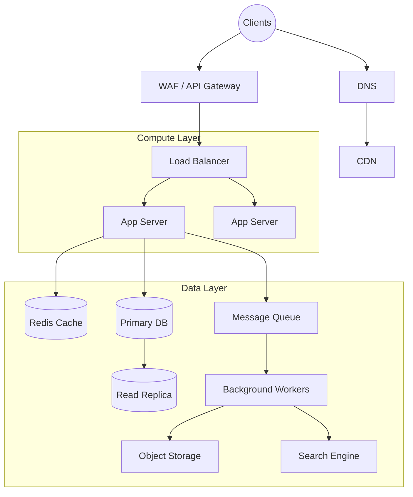

# System Design Interview Framework

*Table of Contents*
- [1. The 4-Step Framework](#1-the-4-step-framework)
- [2. Common Building Blocks](#2-common-building-blocks)
- [3. Key Non-Functional Requirements Checklist](#3-key-non-functional-requirements-checklist)
- [4. AI-Specific System Design Considerations](#4-ai-specific-system-design-considerations)
- [5. Common Mistakes in System Design Interviews](#5-common-mistakes-in-system-design-interviews)

---

## 1. The 4-Step Framework

A successful 45-minute system design interview requires strict time management and structure. Use this 4-step approach to guide the conversation.

### Step 1: Requirements Gathering (5-7 mins)
**Goal:** Clarify the scope and constraints of the problem. Don't jump into solutions.

- **Functional Requirements:** What should the system do? Define the core APIs and user flows. (e.g., "Users can upload a video," "Users can view a feed.")
- **Non-Functional Requirements:** How should the system perform?
  - **Scale:** How many DAU/MAU? Read/Write ratio?
  - **Performance:** Acceptable latency?
  - **Availability vs. Consistency:** CAP theorem trade-offs.
  - **Data estimation (Back-of-the-envelope):** Estimate storage, bandwidth, and memory needs. Keep the math simple.

### Step 2: High-Level Design (10-15 mins)
**Goal:** Draw the core architecture that satisfies the functional requirements.

- Start with the client (Mobile/Web) and draw boxes for core components (API Gateway, App Servers, Databases).
- Connect the boxes to show data flow for 2-3 primary use cases.
- **Do not worry about scaling yet.** Assume a single instance of everything works perfectly. Get buy-in from the interviewer on this basic flow before proceeding.

### Step 3: Deep Dive (15-20 mins)
**Goal:** Address bottlenecks, scaling, and specific complexities.

- Identify the weakest links in your high-level design based on your NFRs (e.g., "The single database will become a bottleneck with 10k writes/sec").
- Discuss data partitioning (sharding), replication strategies, and caching layers.
- Drill down into specific components the interviewer seems interested in (e.g., database schema, API design, specific algorithms).

### Step 4: Trade-offs & Wrap Up (5 mins)
**Goal:** Show maturity by critiquing your own design.

- Discuss trade-offs you made (e.g., "I chose eventual consistency to prioritize availability").
- Talk about single points of failure and how to mitigate them.
- Briefly mention monitoring, alerting, and deployment strategies.

---

## 2. Common Building Blocks

Familiarize yourself with these core components and when to use them.

### When to use what:
- **Load Balancers:** To distribute traffic across multiple servers, improving availability and preventing single points of failure.
- **CDNs (Content Delivery Networks):** To serve static assets (images, videos, JS/CSS) from edge locations close to users, reducing latency and backend load.
- **Message Queues (Kafka, SQS, RabbitMQ):** To decouple services, buffer traffic spikes, and process tasks asynchronously (e.g., sending emails, video encoding).
- **Caches (Redis, Memcached):** To store frequently accessed data in memory, drastically reducing read latency and database load.
- **Relational Databases (SQL - PostgreSQL, MySQL):** When strict ACID guarantees, complex joins, or clear relational data models are required (e.g., financial transactions).
- **NoSQL Databases (Cassandra, DynamoDB, MongoDB):** For massive scale, flexible schemas, or when optimizing for rapid writes/reads over complex queries. Choose based on access patterns.
- **Object Storage (S3, GCS):** For unstructured data like user uploads, media files, or backups.
- **Search Engines (Elasticsearch, Solr):** For full-text search, complex querying, or log aggregation.
- **Rate Limiters:** To protect APIs from abuse, DDoS attacks, or to enforce pricing tiers.
- **API Gateways:** To handle cross-cutting concerns like authentication, SSL termination, and routing before requests hit backend services.

---

## 3. Key Non-Functional Requirements Checklist

Always evaluate your design against these pillars:

1. **Scalability:** Can the system handle increased load by adding resources (horizontal scaling)?
2. **Availability:** What happens when components fail? Calculate nines of availability (e.g., 99.99%). Use redundancy and failover mechanisms.
3. **Consistency:** Is strong consistency required (e.g., bank balance), or is eventual consistency acceptable (e.g., social media likes)?
4. **Latency:** How fast must the system respond? Identify latency sources (network, disk, DB queries) and mitigate them (caching, CDNs).
5. **Durability:** Is data safe from loss? Ensure adequate replication and backups.
6. **Security:** Address authentication, authorization, data encryption (at rest and in transit), and network security.

---

## 4. AI-Specific System Design Considerations

Modern system design often involves integrating AI/ML models.

- **LLM Serving Infrastructure:** Discuss specialized inference hardware (GPUs/TPUs). Use techniques like continuous batching and PagedAttention (vLLM) to maximize throughput.
- **Embedding + Vector DB Patterns:** Generate text/image embeddings and store them in Vector Databases (Pinecone, Milvus, Qdrant) for fast similarity search (KNN/ANN).
- **RAG (Retrieval-Augmented Generation) Architectures:**
  - *Ingestion:* Chunk documents -> Embed -> Store in Vector DB.
  - *Retrieval:* Embed user query -> Search Vector DB -> Retrieve context.
  - *Generation:* Construct prompt (Query + Context) -> Call LLM.
- **Agent Orchestration:** Design systems that allow AI agents to plan tasks, use tools (via APIs), and manage conversation memory.
- **Model Routing & Fallbacks:** Route complex queries to expensive models (GPT-4) and simple queries to cheaper/faster models (Claude Haiku, Llama 3). Implement fallbacks for API rate limits or outages.
- **Token Budget Management:** Track and restrict token usage per user/tenant to control costs. Implement token-aware rate limiting.
- **Streaming Responses:** Use Server-Sent Events (SSE) or WebSockets to stream tokens to the client, improving perceived latency.
- **Caching for LLM Responses:** Implement Semantic Caching (checking if a similar prompt was asked recently) to save costs and reduce latency.

---

## 5. Common Mistakes in System Design Interviews

- **Diving in without clarifying requirements:** You might solve the wrong problem entirely.
- **Ignoring the read/write ratio:** This fundamentally changes the data architecture.
- **Using buzzwords without understanding them:** If you say "Kafka," be prepared to explain topics, partitions, and consumer groups.
- **Not driving the conversation:** The interviewer expects you to lead. Don't wait to be asked every question.
- **Over-engineering early:** Don't start with microservices and sharded databases before proving the core concept works.
- **Failing to mention trade-offs:** Every design choice has pros and cons. Acknowledging them shows seniority.
