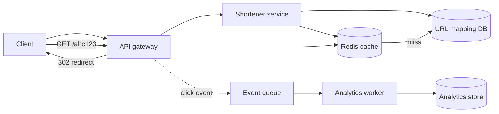
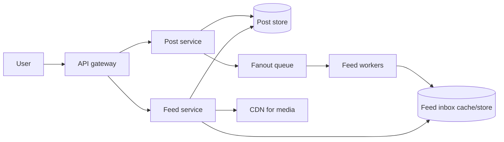
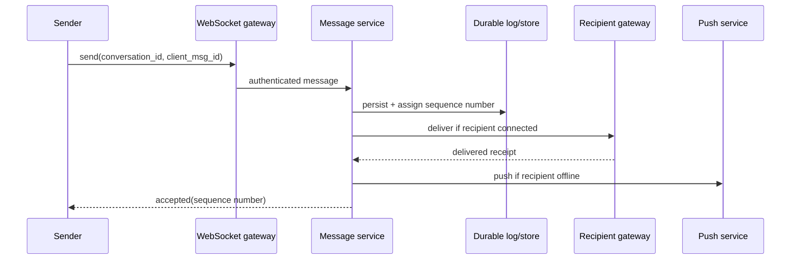
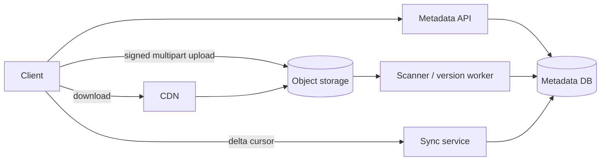
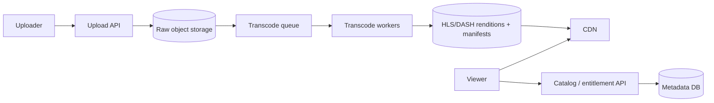
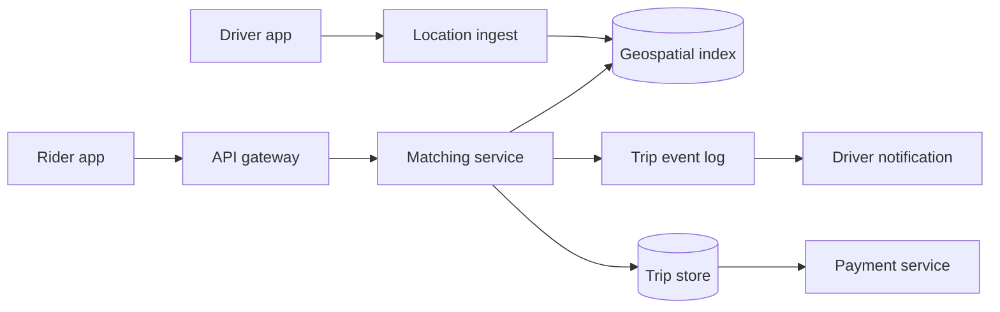
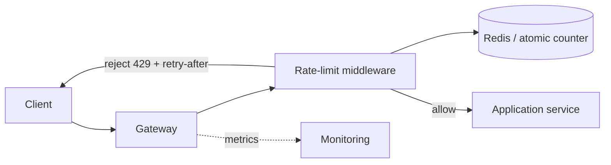
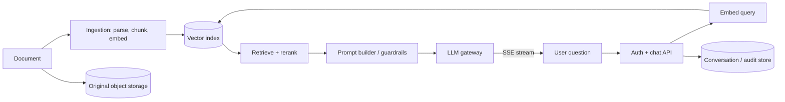

# Major System Design App Walkthroughs

> These are interview walkthroughs, not production blueprints. For every design: clarify scope first, draw the happy path, then pick one or two bottlenecks to deepen. Numbers are assumptions to state and adjust with the interviewer.

## How to use this pack

For each app, practise this sequence aloud:

1. Confirm the core feature and one scale assumption.
2. Explain the diagram from client to storage.
3. Defend the most important data/store choice.
4. Answer the reasoning follow-ups without adding random components.

---

## 1. URL Shortener (TinyURL)

**Scope:** create a short URL, redirect quickly, optional expiry and basic analytics. Read-heavy; redirect latency matters more than immediate analytics.

### Walkthrough

- `POST /urls {long_url, expires_at?}` validates the destination, generates a collision-safe ID, Base62-encodes it, and stores `code -> long_url`.
- `GET /{code}` checks Redis first, falls back to the primary mapping store, caches a hot mapping, and returns a redirect.
- Send click events asynchronously; redirect must not wait for analytics.
- A key-value store fits direct lookup by short code. Partition by a hash of the code; replicas absorb reads.

### Reasoning follow-ups

**Why Base62 rather than a random six-character string?** Base62 is URL-safe and compact. A sequence ID encoded in Base62 is simple and collision-free if allocation is reliable; random IDs reduce central coordination but require collision handling. Say which one you choose and why.

**Why 302 and not 301?** Use 302/307 when the destination can change or analytics/controls need to stay server-side. A permanent 301 may be cached by browsers and bypass later changes.

**What happens on a cache miss?** Read DB, populate cache with TTL, then redirect. Add negative caching briefly for nonexistent codes so abuse does not hammer the DB.

**How do you prevent abuse?** Rate-limit creation, validate URLs against blocklists, require auth for higher quotas, and make the redirect service resistant to open-redirect/phishing reporting workflows.

---

## 2. Social Feed (Instagram / Facebook / Twitter)

**Scope:** users create posts and see a reverse-chronological home feed. Start with follows and posts; ranking can be a later layer.

### Walkthrough

- Store post metadata separately from media. Upload media straight to object storage through a signed URL; CDN serves it.
- For normal users, **fan-out on write**: enqueue a post ID into each follower's feed inbox. Reads become fast.
- For celebrities, **fan-out on read**: do not write millions of inbox entries; merge their recent posts at read time. A hybrid avoids write storms.
- The feed usually tolerates eventual consistency: a new post may appear a few seconds later.

### Reasoning follow-ups

**Why store IDs in the feed rather than whole posts?** Feed entries stay small, editing/deleting one post has one source of truth, and the feed service hydrates post details in batches.

**Why is a celebrity special?** Write fanout is `followers × posts`; one celebrity post can overwhelm queues/storage. Read fanout shifts that work to viewers, where caching and bounded merging help.

**How do you paginate reliably?** Use a cursor such as `(ranking_score, created_at, post_id)`, not offset. Offset duplicates/skips as new posts arrive.

**Where does ranking go?** After the basic inbox works: candidates from the inbox/celebrity merge -> feature/ranking service -> filtered, paginated result. Do not claim a complex ML ranker unless asked.

---

## 3. Chat / WhatsApp

**Scope:** one-to-one and group messages, delivery/read state, offline delivery. Low latency and ordering within one conversation matter.

### Walkthrough

- Long-lived WebSocket gateways hold client connections; message service remains stateless behind them.
- Persist the message before acknowledging it so a server crash does not lose an accepted message.
- Give each conversation a monotonically increasing sequence number. Partition messages by `conversation_id` so one partition/order owner handles that conversation.
- Use client-generated idempotency IDs. A reconnect may retry; server should not create duplicate messages.

### Reasoning follow-ups

**Why can global ordering be avoided?** Users need order inside their conversation, not a single global order. Global ordering destroys scalability and adds latency.

**Exactly once delivery?** End-to-end exactly once is rarely realistic. Aim for at-least-once transport plus idempotent message IDs and de-duplication, which gives users effectively-once display.

**How do groups scale?** Store group membership separately. Publish one durable message and fan out to online members/offline inboxes asynchronously; avoid synchronous N-way work on the sender path.

**What is the consistency contract?** A sender sees accepted only after durable persistence. Recipients can see delayed delivery; read receipts are separate state updates.

---

## 4. File Storage and Sync (Dropbox / Google Drive)

**Scope:** upload/download files, sync across devices, version history. Durability is more important than low write latency.

### Walkthrough

- Metadata DB holds file ID, owner, path, version, content hash, permissions, and object key. Blob bytes live in object storage.
- API issues a signed multipart-upload URL; bytes do not travel through application servers.
- Client sends a content hash; server can deduplicate immutable chunks or detect unchanged files.
- Every successful write creates a version. Sync gives devices a cursor over metadata changes, rather than scanning an entire folder.

### Reasoning follow-ups

**Why separate metadata from file bytes?** Their access patterns differ: metadata needs transactions, directory lookups, and permissions; bytes need cheap durable streaming and CDN delivery.

**How do conflicts work?** Use version IDs / optimistic concurrency. If a device writes based on an old version, create a conflict copy or require merge—never silently lose user data.

**Why chunk a file?** Multipart uploads resume after failure and chunk hashes allow delta syncing/deduplication. It adds metadata and garbage-collection complexity, so start with it only at relevant scale.

**How is deletion safe?** Soft-delete metadata first, retain object versions for a retention period, then garbage-collect unreferenced blobs asynchronously.

---

## 5. Video Streaming (YouTube / Netflix)

**Scope:** upload video and play it globally at different network qualities. Upload/transcode is asynchronous; playback must be reliable and close to the user.

### Walkthrough

- Upload raw media to object storage, enqueue a transcode job, generate several bitrates/resolutions, and publish HLS/DASH manifests only after required renditions are ready.
- The player fetches small segments and selects bitrate adaptively based on buffer/throughput.
- CDN serves the large read volume; origin storage is the source of truth.
- Catalog, recommendations, and entitlements are separate from the media data path.

### Reasoning follow-ups

**Why not stream one MP4?** Adaptive streaming lets the client switch bitrate between segments, reducing buffering across varied networks and devices.

**Why asynchronous transcoding?** It is CPU/GPU-intensive and slow compared with an API response. A queue smooths bursts and supports retries without blocking uploads.

**How do you protect paid content?** Authenticate entitlement before issuing short-lived signed CDN URLs/licenses. Encryption/DRM is an additional layer where required.

**What do you monitor?** Startup time, rebuffer ratio, bitrate switches, CDN hit ratio, transcode backlog/failures, and playback errors by device/region.

---

## 6. Ride Hailing (Uber)

**Scope:** rider requests a trip, system finds a nearby available driver, both see live trip updates. Matching needs low latency; final payment needs correctness.

### Walkthrough

- Driver apps publish location with a bounded cadence; location ingestion updates a geospatial index (for example, cell/grid-based) and an availability state.
- Matching queries nearby cells, filters by availability/vehicle type, ranks candidates by ETA, and reserves one driver with a compare-and-set lease.
- Persist trip state transitions (`requested -> matched -> started -> completed`) as durable events; payment happens only after a completed trip.
- Location display can be eventually consistent. A double-booked driver cannot: reservation must be atomic.

### Reasoning follow-ups

**Why a geospatial index?** A normal relational query over all driver coordinates is too slow at high update rates. Cell IDs let us query a small region then expand rings if no driver is found.

**Why reserve before notifying?** Multiple matching workers can find the same driver. An atomic conditional update prevents assigning that driver twice.

**How do you handle a driver who does not respond?** Reservation has a TTL. On timeout/reject, publish a matching event and try the next candidate; the rider sees status updates.

**What needs strong consistency?** Driver assignment and payment/ledger mutations. Rider/driver location pins and ETA can tolerate brief staleness.

---

## 7. API Rate Limiter

**Scope:** protect APIs with a per-user/tenant limit while keeping decisions fast and correct under concurrent traffic.

### Walkthrough

- Make the decision at the gateway before expensive application work.
- Token bucket is a strong default: capacity allows controlled bursts; tokens refill at a fixed rate.
- Store per-key state in Redis and update/refill/check atomically with Lua, avoiding a check-then-increment race.
- Key by the policy being enforced: user ID/tenant/API key; IP-only limits are a secondary abuse control.

### Reasoning follow-ups

**Why not fixed window counters?** They are simple but allow a burst at the boundary (e.g., 100 requests at `:59`, 100 at `:00`). Token bucket smooths this while permitting bounded bursts.

**Why Redis Lua?** Read, refill, compare, decrement, and set TTL must be one atomic action. Separate commands can oversubscribe under concurrency.

**What if Redis fails?** Choose explicitly: fail closed for an expensive/sensitive endpoint, fail open with alarms for availability-critical read endpoints, or use a small local emergency bucket. There is no universal answer.

**How is this different from concurrency limiting?** Rate limits cap arrivals over time; concurrency limits cap in-flight work. Slow endpoints often need both.

---

## 8. RAG Chat Assistant

**Scope:** users ask grounded questions over documents; stream an answer with citations. Quality, tenant isolation, latency, and cost are first-class requirements.

### Walkthrough

- Ingestion parses documents, produces chunks with document/tenant/ACL metadata, embeds them, and writes vectors plus metadata. Keep source files separately.
- Query path authenticates first, applies the ACL/tenant filter **inside retrieval**, retrieves candidates, optionally reranks, builds a bounded cited prompt, and streams the model output.
- LLM gateway enforces token budgets, timeouts, retries where safe, and fallback models. Log quality/cost metrics without logging sensitive content indiscriminately.

### Reasoning follow-ups

**Why filter during vector retrieval rather than after?** Retrieving unauthorized chunks at all is a data-leak risk. Metadata filters must be part of the search predicate.

**Why rerank after vector retrieval?** ANN retrieval is fast but approximate. A small cross-encoder/LLM reranker can spend more work only on the top candidates, improving relevance.

**How do you prevent hallucination?** Require citations, prompt the model to say it lacks evidence, set a retrieval confidence threshold, and evaluate answer faithfulness. These reduce—not eliminate—hallucination.

**How do you control cost/latency?** Cap context/token sizes, cache safe repeated queries, use a cheaper router/model when sufficient, batch embeddings, and stream output so perceived latency is lower.

---

## Closing Checklist for Any Design

Before you finish, say what you would monitor: traffic/latency/error rate, saturation/queue lag, cache hit rate, storage growth, and one product-quality metric. Then name one trade-off you intentionally made. That turns a diagram into an interview answer.
